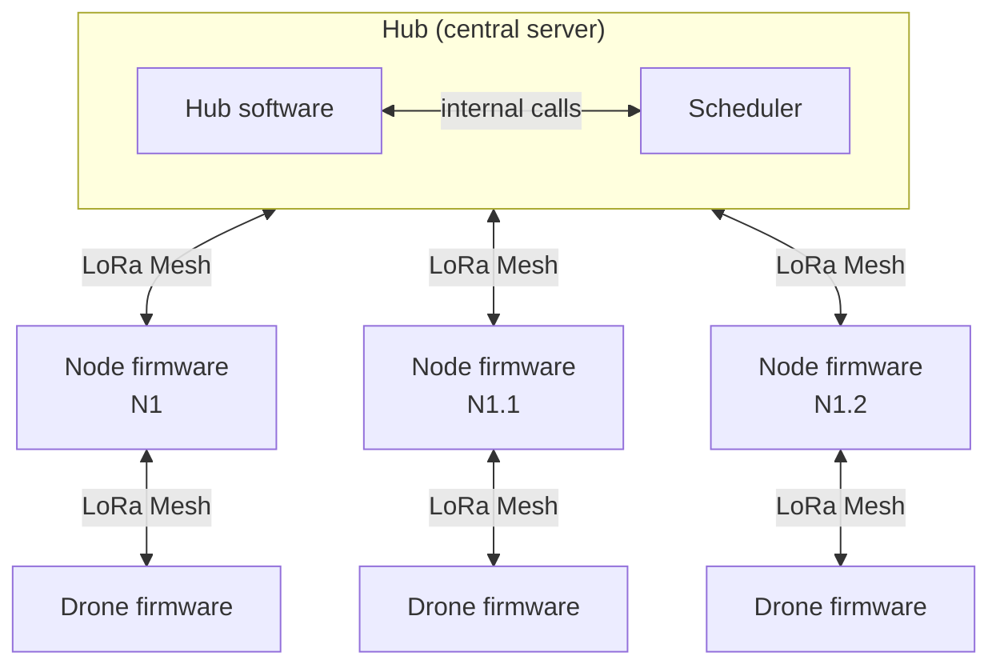
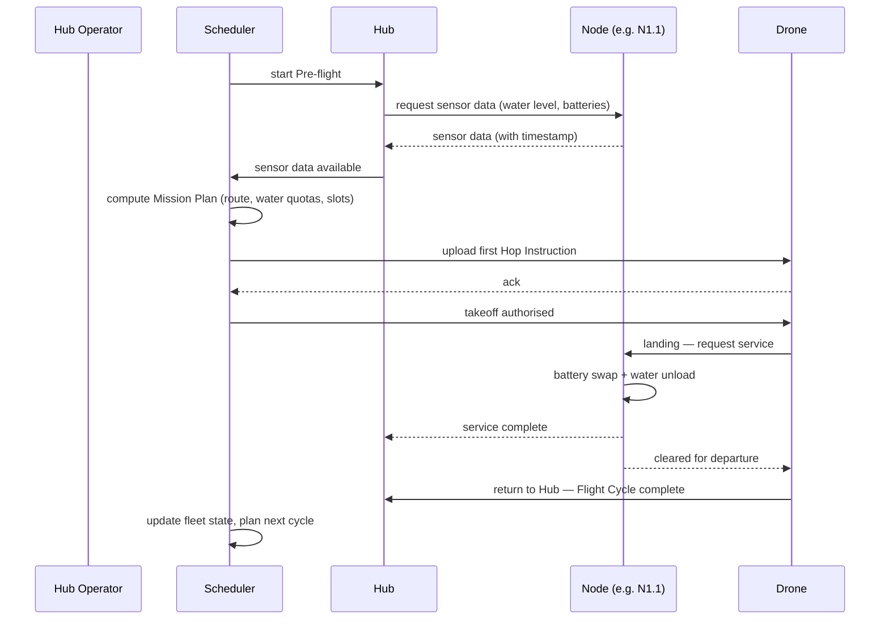
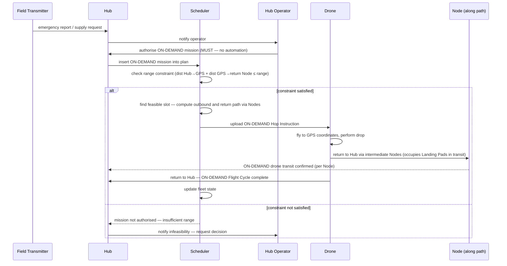
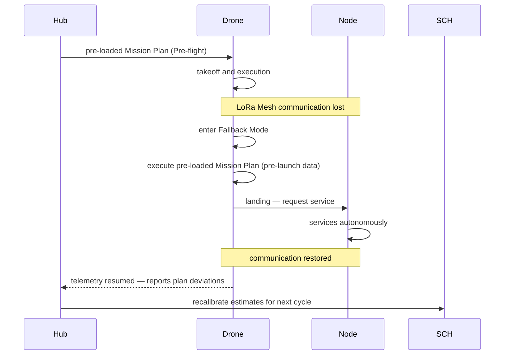
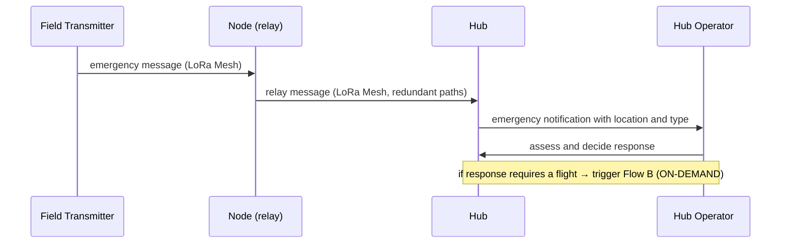

# Functional Specifications
## Supply Open Sky

*Version 0.3 — April 2026*

> *This document is an adapted public version of an internal working
> specification maintained in the Supply Open Sky private repository.
> References to internal-only documents have been preserved as labels
> without links. The Italian working draft is available on request.*

---

## Table of Contents

1. [Purpose and Context](#1-purpose-and-context)
2. [System Overview](#2-system-overview)
3. [Actors and Main Flows](#3-actors-and-main-flows)
4. [Subsystem Requirements](#4-subsystem-requirements)
5. [Abstract Hardware Interfaces](#5-abstract-hardware-interfaces)
6. [Cross-cutting System Requirements](#6-cross-cutting-system-requirements)

---

## 1. Purpose and Context

### 1.1 Purpose of the document

This document defines the functional requirements of the Supply Open
Sky software system. It describes what each software component must
do, how the components interact with each other, and what the
software expects from the hardware it runs on.

The document is the primary reference for the development, testing,
and validation of all software modules of the project. It precedes
and informs the Software Architecture document, which defines how
these requirements are implemented.

### 1.2 Scope of this document

- Functional behaviour of all software modules: Hub, Scheduler, Drone
  firmware, Node firmware, LoRa Mesh stack
- Interactions and data flows between software components
- Abstract hardware interfaces: the contracts the software relies on,
  without specifying their physical implementation
- Cross-cutting system requirements: graceful degradation, operational
  safety constraints, logging

### 1.3 Out of scope

- Physical and mechanical specifications of Nodes, drones, or Landing Pads
- Electronics design, power sizing, or photovoltaic dimensioning
- Hardware selection criteria (covered in *internal physical-infrastructure
  documentation*)
- Software architecture and implementation choices (see
  [Software Architecture](../02_software-architecture/))
- Deployment-specific configurations: topology, GPS coordinates, community
  data (held in an *internal deployment-configuration repository*)

### 1.4 Reference documents

> *Active links resolve to documents available in this public repository.
> Internal-only references appear as italic labels without links: they
> point to specifications maintained in the private working repository
> and are not part of this public release.*

| Document | Location | Notes |
|---|---|---|
| [`NOMENCLATURE.md`](../../NOMENCLATURE.md) | repo root | Authoritative reference for all technical terms used in this document |
| *Project blueprint* | *internal documentation* | Project vision and operational context |
| [`02_software-architecture/`](../02_software-architecture/) | `01_system-architecture/` | Implementation of these requirements |
| [`04_communication-protocol/`](../04_communication-protocol/) | `01_system-architecture/` | LoRa Mesh message formats and protocol details |
| *Drone registry template* | *internal deployment templates* | Per-deployment drone registry |
| *Battery registry template* | *internal deployment templates* | Per-deployment battery registry |
| *Network topology template* | *internal deployment templates* | Per-deployment network topology |
| *Deployment-state seed template* | *internal deployment templates* | Initial asset state at seeding time |

### 1.5 Conventions

**Requirement IDs** follow the format `REQ-[SUBSYSTEM]-[NNN]`:

| Prefix | Subsystem |
|---|---|
| `REQ-HUB` | Hub — fleet management and operator interface |
| `REQ-SCH` | Scheduler |
| `REQ-DRN` | Drone firmware |
| `REQ-NOD` | Node firmware |
| `REQ-COM` | LoRa Mesh and communication |
| `REQ-HW` | Abstract hardware interfaces |
| `REQ-SYS` | Cross-cutting system requirements |

When a requirement spans two subsystems, it is assigned to its owning
subsystem and a cross-reference is added to the other
(`→ see also: REQ-XXX-NNN`).

**Requirement format:**

> `REQ-XXX-NNN` — *[Statement of the requirement in declarative form:
> "The system must…"]*
> Priority: `MUST` / `SHOULD` / `MAY`
> → see also: *(cross-references, if any)*

Priority levels follow RFC 2119 semantics: `MUST` is mandatory, `SHOULD`
is strongly recommended but admits justified exceptions, `MAY` is
optional.

---

## 2. System Overview

### 2.1 Software components

The system is built from five distinct software modules, each
running on a different physical node of the network:

| Module | Runs on | Main responsibility |
|---|---|---|
| **Hub** | Central server (Hub appliance) | Fleet management, operator interface, Pre-flight, network monitoring |
| **Scheduler** | Hosted on the Hub | Flight planning, Landing Pad slot allocation, Flight Cycle management |
| **Drone firmware** | On board the drone | Mission Plan execution, navigation, Fallback Mode, telemetry |
| **Node firmware** | Node controller | Landing Pad automation, sensor reads, battery management, LoRa interfacing |
| **LoRa Mesh stack** | Hub + every Node + drones in flight | Network communication: telemetry, mission updates, sensor data, emergencies |

> The Scheduler is modelled as a separate component with distinct
> responsibilities, but physically resides on the Hub server. The
> separation is functional, not physical.

### 2.2 Map of interactions

All wireless communication takes place over a single **LoRa Mesh**
network running a Reticulum stack:

- **Backbone link** between Hub and Nodes — low bandwidth, long range,
  high resilience.
- **In-flight link** between Nodes and drones — telemetry and
  Hop Instruction delivery on the same mesh, with drones acting as
  active relay nodes.

### 2.3 Main control flow

The system operates as a continuous cycle driven by the Scheduler:

1. **Pre-flight** — The Scheduler queries Node sensor data over the
   LoRa Mesh, computes the Mission Plan, and uploads the first
   Hop Instruction to the drone before takeoff.
2. **In flight** — The drone executes the current Hop Instruction; the
   Hub pushes the next Hop Instruction at each intermediate Node over
   the LoRa Mesh.
3. **Landing at a Node** — The Node firmware drives the Landing Pad
   automation (battery swap, water unload, or cargo handling) and
   updates the Hub over the LoRa Mesh.
4. **Return to the Hub** — The drone closes the Flight Cycle; the
   Scheduler updates fleet state and plans the next cycle.

On loss of communication the drone enters **Fallback Mode** and
autonomously executes the pre-loaded Mission Plan (→ see also: REQ-DRN,
REQ-SYS).

### 2.4 System boundaries

The software perimeter includes everything described in
section 2.1. The following are explicitly out of scope:

- The photovoltaic panel and the spare-battery charging system (pure
  hardware).
- The Landing Pad physical mechanism (actuators, hooks, pumps).
- The drone's internal navigation system (autopilot, GPS, IMU) — the
  S.O.S. firmware interfaces with it through an abstract API.
- External network infrastructure (Internet, cellular networks) — the
  system operates in complete absence of external connectivity.

---

## 3. Actors and Main Flows

### 3.1 System actors

Actors are the entities — human or software — that generate events the
system must respond to.

| Actor | Type | Description |
|---|---|---|
| **Hub Operator** | Human | Technician responsible for operational management. Configures the topology, authorises ON-DEMAND missions, monitors fleet state, and intervenes on anomalies |
| **Scheduler** | Software (internal) | Autonomous component that plans Flight Cycles, allocates Landing Pad slots, and integrates ON-DEMAND missions into the plan |
| **Drone** | Physical system | Executes the assigned Mission Plan. Generates telemetry events, signals anomalies, and requests plan updates |
| **Node** | Physical system | Reports sensor state (water level, batteries, Landing Pads), confirms service to the drone, and relays messages on the LoRa Mesh |
| **Field Transmitter** | External device | Device on loan to villages. Generates urgent supply requests or emergency reports to the network |

### 3.2 Main flows

The flows below describe high-level operational sequences. Specific
details and requirements are developed in Section 4.

---

#### Flow A — WATER / SCHEDULED mission (standard cycle)

---

#### Flow B — ON-DEMAND mission (external request)

---

#### Flow C — Communication degradation (Fallback Mode)

---

#### Flow D — Field Transmitter emergency

---

### 3.3 Observations on the flows

**Flow A** is the core of the system and the nominal case. All other
flows are exceptions to or extensions of this base cycle.

**Flow B** introduces the highest complexity for the Scheduler: an
ON-DEMAND mission always requires explicit authorisation from the
Hub Operator — no mission carrying MEDICAL, POSTAL or SUPPLY payload
can be started automatically. Once authorised, the Scheduler must
insert it into the existing plan without producing Landing Pad
conflicts on Nodes shared with SCHEDULED missions, on both the
outbound and the return leg. An ON-DEMAND drone always returns to the
Hub through intermediate Nodes, occupying Landing Pads in transit:
the return leg is therefore part of the scheduling problem, not a
separate phase.

> **Note on the Off-cycle Drone definition.** An ON-DEMAND drone in
> return transit to the Hub is technically an Off-cycle Drone for the
> entire return leg — it occupies slots on Nodes outside the SCHEDULED
> plan. The Scheduler must track it until full return to the Hub.

**Flow C** highlights the drone's autonomy requirement: the system
is designed to never block waiting for communication. Loss of
connectivity reduces delivery precision (water quotas computed on
pre-launch data) but does not interrupt service.

**Flow D** is the highest human-priority flow but the lowest in
operational frequency. The LoRa Mesh must ensure message propagation
even when intermediate Nodes are inactive. The operational response to
a Field Transmitter report always requires the Hub Operator's
assessment and decision.

---

## 4. Subsystem Requirements

> **Architectural note — hop-by-hop execution model.** The system
> adopts a **hop-by-hop** execution architecture: the Scheduler
> internally computes the complete flight plan (for slot management
> and conflict prevention) but transmits a single Hop Instruction to
> the drone at a time. Each instruction is sent when the drone is at
> the Node, before departure. The drone never knows the full mission
> path.

### 4.1 Hub

The Hub module is the operational centre of the system. It manages
fleet state, coordinates Pre-flight, exposes the operator interface,
and acts as the aggregation point for all data coming from the network.

#### 4.1.1 Network topology management

> `REQ-HUB-001` — The system must maintain an up-to-date
> representation of the network topology: the set of active Nodes,
> their hierarchical relationships (positional ID), and the
> operational status of each.
> Priority: `MUST`

> `REQ-HUB-002` — The system must allow the operator to add, modify,
> or deactivate Nodes without requiring a system restart or
> interruption of flights in progress.
> Priority: `MUST`

> `REQ-HUB-003` — The system must automatically detect when a Node
> stops responding to periodic queries and update its status to
> `UNREACHABLE`, notifying the operator.
> Priority: `MUST`
> → see also: REQ-COM-004

> `REQ-HUB-004` — The system must allow the operator to configure
> per-Node operational parameters: water tank capacity, number of
> available Landing Pads, alert thresholds for water level and
> battery state.
> Priority: `MUST`

#### 4.1.2 Fleet monitoring

> `REQ-HUB-005` — The system must keep real-time state of every
> drone in the fleet: position, Flight Mode, Flight Cycle phase
> (Pre-flight / in flight / waiting at Node / on the ground at the
> Hub), assigned Mission Type, current Hop Instruction, battery
> level.
> Priority: `MUST`

> `REQ-HUB-006` — The system must detect loss of telemetry from a
> drone and notify the operator, distinguishing between temporary
> loss (drone waiting at a Node, LoRa communication interrupted)
> and prolonged loss (possible critical anomaly).
> Priority: `MUST`
> → see also: REQ-DRN-005, REQ-SYS-003

> `REQ-HUB-007` — The system must track ON-DEMAND drones in return
> transit to the Hub for the entire duration of the return leg,
> maintaining visibility on the planned path and the Landing Pads
> they will occupy.
> Priority: `MUST`
> → see also: REQ-SCH-008

#### 4.1.3 Pre-flight

> `REQ-HUB-008` — Before authorising any drone takeoff, the system
> must query over the LoRa Mesh all Nodes on the planned path to
> collect up-to-date sensor data: water tank level, spare battery
> state, Landing Pad availability. The collected data is used by
> the Scheduler to compute the internal flight plan (per-leg water
> quotas, Landing Pad slots) and to determine the first Hop
> Instruction to send to the drone.
> Priority: `MUST`
> → see also: REQ-NOD-001, REQ-COM-002, REQ-SCH-010

> `REQ-HUB-009` — If one or more Nodes on the path do not respond
> within the Pre-flight timeout, the system must use the last
> available valid reading (with timestamp) and log the event. The
> mission must not be blocked because of missing fresh data from a
> single Node.
> Priority: `MUST`
> → see also: REQ-SYS-002

> `REQ-HUB-009b` — If a drone in flight reaches a Node and finds it
> non-operational, the drone must: (1) signal the condition to the
> Hub via the LoRa Mesh through reachable Nodes, (2) land in the
> Emergency Landing Zone (ELZ) adjacent to the Node, (3) wait for
> the Node to be restored before resuming the mission. The Hub must
> update the drone state to `WAITING — ELZ` and notify the operator.
> Priority: `MUST`
> → see also: REQ-DRN-006, REQ-NOD-007, REQ-SCH-009

> `REQ-HUB-010` — The system must transmit to the drone before
> takeoff the mission operational parameters (Mission Type, payload
> configuration) and the first Hop Instruction (destination Node,
> water quota to release for WATER missions). The drone does not
> receive the full path: each subsequent hop is communicated by the
> Hub when the drone is at the intermediate Node, before departure.
> Takeoff must not be authorised without acknowledgement received
> within the timeout.
> Priority: `MUST`
> → see also: REQ-DRN-001, REQ-COM-007

> `REQ-HUB-011` — When a drone reports its arrival at a Node, the
> system must compute and transmit the next Hop Instruction within
> the configurable timeout. The instruction includes: destination
> Node for the next hop, water quota to release at the current Node
> (WATER missions), any cargo loading or unloading instructions. If,
> as the daily operational window draws to a close, no further hops
> are planned, the system must issue a return-to-Hub instruction.
> Priority: `MUST`
> → see also: REQ-DRN-003, REQ-COM-007, REQ-COM-008, REQ-SYS-005

#### 4.1.4 ON-DEMAND mission management

> `REQ-HUB-012` — The system must present incoming Field Transmitter
> requests to the operator with the information needed to decide:
> location, request type, timestamp, originating Node of the message.
> Priority: `MUST`
> → see also: REQ-COM-006

> `REQ-HUB-013` — The system must require explicit operator
> authorisation for every ON-DEMAND mission. No ON-DEMAND mission
> must be started automatically.
> Priority: `MUST`

> `REQ-HUB-014` — Once operator authorisation is received, the
> system must pass the request to the Scheduler for range-constraint
> verification and insertion into the flight plan.
> Priority: `MUST`
> → see also: REQ-SCH-005, REQ-SCH-006

> `REQ-HUB-015` — The system must notify the operator of the
> Scheduler verification outcome: mission inserted into the plan
> (with estimated departure time) or mission infeasible (with reason:
> insufficient range or no available slot).
> Priority: `MUST`

#### 4.1.5 Operator interface

> `REQ-HUB-016` — The system must expose an operator interface that
> shows in aggregated form: fleet state, Node state, active flight
> plan, recent event log, requests awaiting authorisation.
> Priority: `MUST`

> `REQ-HUB-017` — The system must allow the operator to abort a
> flight in progress and command the drone to land in the Emergency
> Landing Zone (ELZ) of the nearest available Node, at any phase of
> the Flight Cycle. The drone remains in `WAITING — ELZ` state until
> a new operator instruction.
> Priority: `MUST`
> → see also: REQ-DRN-006, REQ-SCH-009

> `REQ-HUB-018` — The system must allow the operator to put a Node
> in maintenance state, temporarily excluding it from the flight
> plan. The Scheduler must be notified of the state change.
> Priority: `MUST`
> → see also: REQ-SCH-002

> `REQ-HUB-019` — The operator interface must be accessible locally
> without dependence on Internet connectivity or external network
> infrastructure.
> Priority: `MUST`

---

### 4.2 Scheduler

The Scheduler is the most algorithmically critical component of the
system. It operates continuously on the active flight plan, ensuring
that no Landing Pad is occupied by two drones simultaneously and that
all missions — SCHEDULED and ON-DEMAND — are executed without resource
conflicts.

#### 4.2.1 Responsibilities and operational model

> `REQ-SCH-001` — The Scheduler must internally compute and maintain
> the complete flight plan for every active mission: Node sequence,
> expected arrival time at each Node, occupation time of each
> Landing Pad, per-leg water quota (WATER missions). The complete
> plan is used internally for slot management and conflict
> prevention. The drone is sent one Hop Instruction at a time,
> transmitted by the Hub when the drone is at the Node and before
> departure.
> Priority: `MUST`

> `REQ-SCH-002` — The Scheduler must update the flight plan in real
> time in response to events that change available resources: Node
> in maintenance, Node unreachable, drone in `WAITING — ELZ` state,
> change in weather conditions.
> Priority: `MUST`
> → see also: REQ-HUB-018, REQ-HUB-003

> `REQ-SCH-003` — The number of simultaneously airborne drones must
> not be a fixed configuration parameter: it must be an output of
> the flight plan, computed as a function of the current topology,
> active missions, and Node capacity. The Scheduler must compute
> both the optimal number and the arithmetically maximum admissible
> number.
> Priority: `MUST`

> `REQ-SCH-004` — The Scheduler must never authorise a takeoff if
> the resulting flight plan would produce a Landing Pad conflict on
> any Node along the path, at any time during the mission.
> Priority: `MUST`

#### 4.2.2 Topology representation

> `REQ-SCH-005` — The Scheduler must maintain an internal
> tree-shaped model of the network topology, updated in real time
> from the Node state reported by the Hub. The model must include
> for each Node: positional ID, number of available Landing Pads,
> per-cycle occupation time (currently 6 minutes), distance to
> adjacent Nodes.
> Priority: `MUST`
> → see also: REQ-HUB-001

> `REQ-SCH-006` — The Scheduler must model each Landing Pad as an
> exclusive resource with a time window of occupation. Two drones
> cannot occupy the same Landing Pad in the same time window,
> regardless of Flight Mode or direction of travel.
> Priority: `MUST`

> `REQ-SCH-007` — The Scheduler must automatically identify
> high-pressure Nodes — those that aggregate return traffic from
> multiple branches of the topology — and treat them as priority
> bottlenecks in planning.
> Priority: `MUST`

#### 4.2.3 Planning of SCHEDULED missions

> `REQ-SCH-008` — For SCHEDULED missions, the Scheduler adopts a
> two-phase planning model:
>
> - **Pre-launch:** the Scheduler allocates Landing Pad slots only
>   for the outbound path (Hub → destination) and pre-distributes
>   the corresponding Hop Instructions to the Nodes along the path.
>   The drone does not receive the complete path: it receives only
>   the first Hop Instruction before takeoff.
> - **At runtime, on `DELIVERY_COMPLETE`:** upon receiving the
>   delivery confirmation from the destination, the Scheduler
>   computes and allocates slots for the return path
>   (destination → Hub) and distributes the corresponding Hop
>   Instructions to the Nodes. This ensures that slots on
>   hub-proximal Nodes — those most exposed to congestion on
>   return — are allocated on real completion data, not on
>   estimates.
>
> In both phases execution is hop-by-hop: the Scheduler issues Hop
> Instructions one at a time, as the drone progresses along the
> path.
> Priority: `MUST`
> → see also: REQ-SCH-008a, *internal open-issues tracker*

> `REQ-SCH-008a` — If at `DELIVERY_COMPLETE` no slot is available
> within the planning horizon for the return path, the drone
> remains waiting at the destination. The Scheduler enqueues the
> return request with maximum priority: a drone waiting for return
> instructions precedes any new launch in the planning queue,
> ensuring the Landing Pad is freed in the shortest possible time
> without arbitrary timeouts.
> Priority: `MUST`
> → see also: REQ-SCH-008

> `REQ-SCH-009` — The Scheduler must handle return-traffic
> convergence: when multiple drones from different branches of the
> topology must transit through the same Hub-near Nodes, takeoff
> times must be staggered to avoid conflicts on those Nodes'
> Landing Pads.
> Priority: `MUST`

> `REQ-SCH-010` — For every WATER/SCHEDULED mission, the Scheduler
> must compute the water quota to release at each intermediate Node,
> based on sensor data collected during Pre-flight. The undistributed
> remainder is released entirely at the final destination Node,
> which by definition has non-binding storage capacity: the water is
> consumed directly by the local community and does not require
> incoming-level tank management.
> Priority: `MUST`
> → see also: REQ-HUB-008, REQ-NOD-001

#### 4.2.4 Insertion of ON-DEMAND missions

> `REQ-SCH-011` — Before inserting an ON-DEMAND mission into the
> plan, the Scheduler must verify the range constraint:
> `dist(Hub → delivery_coordinates) + dist(delivery_coordinates → return_Node) ≤ available_range`.
> If the constraint is not satisfied, the mission must be rejected
> and the Hub notified with an explicit reason.
> Priority: `MUST`
> → see also: REQ-HUB-014, REQ-HUB-015

> `REQ-SCH-012` — The Scheduler must plan the outbound leg of the
> ON-DEMAND Flight Cycle before authorising takeoff: direct flight
> Hub → GPS coordinates, with no Landing Pad reservations. Planning
> of the return path (`return_node` → Hub) is performed at runtime
> on receipt of the `DELIVERY_COMPLETE` signal from the drone,
> allocating Landing Pad slots for all return legs. If the
> `return_node`'s Landing Pad is occupied at the time of
> `DELIVERY_COMPLETE`, the drone is directed to the `return_node`'s
> ELZ; the return is queued with maximum priority and confirmed at
> the first available slot (→ see also:
> [`scheduling-algorithm-spec`](../03_scheduling-algorithm/) §4.6).
> Priority: `MUST`
> → see also: REQ-HUB-007

> `REQ-SCH-013` — The Scheduler must find the time slot that
> minimises the ON-DEMAND mission's interference with SCHEDULED
> missions in progress, preferring insertions during low-density
> traffic periods on shared Nodes.
> Priority: `SHOULD`

> `REQ-SCH-014` — If no slot is available to insert the ON-DEMAND
> mission without producing conflicts, the Scheduler must notify
> the Hub with the earliest estimated feasible time, leaving the
> operator the decision whether to wait or abandon the mission.
> Priority: `MUST`
> → see also: REQ-HUB-015

#### 4.2.5 Off-plan drone tracking

> `REQ-SCH-015` — The Scheduler must track ON-DEMAND drones
> throughout the entire return path to the Hub, updating in real
> time the Landing Pad slots occupied along the way. An ON-DEMAND
> drone in return transit is considered an Off-cycle Drone and is
> not available for new missions until full return to the Hub.
> Priority: `MUST`
> → see also: REQ-HUB-007

> `REQ-SCH-016` — The Scheduler must track drones in `WAITING — ELZ`
> state as unavailable resources. When the Hub reports Node
> restoration, drone reintegration is automatic and follows this
> logic: (1) the Scheduler checks Landing Pad availability; (2) if
> a slot is free, it authorises the drone to position immediately
> for battery swap; (3) if all slots are occupied, the drone
> remains on the ground at the ELZ and is inserted into the first
> available time slot without operator intervention.
> Priority: `MUST`
> → see also: REQ-HUB-009b, REQ-NOD-007

> `REQ-SCH-017b` — When a Node is declared non-operational, the
> Scheduler must apply the branch-draining strategy: (1) no new
> drone is authorised to depart the Hub toward the branch containing
> the failed Node; (2) drones already in flight on that branch
> complete their current mission to the reachable point and are
> handled individually (ELZ or return); (3) the branch is
> reactivated only after the Hub has confirmed Node restoration and
> the Scheduler has recomputed the flight plan. This approach
> ensures gradual traffic draining and return to the nominal
> operational case without congestion.
> Priority: `MUST`
> → see also: REQ-SCH-017, REQ-HUB-003, REQ-HUB-009b

#### 4.2.6 Dynamic adaptation

> `REQ-SCH-017` — When a Node is removed from the plan (maintenance,
> failure, unreachability), the Scheduler must apply the
> branch-draining strategy (→ see also: REQ-SCH-017b) and seek
> alternative paths if available in the topology. In the simple
> tree topology alternative paths do not exist by definition; this
> requirement applies to future, more complex topologies (e.g. star
> topology with transverse connections between branches).
> Priority: `SHOULD`
> → see also: REQ-HUB-003, REQ-HUB-018, REQ-SCH-017b

> `REQ-SCH-018` — The Scheduler must detect significant deviations
> between the planned and actual execution — landing delays,
> longer-than-expected Node service times — and update the plan
> dynamically to preserve slot consistency on subsequent legs.
> Priority: `MUST`

> `REQ-SCH-019` — The Scheduler must expose to the Hub a readable
> representation of the active flight plan, including: airborne
> drones with position and current leg, Landing Pad slots allocated
> for the next N hours, off-plan drones (Off-cycle and
> `WAITING — ELZ`).
> Priority: `MUST`
> → see also: REQ-HUB-016

---

### 4.3 Drone firmware

The drone firmware is the component that executes the Mission Plan on
board the aircraft. It operates autonomously throughout the entire
flight and must be able to complete the mission even in the total
absence of communication with the Hub or the LoRa Mesh network. It
interfaces with the drone's navigation system (autopilot, GPS, IMU)
through an abstract API — low-level navigation is delegated to the
firmware of the chosen airframe.

#### 4.3.1 Mission Plan reception and execution

> `REQ-DRN-001` — The firmware must receive from the Hub before
> takeoff the mission operational parameters (Mission Type, payload
> configuration) and the first Hop Instruction (destination Node,
> water quota for WATER missions). It must acknowledge receipt
> before takeoff is authorised. The firmware does not receive nor
> store the full mission path.
> Priority: `MUST`
> → see also: REQ-HUB-010

> `REQ-DRN-002` — The firmware must execute the mission hop-by-hop:
> it receives the Hop Instruction at the current Node, flies to the
> indicated destination Node, lands, completes the service cycle,
> and waits for the next Hop Instruction from the Hub before
> departing. The drone does not autonomously proceed to the next
> Node without explicit instruction.
> Priority: `MUST`

> `REQ-DRN-002b` — Before every landing at a Node, the firmware
> must perform a low-altitude pass over the photovoltaic panels
> along a planned route. The airflow generated by the rotors removes
> sand and debris accumulation that could reduce panel performance.
> The exact route depends on the physical panel configuration and
> will be defined during Node infrastructure design.
> Priority: `SHOULD`
> → see also: `REQ-HW-XXX` (panel physical configuration — to be
> defined)

> `REQ-DRN-003` — After landing at a Node and completing the
> service cycle, the firmware must signal its state to the Hub
> (current Node, battery level, any anomalies) and wait for the
> next Hop Instruction. The firmware must retry the signalling at
> regular intervals if no response is received within the timeout.
> Priority: `MUST`
> → see also: REQ-HUB-011, REQ-COM-008

#### 4.3.2 Wait and return

> `REQ-DRN-004` — If the firmware does not receive the next Hop
> Instruction within the configurable timeout, it must continue
> waiting at the current Node, retrying communication at regular
> intervals. The drone must never proceed to a next Node without
> explicit Hub instruction.
> Priority: `MUST`

> `REQ-DRN-005` — If the firmware detects that the daily operational
> window is closing and it has not received a Hop Instruction within
> the configurable time, it must notify the Hub and wait for the
> return instruction. If this does not arrive either, it must
> autonomously initiate return to the Hub by traversing the Nodes
> back along the outbound path, preferring low-traffic hours to
> minimise Landing Pad conflicts.
> Priority: `MUST`
> → see also: REQ-HUB-011, REQ-COM-008, REQ-SYS-005

> `REQ-DRN-006` — Throughout the entire wait phase at the Node, the
> firmware must continue transmitting telemetry to the Hub at
> regular intervals and participate in the LoRa Mesh network as an
> active relay node.
> Priority: `MUST`
> → see also: REQ-COM-010

#### 4.3.3 In-flight anomaly handling

> `REQ-DRN-007` — If the firmware detects that an intermediate
> destination Node is non-operational on arrival, it must:
> (1) immediately signal the condition to the Hub via the LoRa
> Mesh through reachable Nodes, (2) autonomously land in the
> Emergency Landing Zone (ELZ) adjacent to the Node without waiting
> for instructions. Missing in-flight communication makes
> hover-waiting useless and costly in terms of range.
> Priority: `MUST`
> → see also: REQ-HUB-009b, REQ-SCH-016

> `REQ-DRN-008` — The firmware must continuously monitor the Flight
> Battery charge level during flight. If the level falls below the
> configurable safety threshold, it must abort the mission, signal
> the anomaly to the Hub, and autonomously head to the nearest Node
> reachable with the residual charge.
> Priority: `MUST`

> `REQ-DRN-009` — The firmware must receive and respond to the
> mission-abort command sent by the Hub: it must abort the current
> path and head to the ELZ of the nearest available Node,
> regardless of the current Flight Cycle phase.
> Priority: `MUST`
> → see also: REQ-HUB-017

#### 4.3.4 Telemetry and logging

> `REQ-DRN-010` — The firmware must transmit telemetry to the Hub
> at configurable regular intervals: GPS position, battery level,
> current Mission Plan phase, communication state, any detected
> anomalies.
> Priority: `MUST`
> → see also: REQ-HUB-005

> `REQ-DRN-011` — The firmware must locally record a complete
> flight log for every Flight Cycle: telemetry, received and
> applied updates, anomalous events, plan deviations. The log must
> be transmitted to the Hub on return and retained on board until
> successful transmission.
> Priority: `MUST`
> → see also: REQ-SYS-004

#### 4.3.5 Navigation system interface

> `REQ-DRN-012` — The firmware must interface with the drone's
> navigation system (autopilot, GPS, IMU) through an abstract API.
> Commands sent to the autopilot must be expressed in terms of
> destination coordinates, cruise speed, and altitude — not in
> terms of direct control of rotors or actuators.
> Priority: `MUST`

> `REQ-DRN-013` — The firmware must be designed so that the
> autopilot interface module can be replaced without modifying the
> Mission Plan execution logic. Switching to a different drone
> platform must require only adaptation of the interface module.
> Priority: `SHOULD`

---

### 4.4 Node firmware

The Node firmware handles all automated operations of the physical
node: receiving and servicing drones in transit, reading and
transmitting sensor data, and participating in the LoRa Mesh network.
The Node operates fully autonomously — no human intervention is
required for routine operations.

#### 4.4.1 Landing Pad management

> `REQ-NOD-001` — The firmware must manage the complete drone
> service cycle for each Landing Pad: landing detection, start of
> the service sequence (battery swap or water unload depending on
> Mission Type), signalling completion to the drone and the Hub,
> release of the pad. Cargo loading and unloading for
> SUPPLY/MEDICAL/POSTAL missions takes place in the Emergency
> Landing Zone (ELZ) adjacent to the Node, not on the Landing Pad;
> the relevant ELZ service cycle will be specified in a future
> revision.
> Priority: `MUST`
> → see also: REQ-HUB-008, REQ-SCH-006

> `REQ-NOD-002` — The firmware must keep the state of each Landing
> Pad up to date: `FREE`, `OCCUPIED — IN SERVICE`,
> `OCCUPIED — WAITING`, `OUT OF SERVICE`. The state must be
> transmitted to the Hub over the LoRa Mesh on every change.
> Priority: `MUST`
> → see also: REQ-SCH-006

> `REQ-NOD-003` — The firmware must manage the two Landing Pads as
> independent resources: a fault or prolonged occupation on PAD-1
> must not block operations on PAD-2.
> Priority: `MUST`

> `REQ-NOD-004` — The firmware must detect anomalies during the
> service cycle (failed battery swap, water pump not active) and
> signal them immediately to the Hub, keeping the Landing Pad in
> `OUT OF SERVICE` state until restoration is confirmed.
> Priority: `MUST`
> → see also: REQ-HUB-003

#### 4.4.2 Water tank management

> `REQ-NOD-005` — The firmware must continuously read the water
> tank level sensor and transmit the updated value to the Hub over
> the LoRa Mesh at configurable regular intervals and on every
> significant change.
> Priority: `MUST`
> → see also: REQ-HUB-008, REQ-SCH-010

> `REQ-NOD-006` — The firmware must receive from the Hub, via the
> LoRa Mesh, the water quota to unload into its own tank for each
> incoming drone on WATER mission. The value is included in the
> Hop Instruction transmitted by the Hub before the drone's
> departure from the previous Node. The Node manages the
> water-transfer mechanism during the Landing Pad service cycle.
> Priority: `MUST`

> `REQ-NOD-007` — The firmware must signal to the Hub when the
> tank level falls below a configurable alert threshold, to allow
> the Scheduler to anticipate or intensify WATER/SCHEDULED missions
> toward that Node.
> Priority: `MUST`
> → see also: REQ-SCH-010

#### 4.4.3 Spare battery management

> `REQ-NOD-008` — The firmware must monitor the charge state of all
> spare batteries and transmit the data to the Hub over the LoRa
> Mesh. It must signal to the Hub if the number of fully charged
> batteries falls below the configurable minimum threshold required
> to guarantee operational continuity.
> Priority: `MUST`

> `REQ-NOD-009` — The firmware must prioritise spare battery
> recharging based on the flight plan communicated by the Hub:
> batteries intended for the next planned landing slots must be
> recharged first, ensuring that at least one fully charged battery
> is always available for the next incoming drone.
> Priority: `MUST`
> → see also: REQ-SCH-001, REQ-HUB-008

> `REQ-NOD-009b` — The firmware must monitor the charge/discharge
> cycle count of every spare Flight Battery. When a battery reaches
> the configurable cycle threshold, it must be marked `TO RECALL`
> and no longer assigned to transiting drones. The firmware must
> signal `TO RECALL` batteries to the Hub and coordinate with the
> Scheduler so that the battery is loaded on the first available
> SUPPLY-mission drone returning to the Hub, for in-house
> replacement. Recall batteries must not be transported by drones
> on WATER missions.
> Priority: `MUST`
> → see also: REQ-HUB-016, REQ-SCH-002

#### 4.4.4 Emergency Landing Zone

> `REQ-NOD-010` — The firmware must detect the presence of a drone
> landed in the ELZ adjacent to the Node and immediately signal the
> condition to the Hub, including the drone identifier and the
> landing timestamp.
> Priority: `MUST`
> → see also: REQ-HUB-009b, REQ-SCH-016

> `REQ-NOD-011` — When the Node returns to operation after an
> interruption, the firmware must signal restoration to the Hub and
> wait for Scheduler instructions before authorising the drone
> waiting at the ELZ to position itself on the Landing Pad.
> Priority: `MUST`
> → see also: REQ-SCH-016

#### 4.4.5 LoRa Mesh participation

> `REQ-NOD-012` — The firmware must actively participate in the
> LoRa Mesh network as a relay node: receive, temporarily store, and
> retransmit messages destined for other Nodes or the Hub, even when
> the message is not addressed to the current Node.
> Priority: `MUST`
> → see also: REQ-COM-001

> `REQ-NOD-013` — The firmware must ensure the propagation of
> emergency messages from Field Transmitters with maximum priority,
> interrupting if necessary the transmission of ordinary telemetry
> messages.
> Priority: `MUST`
> → see also: REQ-COM-005

> `REQ-NOD-014` — The firmware must operate in degraded mode when
> LoRa Mesh connectivity with the Hub is interrupted: continue
> servicing transiting drones according to pre-loaded planned slots,
> record all events locally, and synchronise with the Hub upon
> restoration of communication.
> Priority: `MUST`
> → see also: REQ-SYS-003

---

### 4.5 LoRa Mesh and Communication

The LoRa Mesh stack constitutes the communication backbone of the
entire network. It operates on every Node and on the Hub,
ensuring message propagation even in the presence of partial network
outages. No Internet connectivity or external infrastructure is
required: the network is fully self-contained.

> **Note.** The LoRa Mesh protocol stack is **Reticulum** (decided in
> [`communication-protocol-spec`](../04_communication-protocol/) §2.2).
> Requirements in this section are nonetheless expressed in terms of
> expected behaviour, independent of implementation specifics, so
> they remain applicable should an alternative stack be evaluated in
> the future.

#### 4.5.1 Network requirements

> `REQ-COM-001` — The LoRa Mesh must operate in multi-hop mode:
> every Node acts as a relay for messages destined for other Nodes
> or the Hub, propagating received messages automatically toward
> the destination through the available path.
> Priority: `MUST`
> → see also: REQ-NOD-012

> `REQ-COM-002` — The network must guarantee message delivery even
> when intermediate Nodes are inactive, automatically seeking
> alternative paths available in the topology. The loss of a single
> Node must not isolate downstream Nodes from communication with
> the Hub if at least one alternative path exists.
> Priority: `MUST`

> `REQ-COM-003` — The network must support bidirectional messages
> between the Hub and every Node, with acknowledgement of receipt.
> Messages unacknowledged within the timeout must be retried a
> configurable number of times before being marked as undelivered.
> Priority: `MUST`

> `REQ-COM-004` — The Hub must automatically detect loss of
> communication with a Node when it receives no response within a
> configurable number of retries, and update the Node's status to
> `UNREACHABLE`.
> Priority: `MUST`
> → see also: REQ-HUB-003

#### 4.5.2 Message priorities

> `REQ-COM-005` — The network must support at least three message
> priority levels, applied in the following order in case of
> channel congestion:
>
> 1. `EMERGENCY` — Field Transmitter reports, critical system
>    anomalies
> 2. `OPERATIONAL` — hop-by-hop Hop Instructions, Landing Pad
>    service confirmations, Node state updates
> 3. `TELEMETRY` — periodic sensor data, logs, operational
>    statistics
>
> Priority: `MUST`
> → see also: REQ-NOD-013

> `REQ-COM-006` — `EMERGENCY` messages must be propagated with
> absolute priority. A Node that receives an emergency message
> must interrupt the transmission of lower-priority messages and
> retransmit it immediately.
> Priority: `MUST`
> → see also: REQ-HUB-012

#### 4.5.3 Hop-by-hop communication

> `REQ-COM-007` — The network must support transmission of Hop
> Instructions from the Hub to the drone via the current Node where
> the drone is waiting. The instruction message must include:
> destination Node for the next hop, water quota to release at the
> current Node (WATER missions), any cargo to load or release.
> Priority: `MUST`
> → see also: REQ-DRN-001, REQ-NOD-001

> `REQ-COM-008` — When a drone lands at a Node and awaits
> instructions for the next hop, the Node must immediately signal
> the arrival to the Hub via the LoRa Mesh. The Hub must respond
> with the next Hop Instruction within a configurable timeout. If
> the instruction does not arrive within the timeout, the Node
> retransmits the arrival signal at regular intervals. The system
> operates exclusively in the configurable daytime window: if a
> drone is awaiting instructions as the end of the daily operational
> window approaches, the Hub must automatically issue a
> return-to-Hub instruction along the Nodes in reverse order. The
> evening/night return takes place under low-traffic conditions,
> making Landing Pad congestion highly unlikely.
> Priority: `MUST`
> → see also: REQ-SCH-001, REQ-SYS-005

#### 4.5.4 Field Transmitter communication

> `REQ-COM-009` — The network must receive and propagate messages
> sent by Field Transmitters on loan to villages. Field Transmitters
> communicate with the nearest Node; the Node propagates the message
> toward the Hub through the mesh.
> Priority: `MUST`
> → see also: REQ-HUB-012

> `REQ-COM-010` — The network must ensure propagation of Field
> Transmitter messages even when the nearest reference Node is
> inactive. Drones in flight actively participate in the LoRa Mesh
> as dynamic nodes: a Field Transmitter can route a message through
> a transiting drone within its coverage range, which then
> propagates it toward the reachable Node or Hub. This extends mesh
> coverage dynamically, proportionally to the number of airborne
> drones.
> Priority: `MUST`
> → see also: REQ-COM-001, REQ-DRN-010

#### 4.5.5 ~~RF Control Link~~ — Superseded

> **Update note (step 5 — Communication Protocol).** The architectural
> decision in
> [`communication-protocol-spec`](../04_communication-protocol/) §2.2
> established the use of a single LoRa 868 MHz radio with a Reticulum
> stack for all network components, including the drone.
> Mission-control traffic (Hop Instructions, telemetry) flows over the
> same LoRa Mesh used for backbone communication. There is no
> separate RF Control Link.

> `REQ-COM-011` — ~~The RF Control Link between Node and drone in
> flight on the current segment must be independent from the LoRa
> Mesh.~~ **Superseded:** the drone communicates with Nodes via the
> single LoRa Mesh with Reticulum stack. Link resilience on the
> segment is guaranteed by the direct LoRa link between drone and
> Node (point-to-point on the same mesh), not by a separate radio
> channel. → Resolved in
> [`communication-protocol-spec`](../04_communication-protocol/) §2.2.
> Priority: ~~`MUST`~~ → `SUPERSEDED`

> `REQ-COM-012` — ~~The Node must act as a gateway between the RF
> channel (to the drone in flight) and the LoRa Mesh channel (to
> the Hub), translating and forwarding messages between the two
> channels in real time.~~ **Superseded:** with a single radio, the
> Node is a Reticulum node that natively routes messages between
> drone and Hub on the same mesh. No channel translation is needed.
> → Resolved in
> [`communication-protocol-spec`](../04_communication-protocol/) §2.2.
> Priority: ~~`MUST`~~ → `SUPERSEDED`
> → see also: REQ-NOD-012

---

## 5. Abstract Hardware Interfaces

This section defines the contracts between the Supply Open Sky
software and the hardware it runs on. It does not specify how the
hardware is built — that is covered in *internal
physical-infrastructure documentation* — but what the software
expects from it: which data it must receive, which commands it must
be able to send, and which behavioural guarantees the hardware must
provide.

Each interface is expressed as a set of required capabilities. The
software module that implements the adapter for a specific hardware
component must satisfy all `MUST` capabilities of the corresponding
interface.

---

### 5.1 Landing Pad interface

The Landing Pad is the automated landing surface of the Node. The
Node firmware interfaces with it to manage the drone service cycle.

> `REQ-HW-001` — The Landing Pad must expose a binary status signal
> readable by the Node firmware: `FREE` / `OCCUPIED`. The signal
> must update within a configurable time of drone landing or
> takeoff.
> Priority: `MUST`

> `REQ-HW-002` — The Landing Pad must expose a command interface to
> initiate and monitor the automated battery swap cycle. The Node
> firmware must be able to: initiate the cycle, receive completion
> or error notification, query the current cycle state.
> Priority: `MUST`
> → see also: REQ-NOD-001, REQ-NOD-004

> `REQ-HW-003` — The Landing Pad must expose a command interface to
> initiate water transfer from the drone tank to the local tank. The
> Node firmware must be able to: initiate the transfer with a
> specified quota, receive completion or error notification, read
> the actually transferred volume.
> Priority: `MUST`
> → see also: REQ-NOD-006

> `REQ-HW-004` — The Landing Pad must expose a distinct error
> signal for each subsystem: battery swap, water transfer. The Node
> firmware must be able to distinguish the type of anomaly to
> correctly report it to the Hub.
> Priority: `MUST`
> → see also: REQ-NOD-004

> `REQ-HW-005` — ~~The Landing Pad must expose an interface for
> detection and handling of modular cargo (SUPPLY/MEDICAL/POSTAL
> missions): attach, detach, handover confirmation. The interface
> must be the same regardless of cargo type.~~ **Superseded:**
> modular cargo handling has been moved to the Emergency Landing
> Zone (ELZ) adjacent to each Node. The Landing Pad now services
> only battery swap (REQ-HW-002) and water transfer (REQ-HW-003).
> Cargo interface requirements will be specified in a dedicated ELZ
> interface section in a future revision.
> Priority: ~~`MUST`~~ → `SUPERSEDED`
> → see also: REQ-NOD-001

---

### 5.2 Water Level Sensor interface

The level sensor measures the water amount in the Node's local tank.
The Node firmware queries it and transmits the data to the Hub.

> `REQ-HW-006` — The sensor must provide a water level reading in
> absolute units (litres or percentage of capacity) with a
> resolution sufficient to distinguish significant variations
> between one mission and the next. The minimum acceptable
> resolution will be defined during tank sizing.
> Priority: `MUST`
> → see also: REQ-NOD-005

> `REQ-HW-007` — The sensor must provide a timestamp associated
> with each reading, or the Node firmware must be able to associate
> one at the moment of reading. The timestamp is required for the
> Hub's fallback logic in the absence of fresh communication.
> Priority: `MUST`
> → see also: REQ-HUB-009

> `REQ-HW-008` — The sensor must operate reliably in the
> environmental conditions of deployment areas: high temperatures,
> humidity, sand and dust. Specific environmental tolerance will be
> defined during hardware selection.
> Priority: `MUST`

---

### 5.3 Spare Battery interface

The Node's spare-battery management system includes the photovoltaic
charger and the automatic swap mechanism. The Node firmware controls
it to guarantee continuous availability of charged batteries.

> `REQ-HW-009` — The battery management system must expose for each
> spare battery: charge state (percentage), accumulated
> charge/discharge cycle count, operational state (`AVAILABLE` /
> `CHARGING` / `TO RECALL` / `FAULTY`).
> Priority: `MUST`
> → see also: REQ-NOD-008, REQ-NOD-009b

> `REQ-HW-010` — The battery management system must expose a
> command interface to set the charging priority of individual
> batteries. The Node firmware must be able to indicate which
> batteries to charge first based on the flight plan received from
> the Hub.
> Priority: `MUST`
> → see also: REQ-NOD-009

> `REQ-HW-011` — The battery management system must expose an
> interface to select which battery to deliver to the drone during
> the swap cycle. The Node firmware must be able to specify the
> battery to use, not receive a randomly available one.
> Priority: `MUST`
> → see also: REQ-NOD-009

---

### 5.4 Drone Navigation System interface

The drone's navigation system (autopilot, GPS, IMU) is a component of
the physical aircraft. The on-board firmware controls it through an
abstract API.

> `REQ-HW-012` — The navigation system must accept destination
> commands expressed in GPS coordinates (latitude, longitude,
> altitude) and cruise speed. The firmware must not access
> low-level flight controls directly (rotors, actuators, control
> surfaces).
> Priority: `MUST`
> → see also: REQ-DRN-012

> `REQ-HW-013` — The navigation system must expose for reading:
> current GPS position, speed, altitude, flight battery charge
> level, system state (operational / anomaly / landing in progress).
> These data must be available to the firmware at
> configurable intervals.
> Priority: `MUST`
> → see also: REQ-DRN-010

> `REQ-HW-014` — The navigation system must expose an emergency
> landing command at specified GPS coordinates. The firmware
> must be able to command immediate landing at the nearest ELZ
> without having to compute the descent trajectory.
> Priority: `MUST`
> → see also: REQ-DRN-007, REQ-DRN-009

> `REQ-HW-015` — The interface between the firmware and the
> navigation system must be documented and stable: switching to a
> different drone platform must require only replacement of the
> interface adapter, with no changes to the firmware's hop-by-hop
> execution logic. This constrains the choice of autopilot to
> platforms that expose documented and publicly accessible APIs.
> Priority: `MUST`
> → see also: REQ-DRN-013

---

### 5.5 ~~RF Control Link interface~~ — Superseded

> **Update note (step 5 — Communication Protocol).** This section
> described a separate RF module for the direct drone↔Node link.
> With the architectural decision in
> [`communication-protocol-spec`](../04_communication-protocol/) §2.2
> (single LoRa 868 MHz radio with Reticulum stack), the drone↔Node
> link runs over the same LoRa module used for the mesh. Coverage
> and bidirectionality requirements are satisfied by the LoRa module
> described in §5.6.

> `REQ-HW-016` — ~~The RF module must guarantee reliable coverage
> for the entire duration of the flight segment (maximum distance
> 8–9 km).~~ **Superseded:** segment coverage is guaranteed by the
> single LoRa module (§5.6). → Resolved in
> [`communication-protocol-spec`](../04_communication-protocol/) §2.2.
> Priority: ~~`MUST`~~ → `SUPERSEDED`
> → see also: ~~REQ-COM-011~~ (superseded)

> `REQ-HW-017` — ~~The RF module must support bidirectional
> transmission of structured messages between drone and Node.~~
> **Superseded:** bidirectionality is native to the Reticulum stack
> on the single LoRa module. → Resolved in
> [`communication-protocol-spec`](../04_communication-protocol/) §2.2.
> Priority: ~~`MUST`~~ → `SUPERSEDED`
> → see also: ~~REQ-COM-012~~ (superseded)

---

### 5.6 LoRa Module interface (Node and drone)

The LoRa module is present on every Node and every drone. On the
drone, in addition to communication with the Hub, it actively
participates in the mesh network as a dynamic node.

> `REQ-HW-018` — The LoRa module must support multi-hop
> communication: reception, temporary storage, and retransmission of
> messages destined for other nodes of the network. This capability
> must be active on both Nodes and drones in flight.
> Priority: `MUST`
> → see also: REQ-COM-001, REQ-COM-010

> `REQ-HW-019` — The LoRa module on the drone must remain active
> throughout the entire flight and during the battery swap at the
> Node. Operational continuity must be guaranteed by a dedicated
> Supplementary Battery, independent of the main Flight Battery.
> LoRa power consumption is negligible compared to flight
> consumption: a small Supplementary Battery is sufficient to cover
> the entire drone operation including stops at Nodes.
> Priority: `MUST`
> → see also: REQ-DRN-006, REQ-COM-010

> `REQ-HW-019b` — The drone must remain operational (firmware
> active, LoRa active, telemetry available) throughout the entire
> Flight Battery swap at the Node. Replacement of the main Flight
> Battery must not cause interruption of the firmware nor of
> participation in the LoRa Mesh. The Supplementary Battery must
> power all non-propulsive systems for the entire duration of the
> Node stop.
> Priority: `MUST`
> → see also: REQ-NOD-001, REQ-HUB-005

> `REQ-HW-020` — The LoRa module must expose a priority interface
> for outgoing messages, consistent with the levels defined in
> `REQ-COM-005` (`EMERGENCY` / `OPERATIONAL` / `TELEMETRY`).
> High-priority messages must be able to interrupt the transmission
> of lower-priority messages.
> Priority: `MUST`
> → see also: REQ-COM-005, REQ-COM-006

---

### 5.7 Photovoltaic and Power interface

The Node's photovoltaic system powers the spare-battery charger and
all the Node's electronic components. The Node firmware interacts
with it to optimise charging.

> `REQ-HW-021` — The photovoltaic system must expose for reading:
> instantaneous generated power, energy accumulated in the last N
> hours, estimate of remaining autonomy in the absence of
> irradiation. These data allow the Node firmware to adapt battery
> charging priority.
> Priority: `SHOULD`

> `REQ-HW-022` — The power system must guarantee operational
> continuity of the Node firmware and the LoRa Mesh network even
> at night or during periods of reduced irradiation, through
> dedicated infrastructure batteries (distinct from the batteries
> destined for drones).
> Priority: `MUST`

---

## 6. Cross-cutting System Requirements

The requirements in this section apply to the entire system
and are not owned by a single subsystem. Every software module must
respect them to the extent that it is involved.

---

### 6.1 Graceful degradation

> `REQ-SYS-001` — The system must continue to operate usefully in
> the presence of partial failures. The loss of a single component
> (Node, drone, LoRa network segment) must not block the entire
> network: branches not affected by the fault must continue to
> operate normally.
> Priority: `MUST`

> `REQ-SYS-002` — Every software component must be able to operate
> on partial or stale data, using the last available valid reading
> with associated timestamp. No component must block waiting for
> fresh data if it has a usable previous value.
> Priority: `MUST`
> → see also: REQ-HUB-009, REQ-NOD-014

> `REQ-SYS-003` — Loss of communication between the Hub and one or
> more Nodes must not cause interruption of missions in progress.
> Drones waiting at the Node continue to wait; Nodes continue to
> service transiting drones according to pre-communicated slots.
> The interrupted communication is reported to the operator, and
> the Scheduler suspends new takeoffs toward unreachable Nodes
> until restoration.
> Priority: `MUST`
> → see also: REQ-HUB-006, REQ-NOD-014, REQ-SCH-002

> `REQ-SYS-004` — Every operational degradation must be recorded in
> the system log with timestamp, component involved, type of
> anomaly, and action taken. Upon restoration, the system must
> automatically recalibrate on the actual network state before
> resuming normal operations.
> Priority: `MUST`
> → see also: REQ-SYS-005

---

### 6.2 Daily operational window

> `REQ-SYS-005` — The system must operate exclusively within the
> configurable daytime window for each deployment (e.g.
> sunrise–sunset with safety margins). No takeoff must be
> authorised outside the operational window. The window parameters
> must be configurable to adapt to the latitude and the season of
> the deployment territory.
> Priority: `MUST`
> → see also: REQ-COM-008, REQ-DRN-005, REQ-HUB-011

> `REQ-SYS-006` — The Scheduler must plan takeoffs so that all
> drones can reach the Hub or a safe Node before the end of the
> daily operational window, accounting for flight times and Node
> stops. No drone must be in flight as the window closes without a
> defined return plan.
> Priority: `MUST`
> → see also: REQ-SCH-001, REQ-DRN-005

> `REQ-SYS-007` — The night operational window must be dedicated to
> recharging the Nodes' spare batteries and to synchronising flight
> logs with the Hub. The Scheduler must use this period to
> recompute the next day's flight plan based on data collected
> during the day.
> Priority: `SHOULD`
> → see also: REQ-NOD-009, REQ-SCH-001

---

### 6.3 Operational safety

> `REQ-SYS-008` — The system must never authorise an action that
> would put a drone in a condition from which it cannot autonomously
> return to a safe Node. Any mission computation — SCHEDULED or
> ON-DEMAND — must verify in advance that the estimated residual
> charge at the destination is sufficient to reach the nearest
> available Node.
> Priority: `MUST`
> → see also: REQ-SCH-011, REQ-DRN-008

> `REQ-SYS-009` — The system must never authorise the takeoff of a
> drone if there is no fully charged battery available at the first
> destination Node. The verification must take place during
> Pre-flight and must account for drones already in transit toward
> that Node.
> Priority: `MUST`
> → see also: REQ-HUB-008, REQ-NOD-008, REQ-SCH-004

> `REQ-SYS-010` — In the event of an unhandled critical anomaly
> (total loss of communication with a drone, Flight Battery below
> critical threshold without a reachable Node, irreversible firmware
> error), the system must bring the drone to the safest available
> condition — immediate landing at the nearest ELZ — and notify the
> operator with maximum priority.
> Priority: `MUST`
> → see also: REQ-DRN-007, REQ-DRN-008, REQ-HUB-017

> `REQ-SYS-011` — No irreversible action — takeoff, cargo release,
> water unload — must be performed without explicit confirmation
> from the receiving component. The drone must receive confirmation
> from the Node before performing water unload; the Node must
> confirm cargo reception before the drone releases it.
> Priority: `MUST`
> → see also: REQ-NOD-001, REQ-DRN-002

---

### 6.4 Logging and traceability

> `REQ-SYS-012` — Every software component must maintain a local
> log of operational events with timestamps: takeoffs and landings,
> Hop Instructions received and executed, anomalies detected,
> sensor state changes, messages sent and received. Local logs must
> be synchronised with the Hub on restoration of communication or
> at the end of every daily operational window.
> Priority: `MUST`
> → see also: REQ-DRN-011

> `REQ-SYS-013` — The Hub must aggregate the logs of all components
> in a centralised archive accessible by the operator. The archive
> must allow full reconstruction of every Flight Cycle: actual path
> taken, instructions received, anomalies, plan deviations.
> Priority: `MUST`
> → see also: REQ-HUB-016

> `REQ-SYS-014` — Logs must include data sufficient to support
> progressive system improvement between deployments: actual water
> consumption per Node, Landing Pad cycle times, frequency and type
> of anomalies, battery utilisation. These data feed the
> calibration of scheduling parameters in future deployments.
> Priority: `SHOULD`

---

### 6.5 Configurability

> `REQ-SYS-015` — The following operational parameters must be
> configurable per deployment without source-code changes: daily
> operational window (sunrise/sunset with margins), distances
> between Nodes, water tank capacities, battery alert thresholds,
> communication timeouts, recall cycle threshold for batteries,
> maximum number of simultaneously airborne drones per branch.
> Priority: `MUST`

> `REQ-SYS-016` — The network topology (Node IDs, hierarchical
> relationships, distances) must be configurable through a
> deployment configuration file, separate from the source code and
> the public repository. A topology change must not require
> software recompilation.
> Priority: `MUST`
> → see also: REQ-HUB-001, REQ-SCH-005

> `REQ-SYS-017` — Deployment-specific configuration parameters
> (Node GPS coordinates, community data, thresholds calibrated on
> local operational experience) must reside in the private
> *internal deployment-configuration repository*, separate from the
> public source code.
> Priority: `MUST`

---

### 6.6 Fleet management and asset traceability

> `REQ-SYS-018` — The system must track every drone and every
> Flight Battery as a physical asset with unique identity,
> operational state, and full lifecycle. Traceability must cover:
> current position of every battery (on a drone or in a Node's
> Rack Slot), accumulated cycle count, state
> (`ACTIVE` / `RECALLED` / `FAULTY` / `DECOMMISSIONED`). The asset
> registry is initialised from the deployment configuration files
> and kept up to date by the operational system.
> Priority: `MUST`
> → see also: REQ-NOD-009b, REQ-HW-009,
> [`NOMENCLATURE.md`](../../NOMENCLATURE.md) (Flight Battery,
> Rack Slot)

> `REQ-SYS-019` — The system must expose a fleet-management API
> that allows the operator, without editing YAML files or
> restarting the system, to: add a new drone to the fleet; remove a
> drone (with battery dissociation); add new batteries to a Node;
> remove a battery from the system (`FAULTY` or `DECOMMISSIONED`);
> add a new Node to the topology (append-only). All operations
> must be idempotent and produce an event in the system log.
> Priority: `MUST`
> → see also: REQ-SYS-016, *internal open-issues tracker (OI-009)*

---

### 6.7 Local Node persistence and synchronisation

> `REQ-SYS-020` — Each Node's firmware must maintain a persistent
> local state on non-volatile storage (flat files), independent of
> LoRa connectivity with the Hub. The local state includes: current
> battery rack configuration (`slot_id` → `battery_id`), pre-loaded
> PAD slots for the next N flights, buffer of operational events
> accumulated during communication outages. The system must be able
> to resume normal operations after a controller reboot without
> waiting for re-synchronisation with the Hub.
> Priority: `MUST`
> → see also: REQ-NOD-014, *internal open-issues tracker (OI-015)*

> `REQ-SYS-021` — Upon restoration of LoRa connectivity after an
> outage, the Node must transmit to the Hub all events locally
> buffered during the communication gap. The Hub must reconcile the
> received events with the events inferred from the Scheduler's
> program during the same gap, reporting any discrepancies to the
> operator.
> Priority: `MUST`
> → see also: REQ-SYS-004, *internal open-issues tracker (OI-014)*

> `REQ-SYS-022` — The Hub, as the only device in the system with
> Internet access, must synchronise aggregated operational data
> with a remote cloud system when the connection is available. The
> synchronisation must be asynchronous and fault-tolerant: in the
> absence of connectivity, data is buffered locally on the Hub and
> synchronisation resumes automatically upon restoration. Cloud
> synchronisation must not interfere with the Hub's local
> operations. The cloud system is read-only with respect to
> LoRa-network operations.
> Priority: `SHOULD`
> → see also: *internal open-issues tracker (OI-016)*

---
