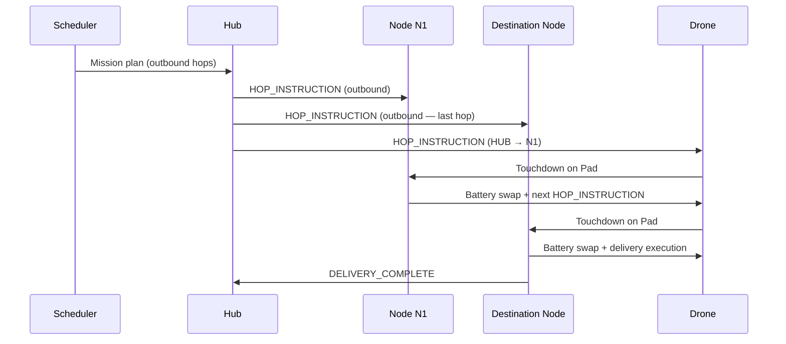
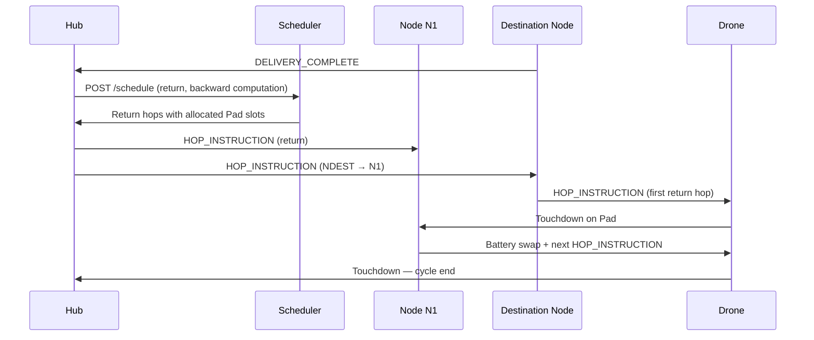
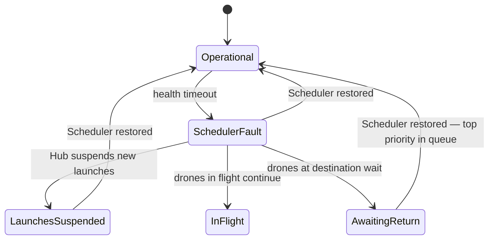

# Software Architecture
## Supply Open Sky

*Version 0.4 — April 2026*

---

> *This document is an adapted public version of an internal working specification maintained in the Supply Open Sky private repository. References to internal-only documents have been preserved as labels without links. The Italian working draft is available on request.*

---

## Table of Contents

1. [Overview](#1-overview)
2. [Component Map](#2-component-map)
3. [Physical Deployment](#3-physical-deployment)
4. [Operational Model: Hop-by-Hop](#4-operational-model-hop-by-hop)
5. [Interfaces](#5-interfaces)
6. [Main Data Structures](#6-main-data-structures)
7. [Technology Stack](#7-technology-stack)
8. [Fault Handling](#8-fault-handling)
9. [Open Questions](#9-open-questions)
10. [Revision Log](#10-revision-log)

---

## 1. Overview

This document describes the software architecture of the Supply Open Sky system. It defines the system components, their physical deployment, the interfaces between them, and the technology stack adopted.

Supply Open Sky is an autonomous drone delivery network with a tree topology. Operational intelligence resides in the Hub, but mission execution is **distributed along the network**: each Node instructs the drone for the next hop at the moment of touchdown. The drone does not carry a complete mission plan, only the instruction for the **next hop**.

---

## 2. Component Map

The system is composed of **six** software components.

| Component | Process Name | Runs On | Language |
|---|---|---|---|
| Hub | `sos-hub` | Hub Server (on-premise) | TypeScript / Node.js |
| Scheduler | `sos-scheduler` | Hub Server (separate process) | Python |
| Dashboard | `sos-dashboard` | Browser (served by `sos-hub`) | React + TypeScript |
| Simulator | `sos-simulator` | Development / test machine | Python |
| Drone Firmware | `sos-drone` | Drone Companion Computer (RPi Zero 2W) | Python |
| Node Firmware | `sos-node` | Raspberry Pi (one per Node) | Python |

> **Note:** `sos-simulator` is not a production component. It impersonates hardware (drones, nodes, sensors) by calling the same `sos-hub` REST endpoints that real hardware would use. It enables end-to-end validation of the system before hardware availability. Architectural detail in [hub-architecture-spec](./hub-architecture-spec.md).

> **Note:** `sos-lora` does not exist as a separate component. The Reticulum stack (LoRa 868 MHz over RNode module) is integrated directly into `sos-node` and `sos-drone` as a communication layer. It is not an autonomous process. See *internal RNode integration specification* and [communication-protocol-spec](../04_communication-protocol/communication-protocol-spec.md).

---

## 3. Physical Deployment

<picture>
  <source media="(prefers-color-scheme: dark)" srcset="assets/software-architecture-deployment-dark.svg">
  
</picture>

---

## 4. Operational Model: Hop-by-Hop

The drone **does not carry a complete Mission Plan**. The operational model is distributed: each Node along the network holds the instruction for the next hop of the drone in transit.

Hop Instructions split into two categories with distinct life cycles:

- **Outbound hops:** planned by the Scheduler and distributed to Nodes *before drone launch*.
- **Return hops:** planned by the Scheduler *at runtime*, upon receipt of the `DELIVERY_COMPLETE` signal, and distributed to Nodes immediately afterwards. This holds for both Flight Modes:
  - **SCHEDULED:** `DELIVERY_COMPLETE` originates from the destination Node.
  - **ON-DEMAND:** `DELIVERY_COMPLETE` originates from the drone at GPS coordinates (via LoRa Mesh relay). If the Pad of the `return_node` is free, the drone flies directly to the Pad; if it is occupied, the drone holds in the ELZ with top priority (→ [scheduling-algorithm-spec](../03_scheduling-algorithm/scheduling-algorithm-spec.md) §4.6).

This decoupling is necessary because the duration of destination operations (water discharge, cargo drop) is variable and not predictable at the time of initial planning. Planning the return on the actual delivery confirmation guarantees that Pad slots on the Nodes along the return path — particularly those closer to the Hub, which experience more congestion — are allocated on real data rather than estimates.

### Outbound flow

### Return flow

### Waiting and priority handling

If a Node has not yet received the Hop Instruction at the moment the drone arrives (degraded communication or delay in return planning), the drone holds on the Pad and the Node sends `DRONE_WAITING` to the Hub.

The Scheduler manages a **priority queue** of planning requests: a drone holding on a Pad has priority over any new mission in the queue. This guarantees that Pads occupied by holding drones are freed as quickly as possible, without introducing arbitrary timeout thresholds.

---

## 5. Interfaces

### 5.1 Hub ↔ Scheduler (REST API — internal)

The Hub and the Scheduler communicate via a local REST API. The Scheduler exposes a minimal set of endpoints; the Hub is the sole consumer.

| Method | Endpoint | Direction | Description |
|---|---|---|---|
| `POST` | `/schedule` | Hub → Scheduler | Planning request. Handles both initial planning (outbound hops, pre-launch) and return planning (triggered by `DELIVERY_COMPLETE`). Payload: topology snapshot, Node state, queued missions. |
| `GET` | `/schedule/{id}` | Hub → Scheduler | Polling on the status of an in-progress computation. |
| `GET` | `/health` | Hub → Scheduler | Liveness check. Used by the Hub fallback mechanism. |

### 5.2 Hub ↔ Node (LoRa Mesh)

The Hub communicates with each Node via the LoRa Mesh / Reticulum network. Messages are asynchronous and low-bandwidth. The complete protocol is defined in [communication-protocol-spec](../04_communication-protocol/communication-protocol-spec.md) — this table reports the principal messages with their official identifiers.

| Direction | Message Type (ID) | Description |
|---|---|---|
| Hub → Node | `CTL_NODE_PREP` (M-02) | Prepare the Node to receive an expected drone: reserved Pad and hop instruction to be delivered to the Companion at touchdown. |
| Hub → Node | `CTL_WATER_QUOTA_UPDATE` (M-03) | In-flight update of the water quota for a specific Node. |
| Hub → Node | `TEL_REQUEST` (M-19) | On-demand request for fresh telemetry during pre-flight. |
| Hub → Node | `CTL_HOLD` (M-17) | Mission suspension: the drone completes the current hop and waits on the Pad. |
| Hub → Node | `CTL_RESUME` (M-18) | Resume after CTL_HOLD, includes the new first hop. |
| Node → Hub | `TEL_SENSOR_REPORT` (M-06) | Current water tank level. |
| Node → Hub | `TEL_BATTERY_STATUS` (M-07) | Status of the rack battery stock. |
| Node → Hub | `TEL_HEARTBEAT` (M-09) | Periodic presence and operational status signal. |
| Node → Hub | `TEL_WEATHER_REPORT` (M-08) | Local weather conditions (if sensors are available). |
| Node → Hub | `EVT_DRONE_ARRIVED` (M-11) | Drone touchdown notification on Pad (drone id, real timestamp). |
| Node → Hub | `EVT_DELIVERY_COMPLETE` (M-10) | Delivery completed — propagation of the message received from the Companion. Triggers return planning in the Scheduler. |

### 5.3 Node ↔ Drone (LoRa Mesh / Reticulum — local link)

The Node and the drone Companion Computer communicate via local Reticulum link on the same LoRa 868 MHz channel. There is no separate RF channel: the same radio infrastructure used for the mesh backbone is used for the direct Node ↔ Companion link.

| Direction | Message Type (ID) | Description |
|---|---|---|
| Node → Companion | `CTL_HOP_INSTRUCTION` (M-01) | Instruction for the next hop: destination Node or GPS coordinates, reserved Pad, water quota. Delivered at touchdown. |
| Companion → Node | `TEL_DRONE_STATUS` (M-05) | Position, mission phase, battery level, residual water. Sent periodically during flight toward the HUB (the Node acts as relay). |
| Companion → Node | `EVT_DELIVERY_COMPLETE` (M-10) | Delivery confirmation sent to the destination Node; the Node propagates it to the HUB. |
| Companion → HUB (via Node relay) | `CTL_HOP_REQUEST` (M-20) | Recovery: the Companion has not received CTL_HOP_INSTRUCTION within timeout; the HUB responds directly. |

---

## 6. Main Data Structures

The formal schemas are defined in [scheduling-algorithm-spec](../03_scheduling-algorithm/scheduling-algorithm-spec.md). The conceptual structures are reported below.

### 6.1 Topology

The network is represented as a tree. Each graph node corresponds to a physical Node; the root is the Hub.

| Field | Type | Description |
|---|---|---|
| `id` | `string` | Node identifier (e.g., `N1`, `N1.1.2`). The root is `HUB`. |
| `name` | `string` | Human-readable name assigned to the deployment (e.g., `VillageA`). |
| `parent_id` | `string \| null` | Parent Node ID. `null` for the Hub. |
| `segment_distance_km` | `float` | Distance from the parent Node in km. |
| `pad_count` | `int` | Number of Landing Pads (currently always 2). |
| `tank_capacity_l` | `float` | Water tank capacity in litres. |

### 6.2 Hop Instruction

The atomic unit of instruction distributed to Nodes and to the drone. There is no monolithic "Mission Plan" on the drone: the mission is the sequence of Hop Instructions distributed along the network.

| Field | Type | Description |
|---|---|---|
| `mission_id` | `string` | Identifier of the parent mission. |
| `drone_id` | `string` | Drone the instruction is destined to. |
| `hop_sequence` | `int` | Progressive number of the hop within the mission (for ordering and traceability). |
| `destination_node_id` | `string \| null` | Destination Node. `null` for GPS drops (ON-DEMAND missions). |
| `destination_gps` | `LatLon \| null` | GPS coordinates. `null` for hops toward fixed Nodes. |
| `action` | `LAND \| DROP \| RETURN` | Action to be executed on arrival. |
| `water_release_l` | `float \| null` | Quantity of water to release (WATER missions only). |
| `valid_until` | `datetime` | Instruction expiry. Past this deadline the Node discards it and notifies the Hub. |

### 6.3 Mission (Hub/Scheduler-side)

The complete mission concept exists only on the Hub and Scheduler side, which see the entire hop sequence.

| Field | Type | Description |
|---|---|---|
| `mission_id` | `string` | Unique identifier. |
| `flight_mode` | `SCHEDULED \| ON-DEMAND` | Operational logic of the flight. |
| `mission_type` | `WATER \| MEDICAL \| POSTAL \| SUPPLY` | Type of payload. |
| `drone_id` | `string` | Assigned drone. |
| `hops` | `HopInstruction[]` | Ordered sequence of hops composing the mission. |
| `status` | `PLANNED \| ACTIVE \| WAITING \| COMPLETE \| FAILED` | Current mission status. |
| `created_at` | `datetime` | Planning timestamp. |

---

## 7. Technology Stack

| Component | Language | Runtime / Platform | Main libraries (indicative) |
|---|---|---|---|
| `sos-hub` | TypeScript | Node.js 20 LTS | Express, Axios, Winston |
| `sos-scheduler` | Python 3.11+ | CPython | NetworkX, FastAPI, Pydantic |
| `sos-drone` | Python 3.11+ | Raspberry Pi OS Lite (RPi Zero 2W) | `rns` (Reticulum), `pymavlink`, `RPi.GPIO`, `msgpack` |
| `sos-node` | Python 3.11+ | Raspberry Pi OS Lite (RPi 3B+/4) | `rns` (Reticulum), `RPi.GPIO`, `msgpack` |

> The libraries listed are indicative. Definitive choices will be confirmed at the start of implementation of each component.

> **Radio module (all physical components):** Heltec LoRa32 V3/V4 or RAK4630 on WisBlock with RNode 1.85 firmware, connected via USB. LoRa parameters: SF10, BW 125 kHz, CR 4/8, 868 MHz, 14 dBm. See *internal RNode integration specification*.

---

## 8. Fault Handling

### 8.1 Scheduler fault

If `sos-scheduler` does not respond to `/health` within the configured timeout:

- **Drones in flight:** continue normally. The Nodes already hold the outbound Hop Instructions distributed before launch.
- **Drones at destination awaiting return planning:** remain on the Pad. `DELIVERY_COMPLETE` was received by the Hub but the Scheduler is not available to compute the return. The drone holds with top priority in the queue as soon as the Scheduler is restored.
- **New launches:** suspended until Scheduler restoration.
- **Hub:** logs the event, notifies the operator, awaits restoration.

### 8.2 Degraded Hub ↔ Node communication

If a Node does not receive the Hop Instruction before drone arrival:

- The drone holds on the Pad (`DRONE_WAITING` message to Hub).
- The Node continues to attempt reception via LoRa Mesh.
- When the instruction arrives, the Node delivers it to the drone and the flight resumes.
- The Hub records the delay with timestamp for recalibration of the next schedule.

### 8.3 Node fault

The fault of a Node blocks all drones transiting through that segment. No alternative routing path is provided at the drone level (the topology is a tree). Handling is operational: the Hub flags the fault and suspends missions on the affected branch. Contingency procedures are documented in *internal contingency procedures*.

---

## 9. Open Questions

| # | Question | Blocks | Resolved in |
|---|---|---|---|
| 1 | ~~LoRa mesh protocol selection~~ — **CLOSED**: Reticulum over LoRa 868 MHz | — | Closed in Communication Protocol spec v0.1 |
| 2 | **PARTIALLY CLOSED** — Companion Computer confirmed: RPi Zero 2W + Python + Reticulum + pymavlink. Flight Controller: ArduPilot in GUIDED mode (primary candidate, hardware selection still open). See *internal drone hardware specifications* and *internal companion firmware specification*. | Definitive FC selection | A future revision dedicated to drone hardware selection |
| 3 | On-premise Hub server hardware specification | Deployment sizing | A future revision dedicated to deployment procedures |
| 4 | Internal Hub ↔ Scheduler REST API authentication | Security posture (low priority on local network) | To be evaluated at implementation time |
| 5 | Timeout mechanism and discard policy for expired Hop Instructions | Behaviour in degraded communication scenarios | [scheduling-algorithm-spec](../03_scheduling-algorithm/scheduling-algorithm-spec.md) |

---

## 10. Revision Log

| Version | Date | Author | Notes |
|---|---|---|---|
| 0.1 | March 2026 | Matteo Casavecchia | First draft. Component map, hop-by-hop model, interfaces, data structures, stack. |
| 0.2 | March 2026 | Matteo Casavecchia | Outbound/return hop distinction. Runtime return planning on DELIVERY_COMPLETE. Scheduler priority queue. Updated LoRa Mesh messages, /schedule endpoint, section 8.1. |
| 0.3 | April 2026 | Matteo Casavecchia | Added `sos-dashboard` and `sos-simulator` to the component map. Updated physical deployment Mermaid diagram. Closed open question #1 (Reticulum). Added reference to `hub-architecture-spec.md`. |
| 0.4 | April 2026 | Matteo Casavecchia | Alignment with confirmed architecture: `sos-drone` Python on RPi Zero 2W (not C/C++); `sos-lora` removed as a separate component (Reticulum integrated into `sos-node` and `sos-drone`); Node↔Drone interface updated from "RF Control Link" to LoRa Mesh / Reticulum local link; message names aligned with the official IDs of `communication-protocol-spec.md`; technology stack updated. |
