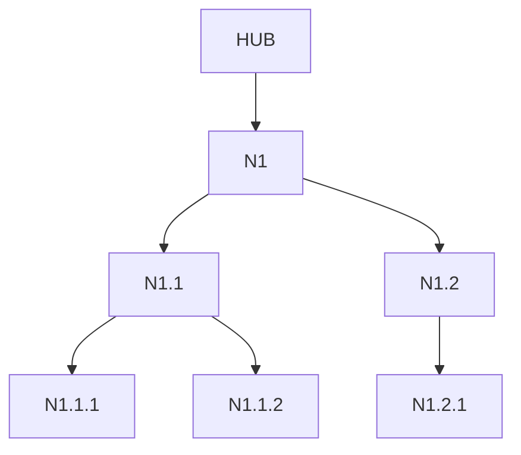
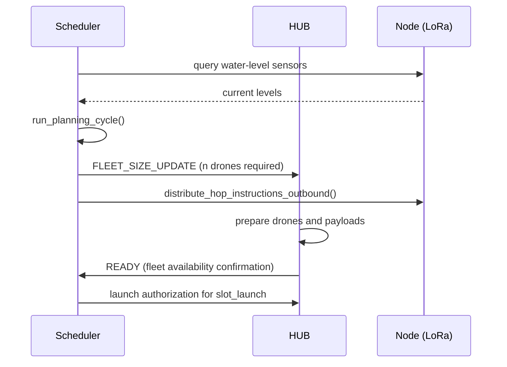
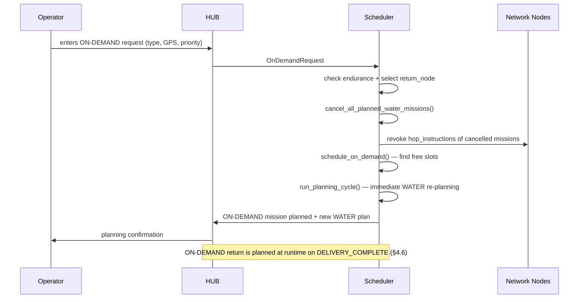

# Scheduling Algorithm Specification
## Supply Open Sky

*Version 0.4 — April 2026*

---

> *This document is an adapted public version of an internal working specification maintained in the Supply Open Sky private repository. References to internal-only documents have been preserved as labels without links. The Italian working draft is available on request.*

---

## Table of Contents

1. [Topology Data Model](#1-topology-data-model)
2. [Time Model and Resource Reservation](#2-time-model-and-resource-reservation)
3. [SCHEDULED Algorithm](#3-scheduled-algorithm)
4. [ON-DEMAND Algorithm](#4-on-demand-algorithm)
5. [Off-cycle Drone Management](#5-off-cycle-drone-management)
6. [Scheduler REST API](#6-scheduler-rest-api)
7. [SQLite Database Schema](#7-sqlite-database-schema)
8. [Revision Log](#8-revision-log)

---

## 1. Topology Data Model

### 1.1 Fundamental entities

#### Node

Represents both the HUB and any node of the network. The HUB is a Node with `parent_id = null`.

```
Node {
  id          : string       // "HUB", "N1", "N1.2.1"
  name        : string       // human-readable name of the deployment (e.g. "VillageA")
  parent_id   : string|null  // null only for HUB
  gps_lat     : float
  gps_lon     : float
  pad_count   : int          // number of physical landing pads — always 2 (fixed hardware constraint)
}
```

> **Note:** `pad_count` is a fixed hardware constraint: each Node is equipped with exactly 2 landing pads. Increased operational capacity at hub-proximal Nodes — the points of maximum return-time pressure — is achieved by installing adjacent Nodes, not by increasing `pad_count` on existing Nodes.

#### Segment

Direct connection between a Node and its parent. In a tree, every Node (except HUB) has exactly one Segment toward the parent.

```
Segment {
  from_node_id    : string   // child Node
  to_node_id      : string   // parent Node (HUB direction)
  distance_km     : float
  travel_time_min : float    // computed at topology load time
}
```

`travel_time_min` is deterministic and pre-computed at deployment time:

```
travel_time_min = (distance_km / DRONE_CRUISE_SPEED_KMH) * 60 * (1 + TRAVEL_MARGIN)
```

#### DroneSpec

Endurance and performance profile associated with a drone type. The system supports heterogeneous fleets: distinct DroneSpec entries make it possible to plan missions with aircraft of different operational characteristics.

```
DroneSpec {
  drone_type_id    : string  // e.g. "CLASS-B-STD", "CLASS-B-HEAVY"
  cruise_speed_kmh : float   // cruise speed in km/h
  max_flight_min   : float   // maximum endurance at full payload, in minutes
  travel_margin    : float   // deterministic margin on flight times (e.g. 0.05 = 5%)
}
```

Each physical drone in the fleet is associated with a `DroneSpec`. The global parameters `DRONE_CRUISE_SPEED_KMH`, `TRAVEL_MARGIN` and `DRONE_MAX_FLIGHT_MIN` (§2.1) are the reference values for the standard drone type; specific DroneSpec entries override them for heterogeneous fleets.

#### Global physical parameters

| Parameter | Default | Description |
|---|---|---|
| `DRONE_CRUISE_SPEED_KMH` | `35.0` | Reference cruise speed in km/h — default for the standard drone type; overridable per drone type in `DroneSpec` |
| `TRAVEL_MARGIN` | `0.05` | Deterministic margin on flight times (5%) — default for the standard drone type; overridable in `DroneSpec` |

---

### 1.2 Per-Node configuration

Each Node has a set of initialization variables describing its operational capacity at deployment time:

```
NodeConfig {
  node_id               : string
  battery_slots_total   : int    // physical slots in the charging rack (uniform across Nodes)
  battery_initial_count : int    // batteries actually loaded at deployment
                                 // (e.g. 22 for N1, 8 for a leaf Node)
}
```

> **Deployment note:** hub-proximal Nodes (N1, N1.1...) must be initialized
> with a battery count close to equilibrium (see §2.4). Leaf Nodes can
> be initialized with reduced stock to avoid immobilizing batteries unnecessarily.

---

### 1.3 In-memory tree structure

The scheduler loads the topology at startup and maintains it as a navigable tree. The fundamental operations are:

- `path_to_hub(node_id)` — ordered list of Nodes from `node_id` up to HUB, both ends included. It is the return path of any mission; it determines the sequence of Pads that will be occupied on return.
- `children(node_id)` — direct children of a Node. Used for local graph navigation and for the distribution of outbound Hop Instructions.
- `ancestors(node_id)` — Nodes between `node_id` and HUB, excluding the Node itself. Subset of `path_to_hub`; identifies the transit Nodes to notify in case of an early return.
- `leaves()` — all Nodes without children. Natural candidates as the final destination of SCHEDULED missions (the actual role is determined by the Mission Plan, not by topology).
- `subtree(node_id)` — all descendants of `node_id`, root included. Used to determine the set of planned missions impacted by a fault or by an operational change on a Node: if a Node becomes unreachable, all missions toward Nodes in its subtree must be re-evaluated by the scheduler.

These operations are the core of planning: each launch evaluation requires the computation of the entire sequence of Pads that will be occupied along the route.

**Topology example:**



---

### 1.4 Topology updates

The topology is **append-only**: Nodes can be added (new branches or extensions of existing branches), but neither moved nor removed.

Updates happen via **hot reload** through the API (§6). Flights in execution are not impacted because their slots are already reserved. The new topology is used exclusively for planning future flights.

---

### 1.5 Architectural boundary with the communication layer

The timeout parameters that govern the behaviour of the LoRa network — `HOP_INSTRUCTION_TIMEOUT_S`, `NODE_HEARTBEAT_TIMEOUT_S`, `ABORT_RESPONSE_TIMEOUT_S` and the others defined in [communication-protocol-spec](../04_communication-protocol/communication-protocol-spec.md) §7.1 — are owned exclusively by the communication layer. **The scheduler neither knows nor uses these parameters.**

The scheduler receives **already-interpreted events** from the Hub application layer: `DELIVERY_COMPLETE`, `PAYLOAD_EXHAUSTED_AT`, `NODE_UNREACHABLE`. It has no visibility on timeouts or on the underlying network mechanisms. The Hub application layer is responsible for observing the network, applying timeouts and translating degradation states into events the scheduler can consume.

This boundary keeps the scheduler **decoupled from the physical layer and from the communication technology**: changes to network timeouts, to the radio protocol or to the degradation strategy do not require changes to the scheduler.

---

### 1.6 Fleet data model

The entities in this section represent the **physical mobile assets** of the network: drones and
flight batteries. They are distinct from topological entities (§1.1–1.2) and are loaded
into the DB through `sos-simulator seed` at deployment time.

#### Enum DroneType

| Value | Description |
|---|---|
| `WATER` | Drone with fixed 10L tank — WATER/SCHEDULED missions |
| `SUPPLY` | Drone with modular cargo slot, max 10kg — MEDICAL/POSTAL/SUPPLY missions |
| `BATTERY_SWAP` | Drone dedicated to recall of RECALLED/FAULTY batteries — physical mechanism TBD |

#### Enum BatteryStatus

| Value | Description |
|---|---|
| `IN_RACK` | Battery in a Rack Slot of a Node, ready for use (fully charged) |
| `CHARGING` | Battery in a Rack Slot in charging phase. The `charge_ready_slot` field indicates the slot at which it will be ready. Automatically flipped to `IN_RACK` at the beginning of `run_planning_cycle` when `slot_now >= charge_ready_slot` |
| `IN_FLIGHT` | Battery currently aboard a drone in flight |
| `RECALLED` | Battery flagged for recall (verification or replacement) |
| `FAULTY` | Faulty battery — excluded from swap cycles |
| `DECOMMISSIONED` | Battery permanently decommissioned |

#### DroneDevice

Physical instance of a drone in the fleet. Distinct from `DroneSpec` (§1.1), which describes the
performance profile of the model: `DroneDevice` tracks the identity and operational state
of the individual aircraft.

```
DroneDevice {
  id                  : string       // "DRN-001", "DRN-002"
  drone_type          : DroneType    // WATER | SUPPLY | BATTERY_SWAP
  model_id            : string       // reference to DroneSpec.drone_type_id
  status              : string       // ACTIVE | INACTIVE | MAINTENANCE
  current_battery_id  : string|null  // battery aboard (null if none)
}
```

#### BatteryModel

Definition of the battery model. Shared by all physical instances of the same type.

```
BatteryModel {
  id           : string   // "TB60-placeholder"
  capacity_wh  : float
  max_cycles   : int      // cycle threshold for scheduled maintenance
}
```

#### Battery

Physical instance of a flight battery. Mobile asset tracked individually for the
complete life cycle: from commissioning to decommissioning.

```
Battery {
  id                    : string          // "BAT-N1-001"
  model_id              : string          // reference to BatteryModel
  status                : BatteryStatus
  cycles_at_commission  : int             // cycles at commissioning
  cycle_count           : int             // total cycles accumulated
  current_node_id       : string|null     // current Node (null if IN_FLIGHT)
  current_drone_id      : string|null     // current drone (non-null only if IN_FLIGHT)
  current_slot_id       : string|null     // current Rack Slot (null if not in rack)
}
```

> **IN_FLIGHT state:** when a battery is aboard a drone in flight,
> `current_node_id = null` and `current_drone_id` is populated. Upon landing
> at the Node, `current_drone_id` reverts to null and `current_node_id` /
> `current_slot_id` are updated. Handling of this intermediate state is
> tracked separately in internal documentation.

#### BatterySlot

Physical Rack Slot in the charging rack of a Node. No RFID hardware: the
battery–slot assignment is tracked entirely in software.

```
BatterySlot {
  slot_id     : string        // "RACK-{nodeId}-{NN}", e.g. "RACK-N1-01"
  node_id     : string
  battery_id  : string|null   // null if slot is empty
}
```

#### BatteryEvent

Log of life-cycle events of a battery. Complementary to `events_log` (§7.7),
which tracks events at mission level: `battery_events` tracks events at the level
of the individual physical asset.

```
BatteryEvent {
  id          : int
  battery_id  : string
  event_type  : string    // COMMISSIONED | SWAP_DEPLOYED | SWAP_RETURNED |
                          // RECALLED | FAULT_DETECTED | DECOMMISSIONED
  slot        : int       // scheduler slot of the event
  drone_id    : string|null
  node_id     : string|null
  detail      : string|null
  created_at  : int
}
```

---

## 2. Time Model and Resource Reservation

### 2.1 Global parameters

| Parameter | Default | Description |
|---|---|---|
| `PAD_SLOT_DURATION` | `360` | Slot duration in seconds (6 minutes) |
| `BATTERY_CHARGE_SLOTS` | `10` | Slots needed to fully charge a battery (60 min) |
| `SCHEDULE_STEP` | `1` | Search increment, in slots |
| `SCHEDULE_HORIZON` | `30` | Maximum search horizon, in slots (3 hours) |
| `PLANNING_CYCLE_SLOTS` | `5` | Re-execution frequency of the planning cycle (30 min) |
| `LAUNCH_STAGGER_SLOTS` | `2` | Minimum slot distance between two consecutive launches from HUB. Prevents multiple drones from flying the same segment in lockstep |
| `PAD_DWELL_SLOTS` | `2` | Slots of permanence on the Pad for a battery swap. Included in the cumulative computation of times between successive hops, so that reservations at downstream Nodes reflect the drone's actual arrival |

> **Implementation:** the global scheduler parameters are defined as **Pydantic models** in the `config.py` file. Pydantic validation guarantees the consistency of values at load time: type errors or out-of-range values produce explicit exceptions before system startup.

---

### 2.2 Slot index

Absolute time is converted to a discrete integer index:

```
slot_index(t) = floor((t - T_EPOCH) / PAD_SLOT_DURATION)
```

`T_EPOCH` is the system startup timestamp. From this point on, the scheduler reasons **exclusively in slots**, not in seconds.

The conversion of flight time to slots happens as follows:

```
travel_slots(segment) = ceil(travel_time_min(segment) * 60 / PAD_SLOT_DURATION)
```

---

### 2.3 The two timelines per Node

For each Node the scheduler maintains two parallel and independent timelines.

#### Pad timeline

Tracks the physical occupation of the landing pads:

```
PadReservation {
  node_id    : string
  pad_index  : int        // 0 or 1
  drone_id   : string
  mission_id : string
  slot_start : int
  slot_count : int        // normally 1; can be >1 in extended-waiting scenarios
}
```

#### Battery timeline

Tracks the availability of charged batteries at a given future `target_slot`. The **source of truth is the `batteries` table** (`status` + `charge_ready_slot` fields), not a proxy based on Pad reservations:

```
batteries_available(node, target_slot, slot_now) =
    baseline                 # batteries physically ready at target_slot
  − future_consumed           # Pad reservations between slot_now and target_slot
  + future_recharged          # Pad reservations whose returning battery
                              # will have completed charging by target_slot
```

where:

```
baseline = COUNT(*) FROM batteries
           WHERE current_node_id = node
             AND ( status = 'IN_RACK'
                 OR (status = 'CHARGING' AND charge_ready_slot <= target_slot) )

future_consumed  = COUNT(pad_reservations)
                   WHERE node_id = node
                     AND slot_start >= slot_now
                     AND slot_start <= target_slot

future_recharged = COUNT(pad_reservations)
                   WHERE node_id = node
                     AND slot_start >= slot_now
                     AND slot_start + BATTERY_CHARGE_SLOTS <= target_slot
```

In words: we start from the DB state of batteries (`IN_RACK` now + `CHARGING` ones that will be ready by `target_slot`), subtract the incoming Pad reservations (each will consume a battery), and add the reservations placed early enough that the returning battery will be fully recharged by `target_slot`.

**Lifecycle of a `CHARGING` battery:**

1. A `POST /batteries/swap` event received by the Hub transitions the incoming battery from `IN_FLIGHT` to `CHARGING` and writes `charge_ready_slot = slot_now + battery_charge_slots`. The scheduler is the only writer of this field.
2. At the beginning of every `run_planning_cycle`, the scheduler automatically flips to `IN_RACK` (with `charge_ready_slot = NULL`) all `CHARGING` batteries whose deadline has been reached, emitting a `CHARGE_COMPLETE` event in `battery_events` as audit trail. No external event from the Node is needed: the DB is self-sufficient with respect to planning.

---

### 2.4 Battery sizing — equilibrium formula

In stationary regime, with both Pads always occupied, the number of batteries required to sustain maximum throughput without ever exhausting stock is:

```
B_equilibrium = pad_count × (1 + BATTERY_CHARGE_SLOTS)
              = 2 × (1 + 10)
              = 22
```

The formula generalizes to any configuration:

```
B_equilibrium = pad_count × (1 + BATTERY_CHARGE_SLOTS)
```

> Nodes that are never under sustained maximum throughput can be initialized
> with a lower stock. The value 22 is the upper bound for Nodes with `pad_count = 2`.

---

### 2.5 Safety invariant

For each Node, for each slot, **both** of the following conditions must hold:

```
∀ node, ∀ slot :

  [PAD]      Σ pad_reservations active in slot  ≤  node.pad_count

  [BATTERY]  batteries_available(node, slot)    ≥  1
```

The scheduler emits **no reservation** that would violate either condition on any Node along the route.

---

### 2.6 Reservation algorithm

The reservation is **atomic**: either all Nodes on the route are reserved together, or none of them.

`try_reserve` accepts an optional `skip_hub_landing` parameter (default: `False`). When `True`, the last element of the route is HUB but **no Pad reservation is emitted on HUB**: the drone will land in Area B without occupying a Pad in Area A. This applies exclusively to ON-DEMAND mission returns (→ §4.6).

```
function try_reserve(route, slot_desired, skip_hub_landing=False):
  slot_candidate = slot_desired

  while slot_candidate ≤ slot_desired + SCHEDULE_HORIZON:

    valid = true
    cumulative = 0
    for i, node in enumerate(route):
      if i == 0: continue          // launch Node — no reservation

      // Skip Pad reservation on HUB for ON-DEMAND returns:
      // the drone lands in Area B, not on an Area A Pad.
      if skip_hub_landing and i == len(route) - 1 and node.id == 'HUB':
        continue

      // Dwell time: the drone spends PAD_DWELL_SLOTS on the Pad of the
      // previous Node (battery swap) before taking off toward this Node.
      // It does not apply to the first hop (launch from the launch Node).
      if i > 1:
        cumulative += PAD_DWELL_SLOTS

      cumulative += travel_slots(segment(route[i-1], node))
      slot_arrival = slot_candidate + cumulative

      if not pad_free(node, slot_arrival):
        valid = false; break
      if not battery_available(node, slot_arrival):
        valid = false; break

    if valid:
      commit_all_reservations(route, slot_candidate, skip_hub_landing)
      return slot_candidate

    slot_candidate += SCHEDULE_STEP

  return UNSCHEDULABLE
```

> **Note:** the cumulative computation includes `PAD_DWELL_SLOTS` after each intermediate Node to account for the physical dwell time (battery swap + DroneAgent departure latency). Without this offset, reservations end up advanced relative to actual arrival, causing mismatches during the landing phase.

> **Note on `skip_hub_landing`:** even with the flag active, intermediate Nodes on the ON-DEMAND return path normally execute the battery swap and Pad reservation. The difference concerns only the last hop toward HUB: the cargo/battery drone lands in Area B and requires neither a Pad nor a battery from HUB.

If the result is `UNSCHEDULABLE`, the scheduler emits an event toward HUB for manual handling.

---

### 2.7 Extended waiting on Pad

In scenarios of degraded communication or unforeseen congestion, a drone may remain on a Pad for more than one slot. This case is not planned in advance by the scheduler: the initial reservation is always 1 slot; if needed, the Node updates the scheduler, which extends the existing reservation (`slot_count > 1`) at event time.

> *Whether the ELZ can be used as an operational buffer to free the Pad in
> cases of extended waiting — avoiding extension of the active reservation —
> is tracked in the internal hardware roadmap.*

---

---

## 3. SCHEDULED Algorithm

### 3.1 Configuration of SCHEDULED missions

SCHEDULED missions are configured at deployment time for each Node that must be served. **The target is not restricted to leaves**: any Node with `tank_capacity_l > 0` (leaf or intermediate) can have its own `NodeScheduleConfig` and receive dedicated missions. The model was historically leaf-only and has been extended to support intermediate Nodes serving local communities. The configuration is static but modifiable via manual API operation (§6).

```
NodeScheduleConfig {
  node_id           : string   // ID of the destination Node (leaf or intermediate with tank)
  interval_slots    : int      // minimum interval between successive missions (in slots)
  sensor_threshold  : float    // water-level % below which an early trigger fires
                               // (0.0–1.0, e.g. 0.20 = below 20% of capacity)
  enabled           : bool     // allows temporarily disabling the Node
}
```

> **Note:** `interval_slots` defines the normal service frequency. For example,
> `interval_slots = 20` corresponds to one mission every 2 hours (20 slots × 6 min).
>
> **Implementation note:** the Pydantic class in code is still named `LeafScheduleConfig`
> for backward compatibility; the internal field is `node_id`, not `leaf_node_id`. The DB
> table is named `node_schedule_configs` (§7.2).

---

### 3.2 Rolling horizon and planning cycle

The scheduler operates on a **rolling 3-hour horizon**, recomputing the plan at every planning cycle.

| Parameter | Default | Description |
|---|---|---|
| `ROLLING_HORIZON_SLOTS` | `30` | Planning horizon in slots (3 hours) |
| `PLANNING_CYCLE_SLOTS` | `5` | Re-execution frequency of the planning cycle (30 min) |

At each planning cycle the scheduler:

1. Reads the current horizon: `[slot_now, slot_now + ROLLING_HORIZON_SLOTS)`
2. Identifies all SCHEDULED missions to insert in the horizon (§3.3)
3. Plans the missions in batch (§3.5)
4. Inserts ON-DEMAND missions in the remaining free slots (§4)

The cycle repeats every `PLANNING_CYCLE_SLOTS`. Reservations already emitted are not cancelled except on explicit manual cancellation (§3.7).

---

### 3.3 Hybrid trigger: frequency + sensors + water-in-flight gate

For each `NodeScheduleConfig`, the scheduler decides whether to insert a mission in the current horizon according to three rules applied in sequence:

```
function needs_mission(config, slot_now):

  current_level = last_known_level(config.node_id)   // via LoRa Mesh, ratio 0..1
  node_cfg      = topology.configs[config.node_id]   // tank_capacity_l, fill_target_ratio

  // Water-in-flight projection gate
  // Sums litres planned toward this Node by missions in PLANNED or IN_FLIGHT
  // (= not yet arrived at target) and projects the ratio at arrival time.
  // If the projection reaches fill_target_ratio, the Node is already "served":
  // further missions would produce over-delivery with tank clipping.
  if node_cfg.tank_capacity_l > 0 AND node_cfg.fill_target_ratio > 0:
    water_in_flight_l = Σ hop_instructions.water_release_l WHERE
                          destination_node_id = config.node_id
                          AND direction = OUTBOUND
                          AND mission.status IN (PLANNED, IN_FLIGHT)
    projected_ratio = current_level + water_in_flight_l / node_cfg.tank_capacity_l
    if projected_ratio ≥ node_cfg.fill_target_ratio:
      return NO_MISSION

  // Trigger B — critical sensor level
  // The critical fires only if, even after counting water-in-flight, the Node
  // remains below threshold: if the in-flight water restores safety, the
  // critical turns off by itself.
  if current_level < config.sensor_threshold:
    return TRIGGER_CRITICAL

  // Trigger A — minimum guaranteed frequency
  last_scheduled = last planned launch slot for config.node_id
  if (slot_now - last_scheduled) ≥ config.interval_slots:
    return TRIGGER_SCHEDULED

  return NO_MISSION
```

Missions with `TRIGGER_CRITICAL` have **higher priority** in batch planning and are scheduled before `TRIGGER_SCHEDULED` missions.

---

### 3.4 Pre-flight water-quota computation

Before each launch, the Hub queries the level sensors of all the Nodes on the route via LoRa Mesh. The Mission Plan is computed on these data.

**Route of a SCHEDULED mission toward target T (leaf or intermediate):**

```
route_outbound = [HUB, N_1, N_2, ..., N_k, T]   // HUB → target
route_return   = [T, N_k, ..., N_2, N_1, HUB]   // target → HUB
```

The target may be a leaf or any intermediate Node with `tank_capacity_l > 0` (cf. §3.1). "Intermediates" are the Nodes along `route_outbound[1..k]` that are not the target.

**Per-Node water configuration:**

```
NodeWaterConfig {
  node_id              : string
  tank_capacity_l      : float   // tank capacity in litres (configured at deploy time)
  fill_target_ratio    : float   // target level to reach in the tank (0.0–1.0)
                                 // e.g. 1.00 = the tank must be filled completely
                                 // (modifiable in real time via API)
}
```

| Parameter | Default | Description |
|---|---|---|
| `WATER_PAYLOAD_LITERS` | `10.0` | Water payload per WATER/SCHEDULED mission |

**Target-first, deepest-first rule:**

The payload is allocated according to two principles:

1. **Target-first** — absolute priority to the destination Node of the mission. The drop at the target is computed to bring the tank to `fill_target_ratio`, capped by the residual payload.
2. **Deepest-first residual** — any residual payload is distributed to the intermediates proceeding from the **deepest one toward the root** (from `route[-2]` toward `route[1]`), not the other way around.

This refactor resolved the problem of the greedy shallow-first water plan, which — in topologies with deep branches — exhausted the payload on the first intermediates, preventing more distant targets from being reached. With the new rule, targets always receive their full need when payload is sufficient, and deep intermediates are replenished before those near HUB (which typically receive more passthrough traffic from missions directed toward sub-branches).

**Per-Node need:**

```
need_i = max(0, tank_capacity(N_i) × fill_target_ratio(N_i) − current_level(N_i))
```

A Node with `tank_capacity_l == 0` or `fill_target_ratio == 0.0` is not eligible as a drop destination and is skipped in allocation.

**Allocation pseudocode:**

```
function compute_water_plan(route_outbound, payload):
  remaining = payload
  drops = { n.id: 0.0 for n in route_outbound[1:] }   // init to zero

  // Step 1: target (last Node on the route) — absolute priority
  target = route_outbound[-1]
  drops[target.id] = min(need(target), remaining)
  remaining -= drops[target.id]

  // Step 2: residual to the intermediates, deepest-first
  for N_i in reversed(route_outbound[1:-1]):   // from route[-2] toward route[1]
    if remaining == 0:
      break
    if tank_capacity(N_i) == 0 or fill_target_ratio(N_i) == 0:
      continue
    drop_i = min(need(N_i), remaining)
    drops[N_i.id] = drop_i
    remaining -= drop_i

  return drops
```

**Mission deferral check:**

If the total of usable drops on the route (`total_utilizable_l = Σ drops`) is **less than `WATER_PAYLOAD_LITERS`**, the mission is deferred: the route does not have a need sufficient to justify the trip. **Exception:** missions with `trigger_type = TRIGGER_CRITICAL` launch anyway, because safety has priority over efficiency.

**Behaviour when the payload is exhausted before the target:**

If the payload reaches zero at an intermediate Node before reaching the target (rare scenario after the refactor, but possible with small payloads and very empty intermediates), the drone does not proceed. It emits a `PAYLOAD_EXHAUSTED_AT` event and starts the early return (§3.5a). The unserved target will be included as `TRIGGER_CRITICAL` at the next planning cycle.

> **Stationary regime:** after the first cycles of operation, the tanks of intermediates
> approach `fill_target_ratio` and their `need_i` tends to zero. The payload is
> delivered almost entirely to the target, while intermediates maintain the threshold
> thanks to the passthrough flow of missions directed to deeper targets.

> **Fallback:** if LoRa communication is not available at launch time,
> the Hub uses the last valid reading available (with timestamp recorded).
> The Mission Plan is marked as `FALLBACK` for traceability.

---

### 3.5 Batch planning algorithm

Planning happens in batch over the entire rolling horizon. Missions are ordered by priority before being scheduled, so that critical cases are not penalized by congestion caused by ordinary missions planned earlier.

> **SCHEDULED return model:** batch planning reserves Pad slots **only for the
> outbound path** (HUB → leaf). Return slots are planned and reserved at runtime,
> upon receipt of the `DELIVERY_COMPLETE` signal from the destination (→ §3.5a).
> Likewise, return Hop Instructions are distributed to the Nodes only after
> `DELIVERY_COMPLETE`, not in pre-launch pre-distribution.
>
> This choice ensures that slots on hub-proximal Nodes — the ones most prone to
> return-time congestion — are allocated on real completion data, not on estimates.
> *Pre-estimation of the return as an early detection mechanism for hub-proximal
> congestion is tracked in the internal software roadmap.*

```
function run_planning_cycle(slot_now):

  // 0. State maintenance: flip CHARGING → IN_RACK for mature batteries
  auto_flip_charging_batteries(slot_now)

  // 1. Collect candidate missions
  candidates = []
  for each config in node_schedule_configs where config.enabled:
    trigger = needs_mission(config, slot_now)   // §3.3 — includes water-in-flight gate
    if trigger ≠ NO_MISSION:
      candidates.append({ config, trigger })

  // 2. Priority ordering (fairness sort)
  //    Three keys, in order:
  //    (a) TRIGGER_CRITICAL before TRIGGER_SCHEDULED (safety > equity)
  //    (b) Fairness: at equal trigger, the most "starved" Node (more slots
  //        since last planned mission) is served first
  //    (c) Tiebreak: increasing depth (shallow-first) at equal starvation
  //    Without key (b), the shallow-first sort caused the scheduler to
  //    converge on the most prolific branch, starving less populated sub-branches.
  starvation(cfg) = slot_now - (cfg.last_scheduled_slot ?? -cfg.interval_slots)
  candidates.sort(by: [
    0 if c.trigger = CRITICAL else 1,     // critical first
    -starvation(c.config),                 // most starved first (descending)
    depth(c.config.node_id),               // shallow first (tiebreak)
  ])

  // 3. Batch planning — outbound path only
  scheduled = []
  unschedulable = []

  next_slot_desired = slot_now   // stagger: advances after each launch

  for each candidate in candidates:
    route_outbound = build_outbound_route(candidate.config.node_id)
    //    route_outbound = [HUB, N_1, ..., N_k, target]
    //    The target may be a leaf or an intermediate (cf. §3.1).

    // Implementation note: create_mission runs BEFORE try_reserve because
    // pad_reservations has an FK on missions. The missions row must exist
    // in the DB before commit_all_reservations inserts the Pad reservations.
    // If try_reserve returns UNSCHEDULABLE, the just-created mission is deleted.
    mission = create_mission(candidate)
    result = try_reserve(route_outbound, next_slot_desired, mission.id)

    if result = UNSCHEDULABLE:
      delete_mission(mission.id)   // rollback: no reservation emitted
      unschedulable.append(candidate)
    else:
      scheduled.append(mission)
      distribute_hop_instructions_outbound(mission)
      // Pre-distribution of outbound hops only.
      // Return hops are planned and distributed on DELIVERY_COMPLETE (§3.5a).

      // Stagger: the next drone leaves at least LAUNCH_STAGGER_SLOTS after this one.
      next_slot_desired = result + LAUNCH_STAGGER_SLOTS

  // 4. Notify HUB of unschedulable missions
  if unschedulable not empty:
    emit_event(UNSCHEDULABLE_MISSIONS, unschedulable)

  return scheduled
```

**Pre-distribution of outbound Hop Instructions:** at planning time, the scheduler sends each Node on the outbound path the instruction for the next hop. The drone receives only the instruction for the first hop; each Node updates the drone at landing with the next hop.

---

### 3.5a Return planning on DELIVERY_COMPLETE

When the destination sends the `DELIVERY_COMPLETE` signal, the Hub forwards it to the scheduler, which plans and reserves the return path slots in real time.

```
function plan_return(mission_id, delivery_slot):
  mission      = get_mission(mission_id)
  target       = mission.target_node_id
  route_return = path_to_hub(target)
  // = [target, N_k, ..., N_1, HUB]

  result = try_reserve(route_return, delivery_slot)

  if result = UNSCHEDULABLE:
    // No slot available in the horizon: the drone holds at the leaf.
    // The priority queue ensures that this request precedes any new
    // launch until the holding drone has been reintegrated.
    enqueue_priority(mission_id, WAITING_RETURN)
    emit_event(RETURN_DELAYED, mission_id)
    return

  distribute_hop_instructions_return(mission, result)
  // Distribution of return Hop Instructions to the Nodes on the path.
```

> **Priority queue:** a drone holding for return at the leaf takes precedence
> over any new mission in the planning queue, so as to free the Pad as soon
> as possible without introducing arbitrary timeouts (→ [software-architecture, §4](../02_software-architecture/software-architecture.md#4-operational-model-hop-by-hop)).

---

### 3.6 Minimum operational fleet

The minimum fleet is not a parameter configured a priori: it is an **implicit output** of the batch planning algorithm. The number of drones simultaneously in flight in any slot is bounded by the Pad safety invariant (§2.5): the scheduler cannot reserve more slots than hub-proximal Nodes can absorb on return.

The number of drones effectively required to execute the plan is:

```
fleet_size = max concurrent drones across all slots in the horizon
           = derived from PadReservations emitted by batch planning
```

The value is computed retrospectively after each planning cycle and communicated to the Hub via a `FLEET_SIZE_UPDATE` event.



---

### 3.7 Manual cancellation of SCHEDULED missions

The operator can cancel a planned SCHEDULED mission via API (§6) to free slots for high-priority ON-DEMAND missions.

Cancellation:
- Releases **all** the `PadReservation` entries associated with the mission (outbound only, if the return is not yet planned)
- Updates the `BatteryState` (reserved batteries become available again)
- Notifies the Nodes involved via LoRa Mesh to revoke the already-distributed Hop Instructions
- Records the event in the log with timestamp and reason

> **Constraint:** it is not possible to cancel a mission whose launch has
> already happened (`IN_FLIGHT` state). In that case the operator can only
> monitor and intervene manually on the drone's return.

---

---

## 4. ON-DEMAND Algorithm

### 4.1 Origins and structure of an ON-DEMAND request

ON-DEMAND missions are inserted manually by the Hub operator via UI. The request is recorded in the scheduler as:

```
OnDemandRequest {
  id              : string
  mission_type    : MEDICAL | POSTAL | SUPPLY
  target_lat      : float        // GPS delivery coordinates
  target_lon      : float
  payload_kg      : float        // payload weight (max 10 kg)
  priority        : int          // assigned manually by the operator (1 = top)
  created_at      : int          // insertion timestamp
  notes           : string|null  // optional operational notes
}
```

Requests pending planning are kept in a **priority queue** ordered by ascending `priority`, then by ascending `created_at` at equal priority.

---

### 4.2 Endurance constraint

Before attempting planning, the scheduler verifies that the drone has enough endurance to complete the first leg of the mission: direct flight HUB → delivery coordinates, followed by landing at the closest return node.

```
dist_outbound = geodistance(HUB, target)
dist_to_return_node = geodistance(target, return_node)

autonomy_required = (dist_outbound + dist_to_return_node) / DRONE_CRUISE_SPEED_KMH * 60
                    * (1 + TRAVEL_MARGIN)

autonomy_required ≤ drone.max_flight_min  // from DroneSpec of the assigned drone
```

| Parameter | Default | Description |
|---|---|---|
| `DRONE_MAX_FLIGHT_MIN` | `15.0` | Reference maximum endurance in minutes — default for the standard drone type. For heterogeneous fleets, use `drone.max_flight_min` from `DroneSpec` (§1.1) |

If the constraint is not satisfied, the mission is flagged `INFEASIBLE` and notified to the operator. The mission remains in the queue — the operator can modify the coordinates or cancel it.

> **Note:** the constraint covers only the leg HUB → target → return_node. The return
> from return_node to HUB happens hop-by-hop with battery swap at each Node:
> endurance for this phase is structurally guaranteed by the network.

---

### 4.3 Selection of the return node

The return node is the **Node geographically closest to the delivery coordinates**, computed on the geodesic distance between the target coordinates and the GPS coordinates of every Node in the network:

```
function select_return_node(target_lat, target_lon):
  return argmin_{n in nodes} geodistance((target_lat, target_lon), (n.gps_lat, n.gps_lon))
```

The return node must satisfy the endurance constraint (§4.2). If the closest Node does not satisfy it, the scheduler iterates over Nodes in increasing distance order until it finds the first compatible one. If no Node is reachable, the mission is `INFEASIBLE`.

---

### 4.4 Insertion into free slots

ON-DEMAND missions are planned **after** the SCHEDULED batch (§3.5), in the slots that remain free in the current rolling horizon.

The path of an ON-DEMAND mission consists of two distinct legs:

```
outbound_leg = [HUB → target_coords]
               // direct flight — no intermediate Node, no Pad to reserve

return_leg   = [target_coords → return_node → N_i → ... → HUB]
               // = [target_coords] + path_to_hub(return_node)
               // each Node on the path occupies a Pad and consumes a battery
```

At launch, only the outbound-leg slots are reserved: being a direct flight to GPS coordinates, it does not traverse Nodes of the network and **requires no Pad reservations**. Return-leg slots are planned and reserved at runtime, upon receipt of the `DELIVERY_COMPLETE` signal from the drone (→ §4.6).

```
function schedule_on_demand(request, slot_now):

  // 1. Endurance check and return node selection
  return_node = select_return_node(request.target_lat, request.target_lon)
  if not feasible(request, return_node):
    mark INFEASIBLE
    notify_operator()
    return

  // 2. Search for a compatible launch slot
  //    The outbound leg is a direct flight HUB → GPS coordinates:
  //    it does not traverse Nodes of the network and requires no Pad reservations.
  //    The compatibility criterion is the availability of a drone at HUB.
  slot_candidate = first_available_drone_slot(slot_now)

  if slot_candidate = NONE:
    // No drone available in the current horizon:
    // the mission stays in the queue and is retried at the next planning cycle.
    return PENDING

  // 3. Mission creation and outbound hop-instruction distribution
  create_mission(request, slot_candidate, return_node)
  //    The return_node is pre-computed and stored on the mission.
  //    The return path is planned and reserved at runtime,
  //    upon receipt of the DELIVERY_COMPLETE signal from the drone (→ §4.6).

  distribute_hop_instruction_outbound(request)
  //    Drone instruction: HUB → target_coords (direct GPS flight).
  //    The drone does not receive the return path at launch time.

  return slot_candidate
```

`PENDING` missions are retried automatically at every rolling planning cycle without operator intervention.

---

### 4.5 Preemption of SCHEDULED missions

ON-DEMAND missions have **absolute priority** over the entire future plan. When an ON-DEMAND request is confirmed by the operator, the scheduler automatically executes a three-step preemption sequence, without manual intervention:

```
function preempt_and_schedule_on_demand(request, slot_now):

  // Step 1 — Cancellation of WATER missions not yet launched
  // Missions with slot_launch > slot_now have no drones in flight:
  // they are cancelled in full (Pad reservations + Hop Instructions revoked).
  // Missions with slot_launch ≤ slot_now are IN_FLIGHT: their return slots
  // on the Nodes are already reserved and are not touched.
  cancel_all_planned_water_missions(slot_now)
  //    → DELETE missions WHERE flight_mode = SCHEDULED AND slot_launch > slot_now
  //    → Release pad_reservations + revoke hop_instructions on involved Nodes

  // Step 2 — Insertion of the ON-DEMAND mission
  // try_reserve now finds free slots without competition with the cancelled WATER.
  // The returns of WATER drones already in flight have reserved slots and are not impacted.
  result = schedule_on_demand(request, slot_now)   // §4.4

  // Step 3 — Immediate re-planning of WATER missions
  // The scheduler immediately runs a new run_planning_cycle to fill the gaps
  // left by the cancellation. WATER missions are re-planned starting from
  // the slot following the cargo launch, respecting the Pad safety invariant.
  run_planning_cycle(slot_now)

  return result
```

> **Invariant on drones in flight:** WATER drones that already took off (`slot_launch ≤ slot_now`) complete their mission normally. Their return slots on intermediate Nodes and on HUB are already reserved and are never cancelled by the preemption. Preemption acts exclusively on future, not-yet-started missions.

> **Immediate re-planning:** the `run_planning_cycle` at Step 3 does not wait for the next periodic cycle (`PLANNING_CYCLE_SLOTS`). It runs in the same transaction as the preemption, ensuring that the infrastructure is not left without a plan for the 30 minutes of the regular cycle.



---

### 4.6 Return planning on DELIVERY_COMPLETE

When the drone signals `DELIVERY_COMPLETE` from the GPS delivery coordinates, the Hub forwards it to the scheduler, which plans and reserves the return path in real time. The mechanism is analogous to the SCHEDULED return planning (§3.5a), with the addition of handling the case in which the `return_node` is temporarily occupied or out of available batteries.

```
function plan_on_demand_return(mission_id, slot_now):
  mission      = get_mission(mission_id)
  return_node  = mission.return_node_id
  route_return = path_to_hub(return_node)
  // = [return_node, N_i, ..., N_k, HUB]

  // Estimate of the arrival slot at the return_node
  slots_to_return_node = ceil(flight_time(target, return_node) * 60 / PAD_SLOT_DURATION)
  slot_at_return_node  = slot_now + slots_to_return_node

  result = try_reserve(route_return, slot_at_return_node, skip_hub_landing=True)
  //    skip_hub_landing=True: the cargo/battery drone lands in Area B at HUB,
  //    no Pad reservation on the last hop (→ §2.6).

  if result ≠ UNSCHEDULABLE:
    // Pad available: the drone flies directly to the Pad of the return_node.
    distribute_hop_instructions_return(mission_id, route_return, result)
    //    First instruction to the drone: fly to return_node Pad
    update_mission_status(mission_id, RETURN_IN_PROGRESS)
    // From this moment the drone is tracked as Off-cycle Drone (→ §5.3).
    return

  // Pad not available (or insufficient batteries) at the return_node.
  // The drone flies anyway toward the return_node and waits in the ELZ:
  // the ELZ provides greater safety than waiting at custom GPS coordinates.
  emit_instruction_fly_to_elz(mission_id, return_node)
  //    Drone instruction: fly to ELZ at return_node (not Pad)
  update_mission_status(mission_id, WAITING_ELZ)

  enqueue_priority(mission_id, WAITING_RETURN)
  //    Priority identical to Off-cycle Drones in WAITING state (→ §5.5):
  //    precedes any new launch in the planning queue.
  emit_event(RETURN_DELAYED, mission_id)
```

When a Pad slot becomes available at the `return_node` and the drone is waiting in the ELZ, the scheduler completes the reservation and transfers the drone onto the Pad:

```
function confirm_elz_to_pad(mission_id, slot_available):
  mission      = get_mission(mission_id)
  return_node  = mission.return_node_id
  route_return = path_to_hub(return_node)

  result = try_reserve(route_return, slot_available)

  if result = UNSCHEDULABLE:
    return   // remains in priority queue — retried at the next free slot

  distribute_hop_instructions_return(mission_id, route_return, result)
  //    First instruction to the drone: transfer from ELZ to Pad of the return_node
  update_mission_status(mission_id, RETURN_IN_PROGRESS)
```

From the moment the drone occupies the Pad of the `return_node`, the return proceeds hop-by-hop with guaranteed slots, exactly like a SCHEDULED mission in its return phase. The drone is tracked as Off-cycle Drone for the entire duration of the transit (→ §5.3).

---

---

## 5. Off-cycle Drone Management

### 5.1 Definition and origins

An **Off-cycle Drone** is a drone that is outside its original planned route and must return to HUB without pre-distributed Hop Instructions for the entire return path. The two possible origins are:

| Origin | Triggering event | Return-start Node |
|---|---|---|
| **Early SCHEDULED return** | `PAYLOAD_EXHAUSTED_AT` — payload exhausted at an intermediate Node before the leaf | Intermediate Node `N_i` where the payload reached zero |
| **ON-DEMAND return transit** | `DRONE_ARRIVED` at the `return_node` after delivery at GPS coordinates | `return_node` selected in §4.3 |

The two cases share the same runtime planning mechanism but differ in the moment of trigger and in the handling of an occupied Pad:

- **ON-DEMAND:** slots are planned and reserved on `DELIVERY_COMPLETE` from the drone (§4.6). If the Pad of the `return_node` is free, the drone flies directly to the Pad; if it is occupied, the drone waits in the ELZ with top priority.
- **Early SCHEDULED return:** return slots are **not reserved** at launch time. The scheduler plans and reserves the return path in real time, triggered by `PAYLOAD_EXHAUSTED_AT`, exactly as it does for the SCHEDULED return on `DELIVERY_COMPLETE` (§3.5a).

---

### 5.2 Early SCHEDULED return

When Node `N_i` signals `PAYLOAD_EXHAUSTED_AT`, the scheduler immediately starts return planning:

```
function plan_early_return(mission_id, node_id, slot_now):
  route_return = path_to_hub(node_id)
  // = [N_i, ..., N_1, HUB]

  result = try_reserve(route_return, slot_now)

  if result = UNSCHEDULABLE:
    // No slot available: the drone holds at N_i.
    // The request is enqueued with maximum priority.
    enqueue_priority(mission_id, WAITING_RETURN)
    emit_event(RETURN_DELAYED, mission_id)
    return

  distribute_hop_instructions_return(mission_id, route_return, result)
  update_mission_status(mission_id, EARLY_RETURN)   // state: early return in progress
  emit_event(EARLY_RETURN_PLANNED, mission_id, node_id, result)
```

The unserved Node is flagged `TRIGGER_CRITICAL` in the `NodeScheduleConfig` registry: it will be included with maximum priority at the next planning cycle (§3.3).

---

### 5.3 ON-DEMAND return transit

The return path of the ON-DEMAND drone is planned at runtime on `DELIVERY_COMPLETE`, according to the procedure in §4.6. The two possible scenarios are:

**Scenario A — Pad available at the `return_node`:**

The drone receives the instruction to fly directly to the Pad of the `return_node`. On landing it sends `DRONE_ARRIVED`; the slots on the entire return_node → HUB path are already reserved (§4.6). The scheduler distributes the return Hop Instructions, and the drone transits hop-by-hop toward HUB exactly like a SCHEDULED mission in its return phase.

**Scenario B — Pad occupied at the `return_node`:**

The drone receives the instruction to fly to the ELZ of the `return_node` and waits. The scheduler enqueues the return planning with maximum priority (§5.5). When a Pad slot becomes available:
1. The scheduler emits the ELZ → Pad transfer instruction to the drone
2. Atomically reserves all slots on the return_node → HUB path
3. Distributes the return Hop Instructions to the Nodes on the path

In both scenarios, from the moment the drone occupies the Pad of the `return_node`, the return proceeds hop-by-hop with guaranteed slots. The drone is tracked as Off-cycle Drone (§5.4) for the entire duration of the transit.

---

### 5.4 Off-cycle Drone registry

The scheduler maintains an active registry of all out-of-plan drones:

```
OffCycleDrone {
  drone_id        : string
  mission_id      : string
  origin          : EARLY_RETURN | ON_DEMAND_TRANSIT
  current_node_id : string        // last confirmed Node
  route_return    : string[]      // remaining sequence of Nodes up to HUB
  next_slot       : int           // expected slot at the next Node
  status          : WAITING            // waiting for Pad slot (at the current Node)
                  | WAITING_ELZ_PAD    // in ELZ at return_node — awaiting Pad slot confirmation
                  | IN_TRANSIT         // in flight between two Nodes
                  | ARRIVED_HUB
}
```

The registry is updated on every `DRONE_ARRIVED` received from a Node on the return path. A drone remains in the registry until landing confirmation at HUB.

---

### 5.5 Priority in the planning queue

An Off-cycle Drone in waiting state (`WAITING`) has **absolute priority** over any new mission in the planning queue. The logic is identical to the one described in §3.5a:

```
Priority order in the planning queue:
  1. Off-cycle Drone in WAITING state (return blocked)
  2. TRIGGER_CRITICAL missions
  3. TRIGGER_SCHEDULED missions
  4. ON-DEMAND missions (by operator priority, then by created_at)
```

This guarantees that Pads occupied by stalled waiting drones are freed as soon as possible, without introducing arbitrary timeouts that could cause further conflicts.

---

### 5.6 End of operational window with active Off-cycle Drones

If the daily operational window approaches closure and one or more Off-cycle Drones are still in transit or waiting, the scheduler applies the following strategy:

1. **Drone in transit** (state `IN_TRANSIT`): the slots on the return path are already reserved. The drone continues; the scheduler verifies that the last slot of the path falls within the operational window. If the window is not sufficient, the drone is stopped at the current Node and resumes the next day.

2. **Drone in waiting** (state `WAITING`): the scheduler attempts a final emergency planning. If no slots are available in the residual window, the drone remains at the current Node overnight. The Node keeps it operational (firmware and LoRa active via Supplementary Battery). The next morning the drone has top priority in the planning queue.

> **Note:** a drone spending the night at an intermediate Node is not a critical anomaly. The Node is able to keep it operational; the scheduler reintegrates it automatically at the first planning cycle of the following day.

---

---

## 6. Scheduler REST API

The Scheduler exposes a local REST API consumed exclusively by the Hub. All endpoints operate on `localhost`; no authentication is in place in the standard configuration (→ open question in [software-architecture, §9](../02_software-architecture/software-architecture.md#9-open-questions), row 4).

---

### 6.1 Planning endpoints

#### `POST /schedule`

Unified planning request. The `type` field in the payload determines the behaviour:

| `type` | Description | Triggered by |
|---|---|---|
| `SCHEDULED_BATCH` | Batch planning cycle on the rolling horizon | Internal timer (every `PLANNING_CYCLE_SLOTS`) |
| `RETURN` | Return planning for a specific mission | `DELIVERY_COMPLETE` (SCHEDULED), `ON_DEMAND_DELIVERY_COMPLETE` (ON-DEMAND), `PAYLOAD_EXHAUSTED_AT` |
| `ON_DEMAND` | Insertion of an ON-DEMAND mission in the plan | Hub operator via UI |

**Payload `SCHEDULED_BATCH`:**
```json
{
  "type": "SCHEDULED_BATCH",
  "slot_now": 142
}
```

**Payload `RETURN`:**
```json
{
  "type": "RETURN",
  "mission_id": "MSN-0042",
  "trigger": "DELIVERY_COMPLETE | ON_DEMAND_DELIVERY_COMPLETE | PAYLOAD_EXHAUSTED_AT",
  "node_id": "N1.2.1",
  "slot_now": 158
}
```

> **Note:** for the `ON_DEMAND_DELIVERY_COMPLETE` trigger the `node_id` field is `null` — the drone is at GPS coordinates and not on a Node of the network. The scheduler uses the `return_node_id` stored on the mission (pre-computed at launch, §4.3) to plan the return.

**Payload `ON_DEMAND`:**
```json
{
  "type": "ON_DEMAND",
  "request_id": "ODR-0017",
  "slot_now": 163
}
```

**Response (all types):**
```json
{
  "schedule_id": "SCH-0089",
  "status": "ACCEPTED | UNSCHEDULABLE | PENDING | INFEASIBLE",
  "missions_planned": 3,
  "slot_launch": 165,
  "message": "optional descriptive string"
}
```

---

#### `GET /schedule/{schedule_id}`

Polling on the status of an in-progress computation (for long planning batches).

**Response:**
```json
{
  "schedule_id": "SCH-0089",
  "status": "RUNNING | COMPLETE | FAILED",
  "progress": 0.75,
  "result": { }
}
```

---

#### `GET /schedule/active`

Snapshot of the active flight plan: missions in progress, slots reserved in the next hours, tracked Off-cycle Drones.

**Response:**
```json
{
  "slot_now": 165,
  "horizon_end": 195,
  "missions_active": [ ],
  "pad_reservations_upcoming": [ ],
  "off_cycle_drones": [ ],
  "fleet_size_current": 4
}
```

---

### 6.2 Mission endpoints

#### `DELETE /missions/{mission_id}`

Manual cancellation of a planned mission (§3.7). Not applicable to missions in `IN_FLIGHT` state.

**Response:**
```json
{
  "mission_id": "MSN-0042",
  "status": "CANCELLED",
  "slots_released": 6,
  "nodes_notified": ["N1", "N1.1", "N1.1.2"]
}
```

---

#### `GET /missions/{mission_id}`

Detailed status of a mission: route, reserved slots, distributed hops, current state.

---

### 6.3 Topology endpoints

#### `POST /topology/reload`

Hot-reload of the topology (§1.4). In-flight missions are not interrupted; the new topology is used only for future planning.

**Payload:**
```json
{
  "source": "config_file | inline",
  "nodes": [ ],
  "segments": [ ]
}
```

**Response:**
```json
{
  "status": "OK",
  "nodes_loaded": 8,
  "segments_loaded": 7,
  "active_missions_unaffected": 3
}
```

---

### 6.4 Operational endpoint

#### `GET /health`

Liveness check. Used by the Hub to detect Scheduler faults (→ [software-architecture, §8.1](../02_software-architecture/software-architecture.md#81-scheduler-fault)).

**Response:**
```json
{
  "status": "ok",
  "uptime_s": 3842,
  "slot_now": 165,
  "missions_active": 4,
  "queue_length": 1
}
```

---

---

## 7. SQLite Database Schema

The Scheduler persists its own state on a local SQLite database. Persistence guarantees state recovery after a Scheduler restart without loss of active reservations.

---

### 7.1 Topology

```sql
CREATE TABLE nodes (
  id              TEXT PRIMARY KEY,   -- "HUB", "N1", "N1.2.1"
  name            TEXT NOT NULL,      -- human-readable deployment name
  parent_id       TEXT,               -- NULL for HUB
  gps_lat         REAL NOT NULL,
  gps_lon         REAL NOT NULL,
  pad_count       INTEGER NOT NULL DEFAULT 2,
  FOREIGN KEY (parent_id) REFERENCES nodes(id)
);

CREATE TABLE segments (
  from_node_id    TEXT NOT NULL,      -- child Node
  to_node_id      TEXT NOT NULL,      -- parent Node (HUB direction)
  distance_km     REAL NOT NULL,
  travel_time_min REAL NOT NULL,      -- pre-computed at load time
  PRIMARY KEY (from_node_id, to_node_id),
  FOREIGN KEY (from_node_id) REFERENCES nodes(id),
  FOREIGN KEY (to_node_id)   REFERENCES nodes(id)
);

CREATE TABLE node_configs (
  node_id                 TEXT PRIMARY KEY,
  battery_slots_total     INTEGER NOT NULL,
  battery_initial_count   INTEGER NOT NULL,
  tank_capacity_l         REAL,
  fill_target_ratio       REAL DEFAULT 1.00,   -- §3.4: target level for compute_water_plan
  FOREIGN KEY (node_id) REFERENCES nodes(id)
);
```

---

### 7.2 SCHEDULED missions configuration

```sql
-- Refactor: the table was renamed from leaf_schedule_configs to node_schedule_configs.
-- It now supports any Node with tank_capacity_l > 0, not only leaves (cf. §3.1).
CREATE TABLE node_schedule_configs (
  node_id             TEXT PRIMARY KEY,
  interval_slots      INTEGER NOT NULL,
  sensor_threshold    REAL NOT NULL DEFAULT 0.20,
  enabled             INTEGER NOT NULL DEFAULT 1,     -- 0 = disabled
  last_scheduled_slot INTEGER,                        -- last planned launch slot
  FOREIGN KEY (node_id) REFERENCES nodes(id)
);
```

---

### 7.3 Missions

```sql
CREATE TABLE missions (
  mission_id        TEXT PRIMARY KEY,
  flight_mode       TEXT NOT NULL,    -- SCHEDULED | ON_DEMAND
  mission_type      TEXT NOT NULL,    -- WATER | MEDICAL | POSTAL | SUPPLY
  drone_id          TEXT,
  target_node_id    TEXT,             -- destination Node for SCHEDULED (leaf or
                                      -- intermediate with tank). NULL for ON-DEMAND.
                                      -- Refactor: was leaf_node_id.
  target_lat        REAL,             -- NULL for SCHEDULED missions
  target_lon        REAL,             -- NULL for SCHEDULED missions
  return_node_id    TEXT,             -- NULL for SCHEDULED missions
  slot_launch       INTEGER,
  trigger_type      TEXT,             -- TRIGGER_SCHEDULED | TRIGGER_CRITICAL | ON_DEMAND
  status            TEXT NOT NULL,    -- PLANNED | IN_FLIGHT | EARLY_RETURN |
                                      -- RETURN_IN_PROGRESS | COMPLETE | CANCELLED | FAILED
  plan_type         TEXT NOT NULL,    -- NOMINAL | FALLBACK
  created_at        INTEGER NOT NULL, -- creation slot
  updated_at        INTEGER NOT NULL,
  FOREIGN KEY (target_node_id) REFERENCES nodes(id),
  FOREIGN KEY (return_node_id) REFERENCES nodes(id)
);
```

---

### 7.4 Pad reservations

```sql
CREATE TABLE pad_reservations (
  id            INTEGER PRIMARY KEY AUTOINCREMENT,
  node_id       TEXT NOT NULL,
  pad_index     INTEGER NOT NULL,   -- 0 or 1
  drone_id      TEXT NOT NULL,
  mission_id    TEXT NOT NULL,
  slot_start    INTEGER NOT NULL,
  slot_count    INTEGER NOT NULL DEFAULT 1,
  direction     TEXT NOT NULL,      -- OUTBOUND | RETURN | OFF_CYCLE
  FOREIGN KEY (node_id)    REFERENCES nodes(id),
  FOREIGN KEY (mission_id) REFERENCES missions(mission_id)
);

CREATE UNIQUE INDEX idx_pad_slot
  ON pad_reservations(node_id, pad_index, slot_start);
-- Physical constraint: no double booking on the same Pad in the same slot.
```

---

### 7.5 Hop Instructions

```sql
CREATE TABLE hop_instructions (
  id                  INTEGER PRIMARY KEY AUTOINCREMENT,
  mission_id          TEXT NOT NULL,
  drone_id            TEXT NOT NULL,
  hop_sequence        INTEGER NOT NULL,
  source_node_id      TEXT NOT NULL,    -- Node from which the drone leaves for this hop
  destination_node_id TEXT,             -- NULL for GPS drops (ON-DEMAND)
  destination_lat     REAL,
  destination_lon     REAL,
  action              TEXT NOT NULL,    -- LAND | DROP | RETURN_TO_HUB
  water_release_l     REAL,
  slot_departure      INTEGER NOT NULL,
  direction           TEXT NOT NULL,    -- OUTBOUND | RETURN
  distributed         INTEGER NOT NULL DEFAULT 0,   -- 1 = sent to the Node
  distributed_at      INTEGER,                      -- distribution slot
  valid_until         INTEGER,                      -- expiry slot
  FOREIGN KEY (mission_id)          REFERENCES missions(mission_id),
  FOREIGN KEY (source_node_id)      REFERENCES nodes(id),
  FOREIGN KEY (destination_node_id) REFERENCES nodes(id)
);
```

---

### 7.6 ON-DEMAND mission queue

```sql
CREATE TABLE on_demand_requests (
  id                TEXT PRIMARY KEY,
  mission_type      TEXT NOT NULL,      -- MEDICAL | POSTAL | SUPPLY
  target_lat        REAL NOT NULL,
  target_lon        REAL NOT NULL,
  payload_kg        REAL NOT NULL,
  priority          INTEGER NOT NULL,   -- 1 = top
  created_at        INTEGER NOT NULL,
  status            TEXT NOT NULL,      -- QUEUED | SCHEDULED | INFEASIBLE | CANCELLED
  mission_id        TEXT,               -- populated when scheduled
  infeasible_reason TEXT,
  FOREIGN KEY (mission_id) REFERENCES missions(mission_id)
);

CREATE INDEX idx_on_demand_queue
  ON on_demand_requests(status, priority, created_at)
  WHERE status = 'QUEUED';
```

---

### 7.7 Events log

```sql
CREATE TABLE events_log (
  id            INTEGER PRIMARY KEY AUTOINCREMENT,
  slot          INTEGER NOT NULL,
  event_type    TEXT NOT NULL,    -- MISSION_PLANNED | RETURN_PLANNED | PAYLOAD_EXHAUSTED |
                                  -- UNSCHEDULABLE | EARLY_RETURN | FLEET_SIZE_UPDATE |
                                  -- NODE_UNREACHABLE | TOPOLOGY_RELOADED |
                                  -- BATTERY_SWAP_EXECUTED | BATTERY_RECALLED | BATTERY_FAULTY | ...
  mission_id    TEXT,
  drone_id      TEXT,
  node_id       TEXT,
  payload       TEXT,             -- JSON with additional event-type-specific data
  created_at    INTEGER NOT NULL
);

CREATE INDEX idx_events_slot     ON events_log(slot);
CREATE INDEX idx_events_mission  ON events_log(mission_id);
CREATE INDEX idx_events_type     ON events_log(event_type);
```

---

### 7.8 Drone Devices

```sql
CREATE TABLE drone_devices (
  id                  TEXT PRIMARY KEY,            -- "DRN-001"
  drone_type          TEXT NOT NULL,               -- WATER | SUPPLY | BATTERY_SWAP
  model_id            TEXT NOT NULL,               -- reference to DroneSpec.drone_type_id
  status              TEXT NOT NULL DEFAULT 'ACTIVE', -- ACTIVE | INACTIVE | MAINTENANCE
  current_battery_id  TEXT                         -- battery aboard (null if none)
);
```

---

### 7.9 Battery Models

```sql
CREATE TABLE battery_models (
  id            TEXT PRIMARY KEY,   -- "TB60-placeholder"
  capacity_wh   REAL NOT NULL,
  max_cycles    INTEGER NOT NULL    -- cycle threshold for scheduled maintenance
);
```

---

### 7.10 Batteries

```sql
CREATE TABLE batteries (
  id                    TEXT PRIMARY KEY,  -- "BAT-N1-001"
  model_id              TEXT NOT NULL,
  status                TEXT NOT NULL DEFAULT 'IN_RACK',
                                           -- IN_RACK | CHARGING | IN_FLIGHT |
                                           -- RECALLED | FAULTY | DECOMMISSIONED
  cycles_at_commission  INTEGER NOT NULL DEFAULT 0,
  cycle_count           INTEGER NOT NULL DEFAULT 0,
  current_node_id       TEXT,              -- null if IN_FLIGHT
  current_drone_id      TEXT,              -- non-null only if IN_FLIGHT
  current_slot_id       TEXT,              -- null if not in rack
  charge_ready_slot     INTEGER,           -- slot at which a CHARGING battery
                                           -- will be ready. NULL for statuses
                                           -- other than CHARGING.
  is_virtual            INTEGER NOT NULL DEFAULT 0,
  FOREIGN KEY (model_id)        REFERENCES battery_models(id),
  FOREIGN KEY (current_node_id) REFERENCES nodes(id)
);

CREATE INDEX idx_batteries_status ON batteries(status);
CREATE INDEX idx_batteries_node   ON batteries(current_node_id);
```

---

### 7.11 Battery Slots

```sql
CREATE TABLE battery_slots (
  slot_id     TEXT PRIMARY KEY,   -- "RACK-N1-01"
  node_id     TEXT NOT NULL,
  battery_id  TEXT,               -- null if slot is empty
  FOREIGN KEY (node_id)    REFERENCES nodes(id),
  FOREIGN KEY (battery_id) REFERENCES batteries(id)
);

CREATE INDEX idx_battery_slots_node ON battery_slots(node_id);
```

---

### 7.12 Battery Events

```sql
CREATE TABLE battery_events (
  id          INTEGER PRIMARY KEY AUTOINCREMENT,
  battery_id  TEXT NOT NULL,
  event_type  TEXT NOT NULL,      -- COMMISSIONED | SWAP_DEPLOYED | SWAP_RETURNED |
                                  -- RECALLED | FAULT_DETECTED | DECOMMISSIONED
  slot        INTEGER NOT NULL,
  drone_id    TEXT,
  node_id     TEXT,
  detail      TEXT,               -- optional descriptive note
  created_at  INTEGER NOT NULL,
  FOREIGN KEY (battery_id) REFERENCES batteries(id)
);

CREATE INDEX idx_battery_events_battery ON battery_events(battery_id);
CREATE INDEX idx_battery_events_slot    ON battery_events(slot);
CREATE INDEX idx_battery_events_type    ON battery_events(event_type);
```

---

### 7.13 Implementation notes

**Atomicity of reservations:** the `commit_all_reservations()` operations must be executed in a single SQLite transaction. If even one INSERT on `pad_reservations` fails (unique-index violation), the entire transaction is rolled back — no partial reservations.

**Unique index as hardware-level guard:** the `idx_pad_slot` index on `(node_id, pad_index, slot_start)` provides the second level of protection against Pad conflicts, after the application-level logic of `try_reserve()`. Even a bug in the algorithm cannot produce a double reservation on the same slot.

**Cleanup of historical data:** `pad_reservations` and `hop_instructions` related to missions in `COMPLETE`, `CANCELLED` or `FAILED` state can be archived or deleted after a configurable N-day window, to contain database size. `events_log` data are compressed (aggregated or exported) according to the retention policy of the deployment.

---

---

## 8. Revision Log

| Version | Date | Author | Notes |
|---|---|---|---|
| 0.4 | April 2026 | Matteo Casavecchia | Refactor of the SCHEDULED model: extension from leaf-only to any Node with `tank_capacity_l > 0`. Target-first / deepest-first water allocation rule. Water-in-flight projection gate in the trigger logic. Fairness sort in batch planning. Battery lifecycle with `charge_ready_slot` field as source of truth. Heterogeneous fleet model via `DroneSpec`. Endurance constraint based on per-drone `max_flight_min`. |
