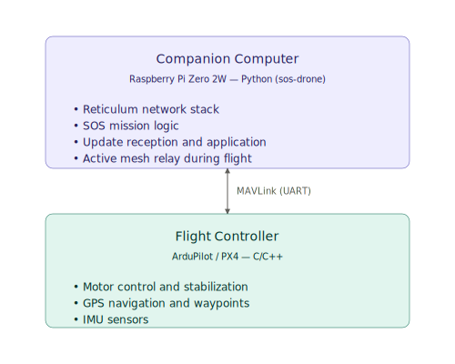

# Communication Protocol Specification
## Supply Open Sky

*Version 0.1 — April 2026*

---

> *This document is an adapted public version of an internal working specification maintained in the Supply Open Sky private repository. References to internal-only documents have been preserved as labels without links. The Italian working draft is available on request.*

---

## Table of Contents

1. [Scope and Objectives](#1-scope-and-objectives)
2. [General Architecture](#2-general-architecture)
3. [Physical Layer](#3-physical-layer)
4. [Network Layer — Reticulum](#4-network-layer--reticulum)
5. [Node Integration](#5-node-integration)
6. [Message Taxonomy](#6-message-taxonomy)
7. [Degradation Behaviour](#7-degradation-behaviour)
8. [Security](#8-security)
9. [Revision Log](#9-revision-log)

---

## 1. Scope and Objectives

This document specifies the communication protocol of the Supply Open Sky system: the set of technologies, software stacks and operational conventions that govern data exchange between all components of the network.

### 1.1 Components involved

The Supply Open Sky communication network interconnects the following actors:

- **Hub** — central operational centre; origin of the scheduling activity and of all Mission Plans
- **Node** — network infrastructure nodes; mesh relays and service points
- **Drone** — autonomous aircraft; active mobile mesh nodes during flight
- **Field Transmitter** — devices distributed to villages; community access points to the network

### 1.2 Requirements the protocol must satisfy

| Requirement | Description |
|---|---|
| Operation without infrastructure | No dependency on the Internet, cellular networks, or pre-existing infrastructure |
| Resilience to interruptions | The system continues to operate even with intermediate Nodes unreachable |
| End-to-end encryption | All messages are encrypted in transit; no intermediate node can read the content |
| Low energy consumption | Radios must operate on the energy available from the Nodes' photovoltaic panels |
| Operational range | Reliable coverage between consecutive Nodes at distances of 8–9 km |
| Drone integration | Drones in flight act as active mesh relays, dynamically extending coverage |

### 1.3 Out of scope

- Specification of binary message formats (deferred to the implementation phase)
- Hardware configuration of the individual radio modules
- Provisioning procedures for the cryptographic identities of specific deployments

---

## 2. General Architecture

### 2.1 Protocol stack

The system adopts **Reticulum** as a single network stack for all communication between Supply Open Sky components.

Reticulum is an open-source network stack designed to operate on links with very low bandwidth and high latency — conditions typical of LoRa networks in remote environments. It provides natively:

- **Cryptographic addressing** — each node has an identity based on an ECC public key; there are no centrally assigned addresses
- **Automatic mesh routing** — paths are discovered dynamically; no manual configuration of the topology
- **End-to-end encryption** — based on ECDH + AES-128; every packet is encrypted between sender and final recipient, regardless of the path taken
- **Store-and-forward** — messages are buffered and retransmitted when the link is restored
- **Transport layer with acknowledge and retransmission** — for messages requiring guaranteed delivery

Reticulum operates as an intermediate layer between the physical transport (LoRa) and the SOS application code, completely abstracting away the complexities of mesh routing and link management.

### 2.2 Physical transport

The physical transport is **LoRa at 868 MHz** for all components of the network.

The choice of a single radio for all components — including the drone — simplifies the hardware architecture and reduces weight and consumption on the aircraft. Mission control traffic does not have latency requirements incompatible with LoRa: the commands exchanged between Hub, Nodes and drones are asynchronous messages with a small payload, not real-time control inputs.

The 868 MHz band is the operational choice for development and testing phases, and for deployments in regions covered by ITU Region 1 regulations, which include the 863–870 MHz ISM band.

### 2.3 Architecture by node type

Each component type hosts Reticulum with a configuration specific to its role.

| Component | Radio hardware | Reticulum runtime | Notes |
|---|---|---|---|
| Hub | LoRa 868 MHz module | Python (server) | Central node of the mesh; always active |
| Node | LoRa 868 MHz module | Python (embedded SBC) | Permanent mesh relay; solar-powered |
| Drone | LoRa 868 MHz module | Python (Companion Computer) | Active mobile relay during flight; see §2.4 |
| Field Transmitter | LoRa 868 MHz module | Python or MicroPython | Full-fledged Reticulum node; see §5.4 |

### 2.4 Drone internal architecture

The drone adopts a two-tier architecture that cleanly separates mission logic from flight control:

<picture>
  <source media="(prefers-color-scheme: dark)" srcset="./assets/drone-internal-architecture-dark.svg">
  
</picture>

**Companion Computer** — manages the Reticulum stack, receives hop-by-hop updates over the mesh, and applies the changes (water quotas, abort, early return) by translating them into MAVLink commands toward the Flight Controller. During flight the Companion operates as an active mesh relay, extending LoRa coverage between the Nodes it overflies.

**Flight Controller** — performs flight control in real time. It receives waypoints and commands from the Companion over MAVLink; it has no awareness of the SOS mission logic or of the communication network.

**MAVLink** is the de facto standard protocol for communication between companion computers and flight controllers. It is natively supported by ArduPilot and PX4 and has mature Python libraries (pymavlink, MAVSDK-Python).

---

## 3. Physical Layer

### 3.1 LoRa parameters

LoRa (Long Range) is a spread-spectrum radio modulation that enables long-distance communication with very low transmitted power, at the cost of limited effective bandwidth. The main parameters that determine the trade-off between range, speed and consumption are the Spreading Factor, the bandwidth and the coding rate.

**Spreading Factor (SF)**

The Spreading Factor determines how much the signal is spread across the spectrum. Higher values increase range and noise immunity but proportionally lengthen the transmission time of each packet (airtime).

For Supply Open Sky the reference value is **SF10**, which offers an adequate balance between operational range (8–9 km in line-of-sight conditions with margin for vegetation and morphological variations) and airtime compatible with the expected message frequency. SF10 produces an airtime of about 330 ms for 50-byte packets — a value entirely acceptable for asynchronous mission messages.

SF12 (maximum range) is not necessary for the operational distances of Supply Open Sky and introduces airtimes longer than one second, with a negative impact on duty cycle and mesh responsiveness. SF7 is suited to dense, high-traffic networks, not to the Supply Open Sky profile.

| SF | Indicative range | Airtime (50 byte) | Use in Supply Open Sky |
|---|---|---|---|
| SF7 | ~2–3 km | ~50 ms | Not suitable — short range |
| SF9 | ~6–7 km | ~165 ms | Reduced margin for 8–9 km |
| **SF10** | **~9–12 km** | **~330 ms** | **Reference value** |
| SF12 | ~15+ km | ~1300 ms | Overkill — excessive airtime |

The range values are indicative and depend strongly on terrain morphology, antenna height and obstacles. Validation of effective parameters is part of prototype testing activities.

**Bandwidth**

The reference bandwidth is **125 kHz**, the standard value for long-range LoRa applications. Narrower bandwidths (62.5 kHz) would further increase range but halve the already limited throughput; wider bandwidths (250, 500 kHz) would reduce range.

**Coding Rate**

The reference coding rate is **CR 4/8** (maximum error correction). In environments with variable interference — typical of Supply Open Sky operational contexts — the additional redundancy reduces the need for retransmissions, compensating for the modest airtime increase compared to CR 4/5.

**Reference parameters summary**

| Parameter | Value |
|---|---|
| Frequency | 868 MHz (863–870 MHz ISM band) |
| Spreading Factor | SF10 |
| Bandwidth | 125 kHz |
| Coding Rate | CR 4/8 |
| TX power | 14 dBm (25 mW) — EIRP limit for the 868 MHz band |

### 3.2 Duty Cycle

The European ETSI regulation for the 868 MHz ISM band imposes a maximum duty cycle of **1%** on the primary sub-channel (863–868 MHz), equivalent to a maximum of 36 seconds of transmission per hour. With SF10 and 50-byte packets (airtime ~330 ms), the limit allows about 109 transmissions per hour per node — amply sufficient for the Supply Open Sky traffic profile, which involves sporadic mission messages and low-frequency periodic heartbeats.

The 869.4–869.65 MHz sub-channel allows duty cycles up to 10% with power up to 27 dBm. This channel can be used as an emergency channel for high-priority messages (distress signals from Field Transmitters, mission abort) when the primary channel is congested.

### 3.3 Antennas and operational range

The operational range between consecutive Nodes (8–9 km) is achievable with standard omnidirectional antennas of **3–5 dBi** mounted in elevated positions on the Nodes. Installation height is a critical factor: every additional metre of height reduces the radio shadow caused by vegetation and terrain morphology.

For drones, the LoRa antenna is mounted on the Companion Computer. The operational flight altitude (to be defined in the drone hardware selection) contributes positively to signal propagation, making the drone a naturally favoured relay compared to ground nodes.

For Field Transmitters, designed for portable use in villages, the range toward the reference Node is limited by antenna height and local morphology. The indicative operational radius of 7–10 km cited in the [Blueprint](../../BLUEPRINT.md) assumes line-of-sight or near-line-of-sight conditions; in contexts with dense vegetation or interposed terrain it may be lower. The Reticulum mesh network can partially compensate through relays via other Field Transmitters or nearby Nodes.

---

## 4. Network Layer — Reticulum

### 4.1 Addressing

In Reticulum each node is identified by a **cryptographic address** derived from its own ECC public key. There are no centrally assigned addresses, nor manually configured routing tables: a node's identity is intrinsic to its cryptographic key pair, generated locally at provisioning time.

Each Supply Open Sky component — Hub, Node, Drone, Field Transmitter — has its own permanent Reticulum identity. In addition to the cryptographic address, each component is associated with a **human-readable name** in the Hub's internal registry, which maps the Reticulum identity to the operational role in the system (e.g. address_hash → `N1.2`, `DRONE-04`, `FT-VillageA`). This mapping is purely application-level and does not interfere with Reticulum routing.

For drones, the Reticulum identity resides on the Companion Computer. Since drones may be replaced or reassigned, identity provisioning is associated with the Companion, not with the physical airframe.

### 4.2 Path discovery and mesh routing

Reticulum uses a **path discovery** mechanism based on announces: when a node wants to make one of its destinations (an application service) reachable, it emits an announce packet that propagates through the mesh. Intermediate nodes record on which interface they received the announce, progressively building a distributed routing table without central coordination.

For Supply Open Sky this means that:

- The Hub does not need to know in advance the radio topology of the mesh in order to reach a Node or a Drone
- Adding a new Node or Field Transmitter to the network requires no reconfiguration of the other nodes — it is sufficient that the new node emit its own announces
- Drones in flight that enter the radio range of a Node automatically update the routing tables of nearby nodes, becoming active relays for messages in transit

Routing is **opportunistic and adaptive**: if a path goes down (Node unreachable, drone landed), Reticulum automatically recomputes the next available path without application intervention.

### 4.3 Transport modalities

Reticulum offers two transport modalities that the SOS application code uses depending on the type of message:

**Packet (fire-and-forget)** — sending without acknowledgement. Suitable for messages tolerant to occasional loss: heartbeats, periodic telemetry updates, sensor readings. Overhead is minimal and duty cycle is preserved.

**Link + Message (guaranteed delivery)** — Reticulum establishes an encrypted link between the two nodes and guarantees delivery with acknowledge and automatic retransmission. Suitable for critical messages: Hop Instructions, water-quota updates, abort commands, emergency signals. The link is opened for the duration of the communication and closed at the end.

The choice between the two modalities is the responsibility of the SOS application code and is detailed in the message taxonomy (§6).

### 4.4 Store-and-forward and behaviour with intermittent links

Reticulum natively implements store-and-forward behaviour: if the recipient of a message is not reachable at the time of sending, the message is buffered in the sender (or in intermediate nodes acting as transports) and delivered as soon as the link is restored.

This mechanism is particularly relevant for Supply Open Sky in two scenarios:

**Drone out of range** — during flight between two Nodes, the drone may temporarily be out of the radio range of both. Messages destined for the drone (updates to the water quota for the current hop) are buffered by the last reached Node and delivered as soon as the drone enters the range of the next Node.

**Temporarily non-operational Node** — if an intermediate Node loses power or fails, messages destined for downstream Nodes and Field Transmitters are buffered by upstream nodes and delivered upon recovery. For mission messages with a temporal deadline (pre-launch updates), the SOS application code is responsible for verifying the timestamp and discarding messages that have become obsolete.

The detailed behaviour in degradation scenarios is described in section 7.

### 4.5 Encryption

Encryption in Reticulum is **end-to-end and transparent** to the application code: every message is encrypted between sender and final recipient before being placed into the mesh. Intermediate relay nodes — including drones in flight — can route the packets without being able to read their contents.

The mechanism is based on:

- **ECDH (Elliptic Curve Diffie-Hellman)** for the derivation of the session key shared between the two endpoints
- **AES-128-CBC** for symmetric encryption of the payload
- **HMAC** for message integrity and authentication

A centralized PKI infrastructure is not required: trust between nodes is established via Reticulum's trust mechanism, which can operate in TOFU (Trust On First Use) mode or with explicit identity verification. The provisioning and trust procedure for Supply Open Sky deployments is defined in section 8.

---

## 5. Node Integration

This section describes the specific communicative role of each component type: which messages it produces, which it consumes, and how it interacts with the Reticulum stack and with the other local systems.

### 5.1 Hub

The Hub is the central, always-active node of the mesh. From a communications standpoint it is the origin of all Hop Instructions and the primary recipient of all operational data of the network.

**Messages produced by the Hub:**

- **Hop Instruction (drone)** — sent to the drone before takeoff; contains the coordinates of the first destination Node, the water quota to release and the assigned Pad; Link + Message mode (guaranteed delivery). The drone knows only the current hop: the complete plan remains internal to the scheduler and is never transmitted to the aircraft.
- **Hop Instruction (Node)** — pre-distributed to all intermediate Nodes before drone launch; contains the identifier of the expected drone, the reserved Pad (slot reservation function) and the instruction for the next hop to deliver to the drone upon landing; Link + Message mode.
- **Water-quota update** — revision of the quota computed in pre-flight, sent to the drone in flight via relay through the closest Node; Link + Message mode.
- **Abort command** — order to interrupt a mission with the destination of return; Link + Message mode, top priority.

**Messages consumed by the Hub:**

- **Sensor report** — periodic reading of the water-level sensor from each Node; Packet mode
- **Battery status report** — state of the Node's battery stock (number of available batteries, state of charge); Packet mode
- **Weather report** — weather conditions detected by the Node's sensors (wind speed, temperature, precipitation where available); Packet mode
- **Heartbeat Node** — presence and operational-state signal from each Node; Packet mode
- **Drone status** — current state of the drone (position, mission phase, supplementary battery level); Packet mode
- **Delivery complete** — confirmation of completed delivery sent by the destination Node at the end of unloading; Link + Message mode
- **Emergency signal** — emergency notification or distress request sent by a Field Transmitter; Link + Message mode, top priority
- **Supply request** — replenishment request sent by a Field Transmitter; Link + Message mode

The Hub maintains a **registry of Reticulum identities** of all components of the network, updated at the provisioning of each new node. The registry associates each cryptographic address with the operational name of the component (e.g. `N1.2`, `DRONE-04`, `FT-VillageA`) and is used by the application code to route messages to the correct recipients.

### 5.2 Node

Each Node is a permanent mesh relay and an active operational node. In addition to routing Reticulum traffic on behalf of other nodes, the Node produces and consumes its own messages related to local management of the water tank, the battery stock, and coordination with drones in transit.

**Messages produced by the Node:**

- **Sensor report** — water-tank level reading, sent periodically to the Hub and on-demand in pre-flight phase; Packet mode
- **Battery status report** — battery-stock state: number of batteries available for swap and state of charge of each; sent periodically to the Hub and on-demand in pre-flight phase; Packet mode
- **Weather report** — locally detected weather conditions (wind speed and direction, temperature, precipitation where sensors are available); sent periodically to the Hub; Packet mode
- **Heartbeat** — presence and operational-state signal sent to the Hub at regular intervals; Packet mode
- **Delivery complete** — confirmation sent to the Hub at the end of water unloading or cargo drop by the drone; Link + Message mode
- **Drone arrived** — notification to the Hub of a drone's landing on the local Pad, with drone identifier; Link + Message mode

**Messages consumed by the Node:**

- **Hop Instruction (Node)** — pre-distributed by the Hub before drone launch; contains the identifier of the expected drone, the reserved Pad and the instruction for the next hop to deliver to the drone upon landing; Link + Message mode
- **Water-quota update** — revision of the quota to unload, received from the Hub and buffered while waiting for the drone's arrival; Link + Message mode

The Node acts as a **handoff point** for flight instructions: upon receipt of `Hop Instruction (Node)` from the Hub, it reserves the indicated Pad, stores the instruction for the next hop and delivers it to the drone's Companion Computer at landing via local Reticulum link.

### 5.3 Drone — Companion Computer

The Companion Computer is the drone's Reticulum node. It manages all mission communications and acts as a bridge between the Supply Open Sky network and the Flight Controller via MAVLink.

**Messages produced by the Companion:**

- **Drone status** — current GPS position, mission phase (in flight / landed / unloading in progress), supplementary battery level; sent periodically to the Hub; Packet mode
- **Delivery complete** — confirmation sent to the destination Node at the end of unloading; Link + Message mode
- **Abort request** — notification of a critical anomaly detected by the Flight Controller (e.g. battery in warning, GPS loss); sent to the Hub for authorization of an early return; Link + Message mode

**Messages consumed by the Companion:**

- **Hop Instruction (drone)** — received from the Hub before takeoff; contains the first destination Node, the water quota and the assigned Pad; the Companion loads the waypoint into the Flight Controller via MAVLink
- **Hop Instruction (Node)** — received from the Node upon landing; contains the coordinates of the next hop and the water quota to release; the Companion updates the Flight Controller via MAVLink and sets up the water-release mechanism
- **Water-quota update** — revision of the quota received in flight from the Hub via Node relay; applied to the current or next hop depending on the mission phase
- **Abort command** — order of early return received from the Hub; the Companion sends the return waypoint to the Flight Controller via MAVLink

**MAVLink bridge**

The Companion translates Reticulum messages into MAVLink commands toward the Flight Controller according to the following logic:

| Reticulum event | Companion action | Involves FC? |
|---|---|---|
| Hop Instruction reception | Loading of destination waypoint via `MAV_CMD_DO_REPOSITION` or `SET_POSITION_TARGET_GLOBAL_INT` (GUIDED mode) | Yes |
| Abort command with return destination | Replacement of the current waypoint with the return destination | Yes |
| Water-quota update | Update of the internal `water_quota` variable in the Companion; no MAVLink command emitted | **No** |
| Trigger water/cargo release | Activation of a Companion GPIO → relay/servo → valve or release mechanism | **No** |
| Reading FC state | Polling telemetry (`HEARTBEAT`, `SYS_STATUS`, `GPS_RAW_INT`) | Yes |

> **Architectural note:** the FC has neither visibility nor responsibility on payload management (water or cargo). The Companion is the only component that manages the water quota and the release trigger, directly via GPIO. MAVLink is used exclusively for navigation commands and for reading flight telemetry.

The Companion does not directly interface motors or IMU sensors: any flight action passes through MAVLink commands to the Flight Controller, which remains the only component responsible for stabilization and flight execution.

### 5.4 Field Transmitter

The Field Transmitter is a full-fledged Reticulum node distributed to communities within the operational radius of each Node. It is the access point to the Supply Open Sky network for local populations.

**Messages produced by the Field Transmitter:**

- **Emergency signal** — emergency notification or distress request; sent to the Hub with top priority on the 869.4–869.65 MHz emergency channel; Link + Message mode
- **Supply request** — urgent replenishment request (water, medicines); sent to the Hub; Link + Message mode
- **Heartbeat** — periodic presence signal; Packet mode

**Messages consumed by the Field Transmitter:**

- **Acknowledge** — confirmation of receipt of the request by the Hub; Link + Message mode
- **Estimated delivery** — Hub response with an estimate of response times to the request; Link + Message mode

The Field Transmitter is designed for simple use by non-technical operators. The user interface (physical buttons, status LEDs, optional display) is defined in the *internal Node configuration specification*. From a communications standpoint, the device emits structured Reticulum messages identical to those of the other nodes: there is no simplified or degraded protocol for Field Transmitters.

> **Implementation note:** the Reticulum runtime on Field Transmitters depends on the chosen hardware. On SBC-based devices (e.g. Raspberry Pi Zero) the standard Python implementation is available. On microcontrollers (e.g. ESP32) the MicroPython port of Reticulum is required, which is currently in an experimental phase. Field Transmitter hardware selection must take this constraint into account and is *tracked in the internal hardware roadmap*.

---

## 6. Message Taxonomy

This section formally defines all messages exchanged between Supply Open Sky components. For each message, the type, direction, payload and serialization rules are specified.

### 6.1 Conventions and identifiers

#### Serialization format

The payload of every Supply Open Sky message is serialized with **MessagePack** (specification 2.0). The choice is consistent with the Reticulum architecture: Reticulum operates as a network/transport layer and handles routing, end-to-end encryption and guaranteed delivery; MessagePack operates at the application layer and converts Python data structures into compact bytes before delivery to Reticulum. The two layers are independent and do not influence each other.

> **Update note:** the specification of the serialization format was explicitly deferred in §1.3 ("Specification of binary message formats — deferred to the implementation phase"). This section formally resolves it.

**Rationale for the choice:**

| Criterion | MessagePack | JSON (rejected) |
|---|---|---|
| Payload size | Compact binary (~30–50% smaller) | Verbose text |
| LoRa airtime | Reduced | Higher |
| Native Python types | Direct support (`dict`, `list`, `int`, `float`, `bytes`) | Requires mapping |
| Available libraries | `msgpack` (CPython), `umsgpack` (MicroPython) | Available everywhere |
| Human readability | None (binary) | Full |

Human readability is not an operational requirement: application logs are the responsibility of the Supply Open Sky application layer, not of the communication protocol.

#### Message schema: hybrid approach

Each message is documented with a schema in two complementary parts:

- **Field table** (normative): field, Python type, mandatoriness, description. It is the source of truth for implementation.
- **Python dict example** (illustrative): shows the message structure as a Python dictionary before MessagePack serialization. Eliminates ambiguity in the mapping between specification and code.

#### Message-type identifiers

Each message includes a `msg_type` field — a string in `UPPER_SNAKE_CASE` — that uniquely identifies the type during deserialization. The identifiers are grouped by category via prefix:

| Prefix | Category | Description |
|---|---|---|
| `CTL_` | Mission control | Messages that drive the behaviour of the drone or the Node |
| `TEL_` | Telemetry | Periodic state and monitoring messages |
| `EVT_` | Event | One-shot notifications of significant operational events |
| `FT_` | Field Transmitter | Messages originating from the local communities |

#### Common fields across all messages

Every message, regardless of type, includes the following mandatory fields in its payload:

| Field | Python type | Required | Description |
|---|---|---|---|
| `msg_type` | `str` | yes | Type identifier (see prefixes above) |
| `msg_id` | `str` | yes | Unique UUID4 of the message; used for deduplication and acknowledge |
| `ts` | `int` | yes | Unix timestamp UTC in seconds at the moment of generation |
| `sender_id` | `str` | yes | Operational identifier of the sender (e.g. `"HUB"`, `"N1.2"`, `"DRONE-04"`, `"FT-VillageA"`) |

These fields are added to the type-specific fields defined in §6.3–6.6.

#### Priority and transport modes

Reticulum does not expose a native priority mechanism at the packet level. Operational priority is managed at the application layer via two levers: the choice of the Reticulum transport mode and the choice of the radio channel.

| Priority | Reticulum mode | Channel | Message categories |
|---|---|---|---|
| Top | Link + Message | Emergency (869.4–869.65 MHz) | `FT_EMERGENCY` |
| High | Link + Message | Primary operational | `CTL_*`, `EVT_*` |
| Normal | Packet | Primary operational | `TEL_*` |

The **Link + Message** mode guarantees delivery acknowledge and automatic retransmission in case of missed reception. The **Packet** mode is fire-and-forget: appropriate for periodic telemetry, where the occasional loss of a sample is not critical and the next transmission provides updated data.

---

### 6.2 Summary table of messages

The following table catalogs all messages of the Supply Open Sky network. The **ID** field is an internal reference within this specification. The **Trigger** field indicates the condition that generates the message.

| ID | `msg_type` | Producer | Consumer | Mode | Priority | Trigger |
|---|---|---|---|---|---|---|
| M-01 | `CTL_HOP_INSTRUCTION` | Hub, Node | Companion | Link + Message | High | Pre-flight (Hub → Companion for the first hop); landing (Node → Companion for subsequent hops) |
| M-02 | `CTL_NODE_PREP` | Hub | Node | Link + Message | High | Pre-flight, for each Node on the route; contains the hop instruction to deliver to the drone upon landing |
| M-03 | `CTL_WATER_QUOTA_UPDATE` | Hub | Node, Companion | Link + Message | High | In-flight update of the water quota, before the drone reaches the destination Node |
| M-04 | `CTL_ABORT` | Hub | Companion | Link + Message | High | Order of early return issued by the Hub |
| M-05 | `TEL_DRONE_STATUS` | Companion | Hub | Packet | Normal | Periodic (~30 s) during flight |
| M-06 | `TEL_SENSOR_REPORT` | Node | Hub | Packet | Normal | Periodic; on-demand in pre-flight phase |
| M-07 | `TEL_BATTERY_STATUS` | Node | Hub | Packet | Normal | Periodic; on-demand in pre-flight phase |
| M-08 | `TEL_WEATHER_REPORT` | Node | Hub | Packet | Normal | Periodic |
| M-09 | `TEL_HEARTBEAT` | Node, Field Transmitter | Hub | Packet | Normal | Periodic; attests presence and operability of the node |
| M-10 | `EVT_DELIVERY_COMPLETE` | Companion, Node | Node (destination), Hub | Link + Message | High | At the end of water unloading or cargo drop: first the Companion notifies the destination Node, then the Node notifies the Hub. Reception by the Hub is the trigger for return-path planning (SCHEDULED missions only) |
| M-11 | `EVT_DRONE_ARRIVED` | Node | Hub | Link + Message | High | Upon landing of a drone on the local Pad |
| M-12 | `EVT_ABORT_REQUEST` | Companion | Hub | Link + Message | High | Critical anomaly detected by the Flight Controller; request for authorization to early return |
| M-13 | `FT_EMERGENCY` | Field Transmitter | Hub | Link + Message | Top | Manual activation by the local operator; emergency channel 869.4–869.65 MHz |
| M-14 | `FT_SUPPLY_REQUEST` | Field Transmitter | Hub | Link + Message | High | Urgent replenishment request |
| M-15 | `FT_ACKNOWLEDGE` | Hub | Field Transmitter | Link + Message | High | Confirmation of receipt in response to `FT_EMERGENCY` or `FT_SUPPLY_REQUEST` |
| M-16 | `FT_ESTIMATED_DELIVERY` | Hub | Field Transmitter | Link + Message | High | Estimate of response times, in response to `FT_SUPPLY_REQUEST` |
| M-19 | `TEL_REQUEST` | Hub | Node | Packet | Normal | On-demand pre-flight: requests an updated `TEL_SENSOR_REPORT` and/or `TEL_BATTERY_STATUS`. Used when the cached datum exceeds the freshness threshold (`TELEMETRY_FRESHNESS_S`) |
| M-17 | `CTL_HOLD` | Hub | Companion | Link + Message | High | Mission suspension: the drone completes the current hop, lands on the Pad, and waits. Main scenario: bad weather |
| M-18 | `CTL_RESUME` | Hub | Companion | Link + Message | High | Resumption after `CTL_HOLD`. Issued only after the scheduler has re-executed planning and distributed new `CTL_NODE_PREP` to the Nodes on the remaining route. Contains the new first hop embedded |
| M-20 | `CTL_HOP_REQUEST` | Companion | Hub | Link + Message | High | Recovery request: the Companion has not received `CTL_HOP_INSTRUCTION` from the Node within the timeout. The Hub responds with `CTL_HOP_INSTRUCTION` (M-01) directly to the Companion |
| M-21 | `FT_CARGO_RELEASE` | Field Transmitter | Hub | Link + Message | High | Manual cargo-release authorization sent by the recipient via Field Transmitter; relevant only for ON-DEMAND missions with `release_mode: "MANUAL"` |
| M-22 | `CTL_CARGO_RELEASE` | Hub | Companion | Link + Message | High | Cargo-release command toward the Companion, in response to `FT_CARGO_RELEASE` (M-21) or on direct initiative of the Hub operator; the Companion actuates the release mechanism and emits `EVT_DELIVERY_COMPLETE` (M-10) |

**Notes on the table:**

- `CTL_HOP_INSTRUCTION` (M-01) and `CTL_NODE_PREP` (M-02) have distinct structures: M-01 is the flight instruction consumed by the Companion; M-02 is the message the Hub sends to the Node before launch, and which includes M-01 as embedded payload to be delivered to the drone upon landing.
- `EVT_DELIVERY_COMPLETE` (M-10) follows a two-step propagation chain: Companion → destination Node → Hub. The `sender_id` field distinguishes the two steps; the payload structure is identical. For SCHEDULED missions, reception of M-10 by the Hub unlocks return planning: the Hub reserves slots on the hub-proximal Nodes, then sends `CTL_HOP_INSTRUCTION` (M-01) to the Companion with the first return hop and the corresponding `CTL_NODE_PREP` (M-02) to each Node on the return path. The Companion waits in the ELZ until M-01 is received before departing.
- `TEL_HEARTBEAT` (M-09) is used by both Nodes and Field Transmitters with the same `msg_type`; the `sender_id` field identifies the sender.
- The `FT_*` messages (M-13–M-16, M-21) travel on the 869.4–869.65 MHz emergency channel for M-13; on the primary operational channel for M-14–M-16 and M-21.
- `FT_CARGO_RELEASE` (M-21) is the only `FT_*` message that triggers a `CTL_*` command: the Hub verifies the correspondence between the sender `ft_id` and the Field Transmitter associated with the mission's destination before issuing `CTL_CARGO_RELEASE` (M-22). An authorization from a non-associated FT is discarded and logged.

---

### 6.3 Mission control messages

Control messages directly drive the behaviour of the drone and of the Nodes. All of them use the **Link + Message** mode with guaranteed acknowledge. All of them include the common fields defined in §6.1.

---

#### M-01 — `CTL_HOP_INSTRUCTION`

Flight instruction for a single hop. It is the most critical message in the system: it defines the destination, the landing Pad and the water quota for the current hop. It is sent by the Hub to the Companion before takeoff (first hop) and by the Node to the Companion at landing (subsequent hops).

| Field | Python type | Required | Description |
|---|---|---|---|
| `dest_node` | `str` \| `None` | yes | Identifier of the destination Node (e.g. `"N1.2"`, `"HUB"`). `None` if the destination is a GPS coordinate (only ON-DEMAND missions with off-network drop) |
| `dest_coords` | `dict` \| `None` | no | GPS coordinates of the destination: `{"lat": float, "lon": float, "alt": float}`. Present only if `dest_node` is `None` |
| `pad` | `int` \| `None` | yes | Landing Pad at the destination Node or Hub. `None` only if the destination is a pure GPS coordinate (ON-DEMAND missions with off-network drop, no landing on infrastructure) |
| `water_quota` | `float` \| `str` | yes | Litres of water to release at the destination. `"all"` if the Node is the leaf of the mission (release the full residual). `0.0` for ON-DEMAND missions (no water release) and for all return hops |
| `mission_id` | `str` | yes | Mission identifier in the format `yyyymmdd-MSN-XXXX` (e.g. `"20260330-MSN-0042"`). Used for log correlation, for `CTL_WATER_QUOTA_UPDATE`, and for `CTL_HOLD`/`CTL_RESUME` |
| `release_mode` | `str` | yes | Cargo-release mode for ON-DEMAND missions: `"AUTO"` (automatic release on landing) or `"MANUAL"` (the Companion waits for `CTL_CARGO_RELEASE` M-22, after recipient authorization via Field Transmitter). Always `"AUTO"` for WATER/SCHEDULED missions |
| `dest_node_reticulum_address` | `str` \| `None` | no | 128-bit Reticulum hash (32 lowercase hex characters) of the destination Node. Set by the Hub for SCHEDULED missions when `dest_node` is set, so the Companion can send `EVT_DELIVERY_COMPLETE` (M-10) to the Node without depending on the propagation of Reticulum announces. `None` for ON-DEMAND missions (`dest_coords` set) or when the Hub lets the Companion use the announce-cache fallback. Consistency with `dest_node` is up to the Hub (not enforced by the validator) |

> **Note on `water_quota: "all"`:** the Companion treats `"all"` as an instruction to fully empty the tank, regardless of the residual volume. The deserializer must handle the field as `Union[float, str]` and distinguish the two cases before passing the value to the release mechanism.
>
> **Note on `dest_node_reticulum_address`:** also propagated in `HopInstructionPayload` (embedded field in M-02 and M-18); the Node automatically reconstructs it in M-01 at touchdown without code changes. Backward-compatible: messages without the field remain valid (default `None`).

```python
# Intermediate hop: Hub → Companion pre-flight (first hop, SCHEDULED mission)
{
    "msg_type": "CTL_HOP_INSTRUCTION",
    "msg_id": "a1b2c3d4-...",
    "ts": 1743000000,
    "sender_id": "HUB",
    "dest_node": "N1",
    "dest_coords": None,
    "pad": 1,
    "water_quota": 2.5,
    "mission_id": "20260330-MSN-0042",
    "release_mode": "AUTO"
}

# Leaf hop: Node → Companion at landing (last hop, releases everything)
{
    "msg_type": "CTL_HOP_INSTRUCTION",
    "msg_id": "e5f6g7h8-...",
    "ts": 1743001800,
    "sender_id": "N1.2",
    "dest_node": "N1.2.1",
    "dest_coords": None,
    "pad": 2,
    "water_quota": "all",
    "mission_id": "20260330-MSN-0042",
    "release_mode": "AUTO"
}

# Return hop: Hub → Companion after EVT_DELIVERY_COMPLETE
{
    "msg_type": "CTL_HOP_INSTRUCTION",
    "msg_id": "i9j0k1l2-...",
    "ts": 1743002400,
    "sender_id": "HUB",
    "dest_node": "N1.2",
    "dest_coords": None,
    "pad": 1,
    "water_quota": 0.0,
    "mission_id": "20260330-MSN-0042",
    "release_mode": "AUTO"
}

# ON-DEMAND hop with manual release: Hub → Companion pre-flight
{
    "msg_type": "CTL_HOP_INSTRUCTION",
    "msg_id": "m3n4o5p6-...",
    "ts": 1743006000,
    "sender_id": "HUB",
    "dest_node": None,
    "dest_coords": {"lat": 0.0341, "lon": -0.0729, "alt": 0.0},
    "pad": None,
    "water_quota": 0.0,
    "mission_id": "20260330-MSN-0051",
    "release_mode": "MANUAL"
}
```

---

#### M-02 — `CTL_NODE_PREP`

Prepares a Node to receive an expected drone. The Hub sends this message to every Node on the route before launch. The Node stores the message and, upon landing of the identified drone, extracts the `hop_instruction` field and delivers it to the Companion as `CTL_HOP_INSTRUCTION` (M-01) via local Reticulum link.

For the SCHEDULED return path, the Hub sends the return `CTL_NODE_PREP` messages immediately after receiving `EVT_DELIVERY_COMPLETE` from the leaf, contextually with the `CTL_HOP_INSTRUCTION` sent to the Companion.

| Field | Python type | Required | Description |
|---|---|---|---|
| `expected_drone_id` | `str` | yes | Identifier of the expected drone (e.g. `"DRONE-04"`) |
| `expected_arrival_slot` | `int` | yes | Expected time slot for drone arrival (referenced to the scheduler's slot model) |
| `reserved_pad` | `int` | yes | Pad reserved for this drone (`1` or `2`); the Node must keep it free until arrival |
| `hop_instruction` | `dict` | yes | Payload of the hop instruction to deliver to the Companion at landing. Contains the type-specific fields of M-01 (`dest_node`, `dest_coords`, `pad`, `water_quota`, `mission_id`), excluding the common fields which will be set by the Node at re-emission time |

```python
# Hub → N1, pre-flight: "expect DRONE-04 on Pad 1, then give it this instruction"
{
    "msg_type": "CTL_NODE_PREP",
    "msg_id": "m3n4o5p6-...",
    "ts": 1743000000,
    "sender_id": "HUB",
    "expected_drone_id": "DRONE-04",
    "expected_arrival_slot": 15,
    "reserved_pad": 1,
    "hop_instruction": {
        "dest_node": "N1.2",
        "dest_coords": None,
        "pad": 2,
        "water_quota": 1.8,
        "mission_id": "20260330-MSN-0042"
    }
}
```

---

#### M-03 — `CTL_WATER_QUOTA_UPDATE`

In-flight update of the water quota for a specific Node. The Hub sends this message when the level sensors return updated data after drone launch. The message is delivered to the destination Node, which updates the buffered quota; if the drone is already approaching, the Node delivers the updated quota to the Companion at landing in place of the one contained in the original `CTL_NODE_PREP`.

| Field | Python type | Required | Description |
|---|---|---|---|
| `mission_id` | `str` | yes | Mission to which the update refers |
| `target_node` | `str` | yes | Node whose quota is being updated (e.g. `"N1.2"`) |
| `water_quota` | `float` \| `str` | yes | New quota in litres, or `"all"` if the Node has effectively become the leaf following a rerouting |

```python
{
    "msg_type": "CTL_WATER_QUOTA_UPDATE",
    "msg_id": "q7r8s9t0-...",
    "ts": 1743001200,
    "sender_id": "HUB",
    "mission_id": "20260330-MSN-0042",
    "target_node": "N1.2",
    "water_quota": 3.1
}
```

---

#### M-04 — `CTL_ABORT`

Order of early return issued by the Hub toward the Companion. The Companion replaces the current waypoint in the Flight Controller with the specified return destination and updates the mission state. Abort can be issued on Hub initiative (e.g. critical weather, operational window closing) or in response to an `EVT_ABORT_REQUEST` (M-12) received from the Companion.

| Field | Python type | Required | Description |
|---|---|---|---|
| `mission_id` | `str` | yes | Mission to interrupt |
| `return_node` | `str` \| `None` | yes | Node toward which to head for return. `None` if the drone must land at the closest ELZ without proceeding toward the network |
| `reason` | `str` | yes | Reason code: `"DRONE_LOW_BATTERY"` (critical flight battery), `"DRONE_FAILURE"` (drone hardware anomaly), `"WEATHER"` (non-operational weather conditions), `"NODE_FAILURE"` (Node unreachable or non-operational — includes Node battery fault), `"OPERATOR"` (manual interruption), `"WINDOW_CLOSING"` (imminent end of operational window) |

```python
{
    "msg_type": "CTL_ABORT",
    "msg_id": "u1v2w3x4-...",
    "ts": 1743001500,
    "sender_id": "HUB",
    "mission_id": "20260330-MSN-0042",
    "return_node": "N1",
    "reason": "WEATHER"
}
```

---

#### M-17 — `CTL_HOLD`

Order of mission suspension. The Companion completes the current hop (if in flight, it lands on the already-reserved destination Pad), then suspends execution and remains waiting on the Pad. No subsequent hop is executed until receipt of `CTL_RESUME` (M-18).

The main scenario is bad weather: the drone reaches the closest Node and freezes there rather than being exposed to adverse conditions during the return flight.

| Field | Python type | Required | Description |
|---|---|---|---|
| `mission_id` | `str` | yes | Mission to suspend |
| `reason` | `str` | yes | Reason code: `"WEATHER"`, `"OPERATOR"` |

```python
{
    "msg_type": "CTL_HOLD",
    "msg_id": "y5z6a7b8-...",
    "ts": 1743003000,
    "sender_id": "HUB",
    "mission_id": "20260330-MSN-0042",
    "reason": "WEATHER"
}
```

---

#### M-18 — `CTL_RESUME`

Order of resumption issued by the Hub after a `CTL_HOLD`. It is sent **only after** the scheduler has re-executed planning, verified the availability of Pads and batteries on all Nodes of the remaining route, and distributed new `CTL_NODE_PREP` (M-02) messages to the affected Nodes.

`CTL_RESUME` directly embeds the new instruction for the first resumption hop, avoiding a separate sequence of `CTL_HOP_INSTRUCTION`: the Companion receives in a single message both authorization to depart and the updated destination.

| Field | Python type | Required | Description |
|---|---|---|---|
| `mission_id` | `str` | yes | Mission to resume |
| `hop_instruction` | `dict` | yes | New first hop to execute upon resumption. Same structure as the type-specific fields of M-01 (`dest_node`, `dest_coords`, `pad`, `water_quota`, `mission_id`), excluding the common fields which the Companion sets at execution time |

```python
{
    "msg_type": "CTL_RESUME",
    "msg_id": "c9d0e1f2-...",
    "ts": 1743010800,
    "sender_id": "HUB",
    "mission_id": "20260330-MSN-0042",
    "hop_instruction": {
        "dest_node": "N1.2.1",
        "dest_coords": None,
        "pad": 1,
        "water_quota": "all",
        "mission_id": "20260330-MSN-0042"
    }
}
```

---

#### M-20 — `CTL_HOP_REQUEST`

Recovery request sent by the Companion to the Hub when the drone has landed on a Node but has not received `CTL_HOP_INSTRUCTION` within the timeout `HOP_INSTRUCTION_TIMEOUT_S` (→ §7.5). The Node may not have received the original `CTL_NODE_PREP`, or may have received it but failed to deliver it correctly.

The Hub responds with a new `CTL_HOP_INSTRUCTION` (M-01) sent directly to the Companion, bypassing the Node.

| Field | Python type | Required | Description |
|---|---|---|---|
| `mission_id` | `str` | yes | Mission in progress |
| `drone_id` | `str` | yes | Identifier of the waiting drone |
| `current_node` | `str` | yes | Node on which the drone is currently sitting and waiting |
| `reason` | `str` | yes | Cause of the request: `"NODE_PREP_MISSING"` (the Node did not have the `CTL_NODE_PREP`), `"HOP_INSTRUCTION_TIMEOUT"` (the Node had the prep but did not deliver the instruction within the timeout) |

```python
{
    "msg_type": "CTL_HOP_REQUEST",
    "msg_id": "h1i2j3k4-...",
    "ts": 1743004200,
    "sender_id": "DRONE-04",
    "mission_id": "20260330-MSN-0042",
    "drone_id": "DRONE-04",
    "current_node": "N1.2",
    "reason": "HOP_INSTRUCTION_TIMEOUT"
}
```

---

#### M-22 — `CTL_CARGO_RELEASE`

Cargo-release command sent by the Hub to the Companion of a drone waiting with `release_mode: "MANUAL"`. The Companion actuates the cargo-release mechanism and immediately emits `EVT_DELIVERY_COMPLETE` (M-10) at completion. This message is issued by the Hub in response to `FT_CARGO_RELEASE` (M-21) received from the recipient's Field Transmitter, or on direct initiative of the Hub operator.

The Companion does not perform the release until it receives this message: it remains at the delivery point with the cargo on board. If `CTL_CARGO_RELEASE` does not arrive within `CARGO_RELEASE_TIMEOUT_S` (parameter configurable per deployment), the Companion emits `EVT_ABORT_REQUEST` (M-12) with `reason: "OPERATOR"` and waits for instructions from the Hub.

| Field | Python type | Required | Description |
|---|---|---|---|
| `mission_id` | `str` | yes | Reference mission |
| `drone_id` | `str` | yes | Identifier of the drone that must perform the release |
| `authorized_by` | `str` | yes | Origin of the authorization: `"FT"` (authorized by Field Transmitter via M-21) or `"OPERATOR"` (authorized directly by the Hub operator) |
| `ft_id` | `str` \| `None` | yes | Identifier of the Field Transmitter that sent the authorization. `None` if `authorized_by` is `"OPERATOR"` |

```python
{
    "msg_type": "CTL_CARGO_RELEASE",
    "msg_id": "r7s8t9u0-...",
    "ts": 1743006300,
    "sender_id": "HUB",
    "mission_id": "20260330-MSN-0051",
    "drone_id": "DRONE-07",
    "authorized_by": "FT",
    "ft_id": "FT-VillageA"
}
```

---

### 6.4 Telemetry messages

Telemetry messages carry periodic monitoring data from Nodes, drones and Field Transmitters toward the Hub. They use **Packet** mode (fire-and-forget): the occasional loss of a sample is not critical because the next transmission provides updated data. All include the common fields defined in §6.1.

The frequencies indicated are configurable defaults per deployment; effective periods may be reduced in pre-flight phase or in critical operational conditions.

---

#### M-05 — `TEL_DRONE_STATUS`

Current operational state of the drone, sent periodically by the Companion to the Hub during flight and stops. It is the main fleet-monitoring tool from the Hub's perspective.

**Frequency:** every 90 s during flight; every 150 s during stops at the Node or in ELZ.

| Field | Python type | Required | Description |
|---|---|---|---|
| `mission_id` | `str` \| `None` | yes | Current mission. `None` if the drone is in standby with no mission assigned |
| `flight_phase` | `str` | yes | Operational phase: `"IN_FLIGHT"`, `"LANDING"`, `"LANDED"`, `"SWAP_IN_PROGRESS"`, `"HOLD"`, `"ELZ"`, `"STANDBY"` |
| `position` | `dict` | yes | Current GPS position: `{"lat": float, "lon": float, "alt": float}` |
| `current_node` | `str` \| `None` | yes | Node on which the drone is currently sitting. `None` if in flight |
| `next_node` | `str` \| `None` | yes | Next destination. `None` if in standby or in HOLD waiting for `CTL_RESUME` |
| `battery_main_pct` | `float` \| `None` | yes | Residual charge of the main flight battery in percent. `None` during battery swap (swap in progress) |
| `battery_aux_pct` | `float` | yes | Residual charge of the auxiliary battery (keep-alive) in percent |
| `water_remaining_l` | `float` \| `None` | yes | Litres of water remaining in the tank. `None` for ON-DEMAND missions (no water tank mounted) |

```python
{
    "msg_type": "TEL_DRONE_STATUS",
    "msg_id": "d1e2f3g4-...",
    "ts": 1743001200,
    "sender_id": "DRONE-04",
    "mission_id": "20260330-MSN-0042",
    "flight_phase": "IN_FLIGHT",
    "position": {"lat": 0.0521, "lon": -0.0834, "alt": 85.0},
    "current_node": None,
    "next_node": "N1.2",
    "battery_main_pct": 72.4,
    "battery_aux_pct": 91.0,
    "water_remaining_l": 6.2
}
```

---

#### M-06 — `TEL_SENSOR_REPORT`

Current level of the Node's water tank. Used by the Hub to compute water quotas in pre-flight phase and for in-flight updates via `CTL_WATER_QUOTA_UPDATE`.

**Frequency:** every 300 s (5 min); on-demand in response to `TEL_REQUEST` (M-19).

| Field | Python type | Required | Description |
|---|---|---|---|
| `node_id` | `str` | yes | Node emitting the report (matches `sender_id`; explicit to ease parsing on the Hub side) |
| `tank_level_l` | `float` | yes | Current tank level in litres |
| `tank_capacity_l` | `float` | yes | Total tank capacity in litres |
| `tank_level_pct` | `float` | yes | Percentage level (`tank_level_l / tank_capacity_l * 100`); included for the convenience of the Hub application layer |

```python
{
    "msg_type": "TEL_SENSOR_REPORT",
    "msg_id": "h5i6j7k8-...",
    "ts": 1743000600,
    "sender_id": "N1.2",
    "node_id": "N1.2",
    "tank_level_l": 47.3,
    "tank_capacity_l": 200.0,
    "tank_level_pct": 23.65
}
```

---

#### M-07 — `TEL_BATTERY_STATUS`

State of the Node's battery stock: availability, charge and status of every unit. The Hub uses this datum in pre-flight phase to verify that the Node can sustain the battery swap of the expected drone, and as input for the scheduler's safety invariant.

**Frequency:** every 300 s (5 min); on-demand in response to `TEL_REQUEST` (M-19).

| Field | Python type | Required | Description |
|---|---|---|---|
| `node_id` | `str` | yes | Node emitting the report |
| `batteries` | `list[dict]` | yes | List of all batteries in the stock. Each element: `{"id": int, "charge_pct": float, "status": str}`. Status: `"READY"` (charge ≥ operational threshold), `"CHARGING"` (charging, not available), `"FAULT"` (faulty) |
| `batteries_ready` | `int` | yes | Number of batteries in `"READY"` state; summary field for the scheduler |
| `swap_capable` | `bool` | yes | `True` if the Node has at least one `"READY"` battery and the swap mechanism is operational. Direct value on which the scheduler bases the launch decision |

```python
{
    "msg_type": "TEL_BATTERY_STATUS",
    "msg_id": "l9m0n1o2-...",
    "ts": 1743000600,
    "sender_id": "N1.2",
    "node_id": "N1.2",
    "batteries": [
        {"id": 1, "charge_pct": 98.0, "status": "READY"},
        {"id": 2, "charge_pct": 45.0, "status": "CHARGING"},
        {"id": 3, "charge_pct": 100.0, "status": "READY"},
        {"id": 4, "charge_pct": 0.0,  "status": "FAULT"}
    ],
    "batteries_ready": 2,
    "swap_capable": True
}
```

---

#### M-08 — `TEL_WEATHER_REPORT`

Locally detected weather conditions by the Node. The Hub uses these data to decide whether to issue `CTL_HOLD` or `CTL_ABORT` on active missions, and as a preventive input for the planning of new missions.

**Frequency:** every 60 s; reduced to every 30 s if `wind_speed_kmh` exceeds the configured operational threshold.

| Field | Python type | Required | Description |
|---|---|---|---|
| `node_id` | `str` | yes | Node emitting the report |
| `wind_speed_kmh` | `float` | yes | Wind speed in km/h |
| `wind_direction_deg` | `float` \| `None` | no | Wind direction in degrees (0–360, 0 = North). `None` if the sensor is not available |
| `temperature_c` | `float` | yes | Temperature in degrees Celsius |
| `precipitation` | `bool` | yes | `True` if the sensor detects precipitation |
| `ops_clear` | `bool` | yes | Synthetic operability assessment: `True` if conditions fall within operational parameters (wind below threshold, no precipitation). Computed by the Node firmware before sending; allows the Hub to make a quick decision without re-processing the individual fields |

```python
{
    "msg_type": "TEL_WEATHER_REPORT",
    "msg_id": "p3q4r5s6-...",
    "ts": 1743001800,
    "sender_id": "N1.2",
    "node_id": "N1.2",
    "wind_speed_kmh": 18.4,
    "wind_direction_deg": 245.0,
    "temperature_c": 38.1,
    "precipitation": False,
    "ops_clear": True
}
```

---

#### M-09 — `TEL_HEARTBEAT`

Periodic presence signal emitted by Nodes and Field Transmitters. The Hub uses heartbeats to detect unreachable nodes: if a Node does not emit a heartbeat within a configurable window, it is flagged as a potential `NODE_FAILURE` and missions traversing it are reported at risk.

**Frequency:** every 90 s for Nodes; every 1500 s for Field Transmitters.

| Field | Python type | Required | Description |
|---|---|---|---|
| `node_id` | `str` | yes | Identifier of the node emitting the heartbeat (Node or Field Transmitter) |
| `operational` | `bool` | yes | `True` if the node is fully operational. `False` if in degraded state (e.g. faulty sensor, swap mechanism error) but still reachable |
| `uptime_s` | `int` | yes | Seconds of continuous operation since last reboot; useful for remote diagnostics |

```python
{
    "msg_type": "TEL_HEARTBEAT",
    "msg_id": "t7u8v9w0-...",
    "ts": 1743002400,
    "sender_id": "N1.2",
    "node_id": "N1.2",
    "operational": True,
    "uptime_s": 86400
}
```

---

#### M-19 — `TEL_REQUEST`

On-demand request for fresh telemetry, sent by the Hub to a Node before launching a mission (pre-flight phase). The Node responds immediately with `TEL_SENSOR_REPORT` (M-06) and `TEL_BATTERY_STATUS` (M-07) updated to the moment of reception.

The Hub uses `TEL_REQUEST` when the cached datum is older than the configured freshness threshold (`TELEMETRY_FRESHNESS_S`, default 120 s). If the Node does not respond within a timeout, the Hub uses the last valid datum with recorded timestamp (fallback behaviour, consistent with the graceful degradation model described in §7).

| Field | Python type | Required | Description |
|---|---|---|---|
| `target_node` | `str` | yes | Node to which telemetry is being requested |
| `reports` | `list[str]` | yes | List of requested report types: `["TEL_SENSOR_REPORT"]`, `["TEL_BATTERY_STATUS"]`, or both |

```python
{
    "msg_type": "TEL_REQUEST",
    "msg_id": "x1y2z3a4-...",
    "ts": 1743002700,
    "sender_id": "HUB",
    "target_node": "N1.2",
    "reports": ["TEL_SENSOR_REPORT", "TEL_BATTERY_STATUS"]
}
```

---

### 6.5 Event messages

Event messages notify significant operational transitions. They are one-shot, not periodic, and use the **Link + Message** mode with guaranteed acknowledge. All include the common fields defined in §6.1.

---

#### M-10 — `EVT_DELIVERY_COMPLETE`

Confirmation of completed delivery. It follows a two-step propagation chain:

1. **Companion → destination Node** — the drone notifies the Node at the end of water unloading or cargo drop.
2. **Node → Hub** — the Node propagates the confirmation to the Hub with the same payload. Reception by the Hub is the trigger for return-path planning in SCHEDULED missions (→ §6.2, M-10 note).

The `sender_id` field distinguishes the two steps of the chain; the payload structure is identical.

| Field | Python type | Required | Description |
|---|---|---|---|
| `mission_id` | `str` | yes | Completed mission |
| `dest_node` | `str` | yes | Destination Node where delivery occurred |
| `delivery_type` | `str` | yes | Delivery type: `"WATER"` for SCHEDULED missions, `"CARGO"` for ON-DEMAND missions |
| `water_discharged_l` | `float` \| `None` | yes | Litres of water actually unloaded. `None` for `"CARGO"` deliveries |
| `ts_delivery` | `int` | yes | Unix timestamp of delivery completion (may differ from `ts` in case of delayed propagation) |

```python
# Step 1: Companion → destination Node
{
    "msg_type": "EVT_DELIVERY_COMPLETE",
    "msg_id": "b5c6d7e8-...",
    "ts": 1743003600,
    "sender_id": "DRONE-04",
    "mission_id": "20260330-MSN-0042",
    "dest_node": "N1.2.1",
    "delivery_type": "WATER",
    "water_discharged_l": 5.8,
    "ts_delivery": 1743003590
}

# Step 2: Node → Hub (same payload, sender_id updated)
{
    "msg_type": "EVT_DELIVERY_COMPLETE",
    "msg_id": "f9g0h1i2-...",
    "ts": 1743003605,
    "sender_id": "N1.2.1",
    "mission_id": "20260330-MSN-0042",
    "dest_node": "N1.2.1",
    "delivery_type": "WATER",
    "water_discharged_l": 5.8,
    "ts_delivery": 1743003590
}
```

---

#### M-11 — `EVT_DRONE_ARRIVED`

Notification of a drone's landing on the local Pad, sent by the Node to the Hub. Allows the Hub to update fleet status with real arrival times and compare them with the slots planned by the scheduler.

| Field | Python type | Required | Description |
|---|---|---|---|
| `drone_id` | `str` | yes | Identifier of the landed drone |
| `mission_id` | `str` | yes | Mission to which the drone belongs |
| `pad` | `int` | yes | Pad on which the drone landed |
| `ts_arrival` | `int` | yes | Unix timestamp of effective touchdown |

```python
{
    "msg_type": "EVT_DRONE_ARRIVED",
    "msg_id": "j3k4l5m6-...",
    "ts": 1743003100,
    "sender_id": "N1.2",
    "drone_id": "DRONE-04",
    "mission_id": "20260330-MSN-0042",
    "pad": 1,
    "ts_arrival": 1743003098
}
```

---

#### M-12 — `EVT_ABORT_REQUEST`

Request for early interruption sent by the Companion to the Hub when the Flight Controller detects a critical anomaly that the drone cannot handle autonomously. The Companion temporarily suspends execution of the current hop and waits for the Hub's response in the form of `CTL_ABORT` (M-04) with the confirmed return destination.

The `suggested_return_node` field allows the Hub to validate the Companion's proposal and, if necessary, indicate an alternative destination more suited to the current network state.

| Field | Python type | Required | Description |
|---|---|---|---|
| `mission_id` | `str` | yes | Mission in progress |
| `drone_id` | `str` | yes | Identifier of the drone (explicit to speed up parsing on the Hub side) |
| `reason` | `str` | yes | Cause of the anomaly: `"DRONE_LOW_BATTERY"`, `"DRONE_FAILURE"`, `"WEATHER"` |
| `position` | `dict` | yes | GPS position at the time of the request: `{"lat": float, "lon": float, "alt": float}` |
| `suggested_return_node` | `str` \| `None` | yes | Closest reachable Node estimated by the Companion based on residual endurance. `None` if the Companion cannot estimate a reachable node (ELZ landing) |

```python
{
    "msg_type": "EVT_ABORT_REQUEST",
    "msg_id": "n7o8p9q0-...",
    "ts": 1743002900,
    "sender_id": "DRONE-04",
    "mission_id": "20260330-MSN-0042",
    "drone_id": "DRONE-04",
    "reason": "DRONE_LOW_BATTERY",
    "position": {"lat": 0.0891, "lon": -0.0903, "alt": 82.0},
    "suggested_return_node": "N1.2"
}
```

---

### 6.6 Field Transmitter messages

Field Transmitter messages cover the interface between local communities and the Supply Open Sky network. Five types: three originated from the FT (emergency, supply request, manual cargo authorization) and two generated by the Hub in response (acknowledge and time estimate). All use **Link + Message** mode with guaranteed acknowledge.

> **Payload-size constraint:** Field Transmitters operate over LoRa with the same SF and bandwidth as the Nodes. Free-text fields (e.g. `description`) are subject to a **100-character** limit to keep airtime within values compatible with the 1% duty cycle of the 868 MHz band.

All include the common fields defined in §6.1.

---

#### M-13 — `FT_EMERGENCY`

Emergency notification sent by the Field Transmitter to the Hub. It is the top-priority message in the entire system: it travels on the dedicated 869.4–869.65 MHz channel and is forwarded immediately to the Hub operator. The Hub responds with `FT_ACKNOWLEDGE` (M-15) as soon as reception is confirmed.

| Field | Python type | Required | Description |
|---|---|---|---|
| `ft_id` | `str` | yes | Identifier of the Field Transmitter (matches `sender_id`; explicit for Hub parsing) |
| `emergency_type` | `str` | yes | Emergency category: `"MEDICAL"`, `"WATER"`, `"SECURITY"`, `"OTHER"` |
| `location_coords` | `dict` \| `None` | no | GPS coordinates of the emergency location if different from the FT position: `{"lat": float, "lon": float}`. `None` if not available |
| `description` | `str` \| `None` | no | Brief textual description of the emergency. Maximum 100 characters |
| `people_affected` | `int` \| `None` | no | Estimated number of people involved. `None` if unknown |

```python
{
    "msg_type": "FT_EMERGENCY",
    "msg_id": "r1s2t3u4-...",
    "ts": 1743005000,
    "sender_id": "FT-VillageA",
    "ft_id": "FT-VillageA",
    "emergency_type": "MEDICAL",
    "location_coords": {"lat": 0.0341, "lon": -0.0729},
    "description": "Child with high fever, urgent medical kit needed",
    "people_affected": 1
}
```

---

#### M-14 — `FT_SUPPLY_REQUEST`

Replenishment request sent by the Field Transmitter to the Hub. Unlike `FT_EMERGENCY`, it does not use the emergency channel and does not imply immediate intervention: the request is inserted into the scheduler's ON-DEMAND queue. The Hub responds with `FT_ACKNOWLEDGE` (M-15) and, if the request is scheduled, with `FT_ESTIMATED_DELIVERY` (M-16).

| Field | Python type | Required | Description |
|---|---|---|---|
| `ft_id` | `str` | yes | Identifier of the Field Transmitter |
| `request_type` | `str` | yes | Type of supply requested, aligned with Mission Type: `"WATER"`, `"MEDICAL"`, `"POSTAL"`, `"SUPPLY"` |
| `quantity` | `float` \| `None` | no | Requested quantity: litres for `"WATER"`, kg for the others. `None` if unspecified (the Hub uses deployment defaults) |
| `urgency` | `str` | yes | Urgency level: `"ROUTINE"` (insertion in the next scheduled window), `"URGENT"` (priority insertion in the ON-DEMAND queue) |
| `delivery_coords` | `dict` \| `None` | no | GPS delivery coordinates if different from the FT position: `{"lat": float, "lon": float}`. Used for ON-DEMAND missions with off-network drop |

```python
{
    "msg_type": "FT_SUPPLY_REQUEST",
    "msg_id": "v5w6x7y8-...",
    "ts": 1743005400,
    "sender_id": "FT-VillageA",
    "ft_id": "FT-VillageA",
    "request_type": "WATER",
    "quantity": 20.0,
    "urgency": "URGENT",
    "delivery_coords": None
}
```

---

#### M-21 — `FT_CARGO_RELEASE`

Manual cargo-release authorization sent by the Field Transmitter to the Hub. It is relevant exclusively for ON-DEMAND missions with `release_mode: "MANUAL"` in the `CTL_HOP_INSTRUCTION` (M-01): the drone has landed at the delivery point and is waiting for this signal before actuating the release mechanism.

The Hub receives the message, verifies that the sender `ft_id` matches the Field Transmitter associated with the destination of the indicated mission, and sends `CTL_CARGO_RELEASE` (M-22) to the Companion. The Hub responds to the Field Transmitter with `FT_ACKNOWLEDGE` (M-15).

> **Precondition for FT-mission association:** at the time of defining the ON-DEMAND mission with `release_mode: "MANUAL"`, the Hub operator specifies the `ft_id` authorized for release. This datum is part of the internal Mission Plan of the scheduler and is not transmitted to the drone.

| Field | Python type | Required | Description |
|---|---|---|---|
| `ft_id` | `str` | yes | Identifier of the sending Field Transmitter |
| `mission_id` | `str` | yes | Identifier of the mission to which the authorization refers; communicated to the recipient by the Hub operator via `FT_ESTIMATED_DELIVERY` (M-16) |
| `drone_id` | `str` | yes | Identifier of the drone waiting for release; communicated to the recipient contextually with `mission_id` |

```python
{
    "msg_type": "FT_CARGO_RELEASE",
    "msg_id": "n1o2p3q4-...",
    "ts": 1743006250,
    "sender_id": "FT-VillageA",
    "ft_id": "FT-VillageA",
    "mission_id": "20260330-MSN-0051",
    "drone_id": "DRONE-07"
}
```

---

#### M-15 — `FT_ACKNOWLEDGE`

Confirmation of receipt sent by the Hub to the Field Transmitter in response to `FT_EMERGENCY` (M-13), `FT_SUPPLY_REQUEST` (M-14), or `FT_CARGO_RELEASE` (M-21). It is the signal that the message has reached the operational centre and the situation is being handled. Fundamental for the local operator, who otherwise has no way of knowing whether the report has arrived.

| Field | Python type | Required | Description |
|---|---|---|---|
| `ref_msg_id` | `str` | yes | `msg_id` of the message being responded to (M-13, M-14, or M-21) |
| `status` | `str` | yes | Outcome of the handling: `"RECEIVED"` (received, under evaluation), `"PROCESSING"` (under processing, action started), `"REJECTED"` (not processable) |
| `rejection_reason` | `str` \| `None` | no | Reason for rejection if `status` is `"REJECTED"`. Maximum 100 characters. Examples: `"Outside operational range"`, `"Fleet not available"`, `"FT not authorized for this mission"` |

```python
{
    "msg_type": "FT_ACKNOWLEDGE",
    "msg_id": "z9a0b1c2-...",
    "ts": 1743005012,
    "sender_id": "HUB",
    "ref_msg_id": "r1s2t3u4-...",
    "status": "RECEIVED",
    "rejection_reason": None
}
```

---

#### M-16 — `FT_ESTIMATED_DELIVERY`

Estimate of delivery times sent by the Hub to the Field Transmitter after an `FT_SUPPLY_REQUEST` has been successfully scheduled. Informs the local operator of the assigned mission and the expected time. It is not issued in response to `FT_EMERGENCY`: for emergencies the response timing is managed directly by the Hub operator.

| Field | Python type | Required | Description |
|---|---|---|---|
| `ref_msg_id` | `str` | yes | `msg_id` of the `FT_SUPPLY_REQUEST` being responded to |
| `mission_id` | `str` \| `None` | yes | Identifier of the scheduled mission. `None` if the estimate is preliminary and the mission is not yet confirmed |
| `estimated_delivery_ts` | `int` \| `None` | yes | Estimated Unix timestamp of delivery. `None` if not computable (e.g. ongoing bad weather) |
| `delivery_node` | `str` \| `None` | no | Node through which delivery will occur, if applicable |

```python
{
    "msg_type": "FT_ESTIMATED_DELIVERY",
    "msg_id": "d3e4f5g6-...",
    "ts": 1743005430,
    "sender_id": "HUB",
    "ref_msg_id": "v5w6x7y8-...",
    "mission_id": "20260330-MSN-0051",
    "estimated_delivery_ts": 1743010800,
    "delivery_node": "N1.2"
}
```

---

## 7. Degradation Behaviour

This section defines the system's behaviour at the protocol level when communication is partially or totally absent. The objective is to specify which timeouts fire, which messages are exchanged and which autonomous logic activates in each scenario. The operational recovery procedures (Hub operator actions) are covered in the *internal operations manual*.

### 7.1 General principles

The Supply Open Sky system is designed according to three degradation principles:

1. **No mission stalls due to lack of communication.** Every component has an autonomous fallback behaviour activated by timeout. The mission continues with the data available at launch time.
2. **Degradation is progressive, not binary.** The loss of a link reduces operational precision (less updated water quotas, less accurate time estimates) but does not interrupt functionality.
3. **Every component tracks its own state.** Companion, Node and Hub log all degradation events with timestamp for post-mission traceability.

#### Configurable timeouts table

| Parameter | Default | Description |
|---|---|---|
| `TELEMETRY_FRESHNESS_S` | 120 s | Maximum age of cached datum accepted for pre-flight without issuing a `TEL_REQUEST` |
| `TEL_REQUEST_TIMEOUT_S` | 30 s | Wait for response to `TEL_REQUEST` before falling back to cached datum |
| `ABORT_RESPONSE_TIMEOUT_S` | 60 s | Wait for `CTL_ABORT` after `EVT_ABORT_REQUEST` before acting autonomously |
| `HOP_INSTRUCTION_TIMEOUT_S` | 120 s | Wait for `CTL_HOP_INSTRUCTION` from the Node after landing before issuing `CTL_HOP_REQUEST` |
| `HOP_REQUEST_RESPONSE_TIMEOUT_S` | 90 s | Wait for `CTL_HOP_INSTRUCTION` from the Hub after `CTL_HOP_REQUEST` before issuing `EVT_ABORT_REQUEST` |
| `NODE_HEARTBEAT_TIMEOUT_S` | 270 s | 3× Node heartbeat interval (90 s): threshold to declare `NODE_FAILURE` |
| `MAX_HOLD_DURATION_S` | configurable | Maximum duration of a `CTL_HOLD` state before the Companion autonomously issues `EVT_ABORT_REQUEST` |
| `HUB_SILENCE_TIMEOUT_S` | 600 s | Absence of any message from the Hub: condition of implicit Hub failure |

All parameters are configurable per deployment in the system configuration file.

> **Ownership of timeout parameters:** these parameters belong exclusively to the communication layer. The scheduler is neither aware of nor uses them: it receives **already-interpreted events** from the Hub application layer (`DELIVERY_COMPLETE`, `NODE_UNREACHABLE`, etc.) and reacts to these without visibility on the underlying network mechanisms. This separation is a deliberate architectural choice (→ [scheduling-algorithm-spec §1.5](../03_scheduling-algorithm/scheduling-algorithm-spec.md#15-architectural-boundary-with-the-communication-layer)).

---

### 7.2 Pre-flight degradation: telemetry data not up to date

**Scenario:** during the pre-flight phase, the Hub sends `TEL_REQUEST` (M-19) to one or more Nodes to obtain fresh tank-level and battery data. The Node does not respond within `TEL_REQUEST_TIMEOUT_S`.

**Hub behaviour:**

1. Waits `TEL_REQUEST_TIMEOUT_S` (default 30 s) from the transmission of `TEL_REQUEST`.
2. If no response arrives, uses the most recent cached datum available for that Node.
3. If the cached datum is older than `TELEMETRY_FRESHNESS_S`, computes the fallback water quota by applying a conservative factor (quota reduced to 50% of nominal estimate) to avoid overloading a tank whose actual level is unknown.
4. Logs the event with timestamp and the datum used (`stale_data_used: true`, `data_age_s: N`).
5. Launch happens nonetheless: the mission is not blocked due to stale data.

> The lack of response to `TEL_REQUEST` is distinct from the lack of heartbeat reception: a Node may be reachable (heartbeat OK) but have a faulty sensor that does not produce updated data. The two states are tracked separately.

---

### 7.3 Drone in flight without updates (Fallback Mode)

**Scenario A — no `CTL_WATER_QUOTA_UPDATE` received**

The drone is in flight toward an intermediate Node. The Hub has updated level data and would like to send a revised water quota via `CTL_WATER_QUOTA_UPDATE` (M-03), but the message does not reach the Companion (degraded link).

**Companion behaviour:** executes the pre-loaded Mission Plan. The water quota used is the one from the `CTL_HOP_INSTRUCTION` received before takeoff. The Companion logs the absence of updates in the flight log. The mission proceeds without interruption.

**Scenario B — `EVT_ABORT_REQUEST` sent, `CTL_ABORT` not received**

The Companion detects a critical anomaly (e.g. `DRONE_LOW_BATTERY`) and sends `EVT_ABORT_REQUEST` (M-12) to the Hub. It does not receive a response within `ABORT_RESPONSE_TIMEOUT_S`.

**Companion behaviour:**

1. Sends `EVT_ABORT_REQUEST` and starts the `ABORT_RESPONSE_TIMEOUT_S` timer (default 60 s).
2. During the wait, continues flying toward the current destination if the anomaly allows it (e.g. low but not critical battery).
3. Upon timeout expiry without response, acts autonomously:
   - If `suggested_return_node` is reachable with residual endurance: turns toward that Node.
   - Otherwise: activates the emergency landing protocol in ELZ.
4. Logs `abort_autonomous: true` with the expired timeout.

---

### 7.4 Non-operational Node

**Scenario A — detected by the Hub before launch**

The Hub does not receive a heartbeat from a Node for more than `NODE_HEARTBEAT_TIMEOUT_S` (default 270 s = 3 missed heartbeats).

**Hub behaviour:**

1. Marks the Node as `NODE_FAILURE` in the topology registry.
2. Blocks the launch of any mission that traverses that Node.
3. Notifies the operator via the Hub interface.
4. If the Node becomes reachable again (heartbeat received), removes the `NODE_FAILURE` flag and re-enables launches.

**Scenario B — detected by the Companion on arrival**

The Companion arrives near the destination Node, but the Node does not respond to the Reticulum link attempt (no acknowledge to the received `CTL_HOP_INSTRUCTION`, or link not established).

**Companion behaviour:**

1. Attempts to establish the Reticulum link with the Node for a configurable period.
2. If the link cannot be established: turns toward the Node's ELZ (coordinates pre-loaded into the Mission Plan).
3. Once in ELZ, emits `EVT_ABORT_REQUEST` (M-12) with `reason: "NODE_FAILURE"` and `suggested_return_node` set to the previous Node on the route.
4. Waits for `CTL_ABORT` from the Hub. If it does not arrive within `ABORT_RESPONSE_TIMEOUT_S`, applies the autonomous behaviour defined in §7.3-B.

---

### 7.5 CTL_HOP_INSTRUCTION not received at the Node

**Scenario:** the drone lands correctly on a Node's Pad, but the Node does not deliver the expected `CTL_HOP_INSTRUCTION` within `HOP_INSTRUCTION_TIMEOUT_S` (default 120 s). The Node may not have received the original `CTL_NODE_PREP`, or may have received it but not processed it correctly.

**Companion behaviour:**

1. Starts the `HOP_INSTRUCTION_TIMEOUT_S` timer at landing.
2. Upon expiry without reception: sends `CTL_HOP_REQUEST` (M-20) directly to the Hub.
3. Waits for `CTL_HOP_INSTRUCTION` from the Hub for `HOP_REQUEST_RESPONSE_TIMEOUT_S` (default 90 s).
4. If the Hub responds with `CTL_HOP_INSTRUCTION`: the Companion resumes the mission normally.
5. If `HOP_REQUEST_RESPONSE_TIMEOUT_S` also expires without response: emits `EVT_ABORT_REQUEST` with `reason: "NODE_FAILURE"` and starts the autonomous return behaviour (→ §7.3-B).

**Hub behaviour upon receipt of `CTL_HOP_REQUEST`:**

1. Verifies the state of the Mission Plan for the indicated mission.
2. Retrieves the hop instruction expected for that Node.
3. Sends `CTL_HOP_INSTRUCTION` (M-01) directly to the Companion, bypassing the Node.
4. If necessary, re-sends `CTL_NODE_PREP` to the Node for subsequent hops.
5. Logs the event as a delivery anomaly on the Node.

---

### 7.6 Indefinite CTL_HOLD

**Scenario:** the drone is in `HOLD` state on a Pad following a `CTL_HOLD` (M-17). The Hub does not send `CTL_RESUME` (M-18) within `MAX_HOLD_DURATION_S`.

`MAX_HOLD_DURATION_S` is a runtime-configurable parameter, sized as a function of the capacity of the drone's auxiliary battery and the expected duration of the event that caused the hold (e.g. bad-weather window). It does not have a fixed default.

**Companion behaviour:**

1. Upon receipt of `CTL_HOLD`, starts the `MAX_HOLD_DURATION_S` timer.
2. During the hold, emits `TEL_DRONE_STATUS` with `flight_phase: "HOLD"` at reduced frequency (150 s).
3. Upon expiry of `MAX_HOLD_DURATION_S` without `CTL_RESUME`: emits `EVT_ABORT_REQUEST` with `reason: "DRONE_LOW_BATTERY"` (if the cause is auxiliary battery exhaustion) or `"OPERATOR"` (if the timeout has expired for other reasons).
4. Waits for `CTL_ABORT` from the Hub for `ABORT_RESPONSE_TIMEOUT_S`, then acts autonomously (→ §7.3-B).

> The Node firmware on which the drone is on hold must keep the Pad occupied for the entire duration of the hold and must not reassign it to other drones. The Hub scheduler must take this into account in planning.

---

### 7.7 Hub failure

**Scenario:** the Hub stops emitting any message. Nodes and Companions detect the condition by absence of `CTL_*` or `TEL_REQUEST` traffic for more than `HUB_SILENCE_TIMEOUT_S` (default 600 s). An explicit Hub heartbeat is not provided: prolonged silence is the implicit failure signal.

**Behaviour of Companions in flight:**

1. They complete the current mission by executing the pre-loaded Mission Plan in Fallback Mode.
2. No water-quota update or abort instruction is received: the pre-launch plan is the only source of truth.
3. At mission completion or upon endurance exhaustion, drones land at the closest Node or in ELZ and remain in standby.
4. No new launch is authorized in the absence of the Hub.

**Behaviour of Nodes:**

1. They continue to operate autonomously: battery swaps for drones in transit, local water distribution, heartbeats toward the mesh.
2. They continue to buffer incoming messages (Reticulum store-and-forward): when the Hub comes back online, it receives the complete backlog of events that occurred during the downtime.
3. Field Transmitters continue to reach the LoRa mesh: emergency notifications are buffered and delivered to the Hub upon recovery.

**Recovery:** upon Hub recovery, the first operational cycle includes reading the Reticulum backlog, reconciling fleet state via received `TEL_DRONE_STATUS` messages, and a cycle of `TEL_REQUEST` messages toward all Nodes to update topology before authorizing new launches.

---

## 8. Security

This section describes the security model of the Supply Open Sky communication protocol: the threats considered, the defense mechanisms adopted and the explicit limits of the model. Physical security of specific deployments and provisioning procedures for individual installations are covered in the *internal operational documentation*.

### 8.1 Security model and threat model

The Supply Open Sky system operates in geographically remote contexts, without continuous human oversight on the Nodes and without Internet connectivity. The security model is defined with respect to realistic threats in this context.

**Threats considered:**

| Threat | Description | Mitigation |
|---|---|---|
| Radio traffic interception | Passive reception of LoRa packets in air | Reticulum end-to-end encryption (§8.2) |
| Component spoofing | An external actor impersonates a Node, drone or FT | Reticulum cryptographic authentication (§8.2) + Hub identity registry (§8.3) |
| Replay attack | Retransmission of intercepted legitimate messages | `msg_id` + `ts` fields for deduplication (§8.4) |
| Unauthorized Field Transmitter | Use of an unregistered FT to send false reports | Whitelist of FT identities in the Hub (§8.5) |
| Physical access to a Node | Extraction of the private key from Node hardware | Storage on secure element where available (§8.6) |

**Out-of-scope threats:**

- **Intentional RF jamming:** physical suppression of the LoRa signal has no protocol-level countermeasure; it is an operational risk handled in contingency plans.
- **Hub compromise:** if the Hub is compromised, the entire network is compromised. Physical security of the Hub is an operational requirement, not a protocol one.
- **Attacks on higher application layers:** vulnerabilities in the Python code of the Hub or Nodes are out of scope of this specification.

---

### 8.2 Encryption and authentication via Reticulum

Reticulum natively provides end-to-end encryption and node authentication via public-key cryptography. There is no need to add an application-level cryptographic layer on top of Reticulum: protection operates at the transport level.

**Mechanism:**

- Each component has an **ECC (Curve25519)** key pair generated at provisioning time. The private key never leaves the device.
- The **Reticulum address** of each node is derived deterministically from the public key via hash (`BLAKE2b`): identity is cryptographically verifiable without a central authority.
- Message encryption uses **ECDH** for key agreement and **AES-128-CBC** for the payload. Each session has ephemeral session keys: compromise of one session does not expose previous sessions.
- The intermediate mesh nodes that forward packets see only encrypted content: they cannot read the payload of messages destined for other nodes.

**Operational implication:** since the Reticulum address is derived from the public key, replacing a hardware component is equivalent to changing identity. A replaced Node must be re-provisioned with the same keys (restore from secure backup) or registered as a new identity in the Hub registry.

---

### 8.3 Cryptographic identities and Hub registry

Every component of the network has a unique Reticulum identity generated at provisioning. The Hub maintains an **identity registry** that associates each cryptographic address with the operational name of the component.

#### Registry structure

| Field | Type | Description |
|---|---|---|
| `reticulum_address` | `str` | Reticulum address of the component (hash of the public key) |
| `component_type` | `str` | `"HUB"`, `"NODE"`, `"DRONE"`, `"FT"` |
| `operational_id` | `str` | Operational name (e.g. `"N1.2"`, `"DRONE-04"`, `"FT-VillageA"`) |
| `public_key` | `bytes` | ECC public key of the component |
| `provisioned_at` | `int` | Unix timestamp of provisioning |
| `active` | `bool` | `False` if the component has been decommissioned or its key compromised |

Messages received from Reticulum addresses not in the registry or with `active: False` are discarded by the Hub application layer without further processing. This whitelist is the main defense against spoofing and unauthorized Field Transmitters.

#### Provisioning

The provisioning procedure is deployment-specific and documented in the operational materials. At the protocol level it is required that:

1. Each component generates its own key pair locally before first operational power-up.
2. The public key is registered in the Hub registry before the component is authorized to operate on the network.
3. The private key is never transmitted on the network nor recorded outside the device that generated it.

---

### 8.4 Replay-attack protection

Reticulum includes session protections at the transport level. At the Supply Open Sky application level, two fields present in every message provide an additional deduplication layer:

- **`msg_id` (UUID4):** unique identifier generated for every message. The Hub and every Node maintain a cache of `msg_id` values received in the last `DEDUP_WINDOW_S` seconds (default: 300 s). A message with `msg_id` already in cache is silently discarded.
- **`ts` (Unix timestamp):** messages with a `ts` older than `MAX_MSG_AGE_S` (default: 120 s) compared to the receiver's clock are discarded. This limits the validity window of an intercepted message for a possible replay.

> **Time synchronization requirement:** Supply Open Sky components must keep their clock reasonably synchronized. Nodes synchronize the clock to the Hub at provisioning and periodically over LoRa. Drones synchronize via GPS. Drift greater than `MAX_MSG_AGE_S / 2` (default: 60 s) may cause legitimate valid messages to be discarded.

---

### 8.5 Field Transmitter: specific considerations

Field Transmitters are distributed to local non-technical operators and are physically reachable by anyone within the operational range of the Node. Compared to other components of the network, they present a different risk profile.

**Mitigation measures:**

- **Identity whitelist:** only FTs with a `reticulum_address` registered in the Hub registry can send messages processed by the Hub (§8.3). A lost or stolen FT must be deactivated by setting `active: False` in the registry.
- **Rate limiting on `FT_EMERGENCY`:** the Hub applies a frequency limit for `FT_EMERGENCY` per `ft_id`: no more than N reports per hour (parameter `FT_EMERGENCY_RATE_LIMIT`, configurable per deployment). Reports beyond the limit are logged but not processed as active emergencies.
- **Context verification on `FT_CARGO_RELEASE`:** the Hub accepts `FT_CARGO_RELEASE` (M-21) only if: (a) the sender `ft_id` matches the Field Transmitter authorized at mission-definition time, (b) the indicated `mission_id` is active and in awaiting-release state, (c) the drone has landed and is waiting. Non-verifiable requests are discarded and answered with `FT_ACKNOWLEDGE` of status `"REJECTED"` with explicit `rejection_reason`.
- **No general mission-control capability:** `FT_CARGO_RELEASE` is the only `FT_*` message that can trigger a `CTL_*` action, and only after the verifications above. The Hub application layer rejects any other attempt by an FT to issue or trigger flight instructions.

---

### 8.6 Physical security of components

Nodes are installed in remote areas without continuous human oversight. Unauthorized physical access to a Node's hardware could enable extraction of the Reticulum private key, allowing an attacker to impersonate that Node.

**Recommendations:**

- **Secure element:** where available on the Node's SBC, the Reticulum private key must be stored in a secure element or TPM and not accessible in clear from the filesystem.
- **Filesystem encryption:** in the absence of a secure element, the SBC's filesystem must be encrypted with a hardware-derived key.
- **Physical enclosure:** the Node must be housed in a physical enclosure resistant to unauthorized opening, with tamper-evident screws and visual seals.
- **Compromise procedure:** if a Node is physically compromised or lost, the key must be revoked immediately by setting `active: False` in the Hub registry and re-provisioning the Node with a new key pair.

The drone's Companion Computer is subject to the same recommendations. The auxiliary battery keeps the Companion active even on the ground: an unattended drone is a vector of access to the network.

**Specific consideration for ON-DEMAND missions with `release_mode: "MANUAL"`:** the drone remains on the ground waiting for `CTL_CARGO_RELEASE` for a potentially long period. During this window the Companion is active and connected to the LoRa mesh. The closest Node must be reachable to guarantee delivery of the command in case of degraded link; in the absence of a link the message is buffered by Reticulum (store-and-forward) and delivered upon link recovery.

---

### 8.7 Explicit limits of the model

The Supply Open Sky security model does not cover the following scenarios:

- **Physical compromise of the Hub:** if the Hub is physically compromised, all keys in the identity registry and the ability to issue `CTL_*` messages are exposed. Physical security of the Hub is the most critical security requirement of the entire system.
- **RF jamming:** intentional suppression of the LoRa signal cannot be countered at the protocol level. The system enters Fallback Mode (→ §7) but cannot detect whether the silence is due to jamming or to hardware failure.
- **Clock drift greater than `MAX_MSG_AGE_S / 2`:** may cause legitimate messages to be discarded or, in extreme cases, acceptance of stale messages. Components must synchronize the clock periodically.
- **Vulnerabilities in application code:** this specification defines the protocol, not the implementation. Bugs in the Python code of the Hub, Nodes or Companion are out of scope and must be handled via code review, testing and software updates.

---

## 9. Revision Log

| Version | Date | Author | Notes |
|---|---|---|---|
| 0.1 | April 2026 | Matteo Casavecchia | Initial draft. Reticulum + LoRa 868 MHz network stack. MessagePack serialization (formally resolves the §1.3 deferral). Twenty-two messages defined across `CTL_*`, `TEL_*`, `EVT_*` and `FT_*` categories. Degradation behaviour with eight configurable timeouts and seven failure scenarios. Security model with threat enumeration, identity registry, replay protection, Field Transmitter whitelist, physical-security recommendations, and explicit limits. |
