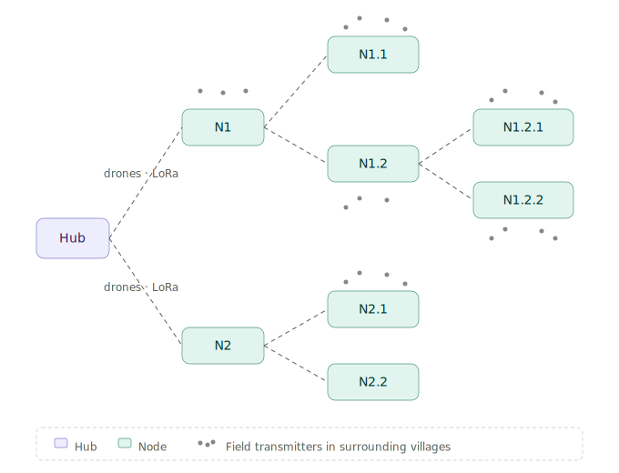
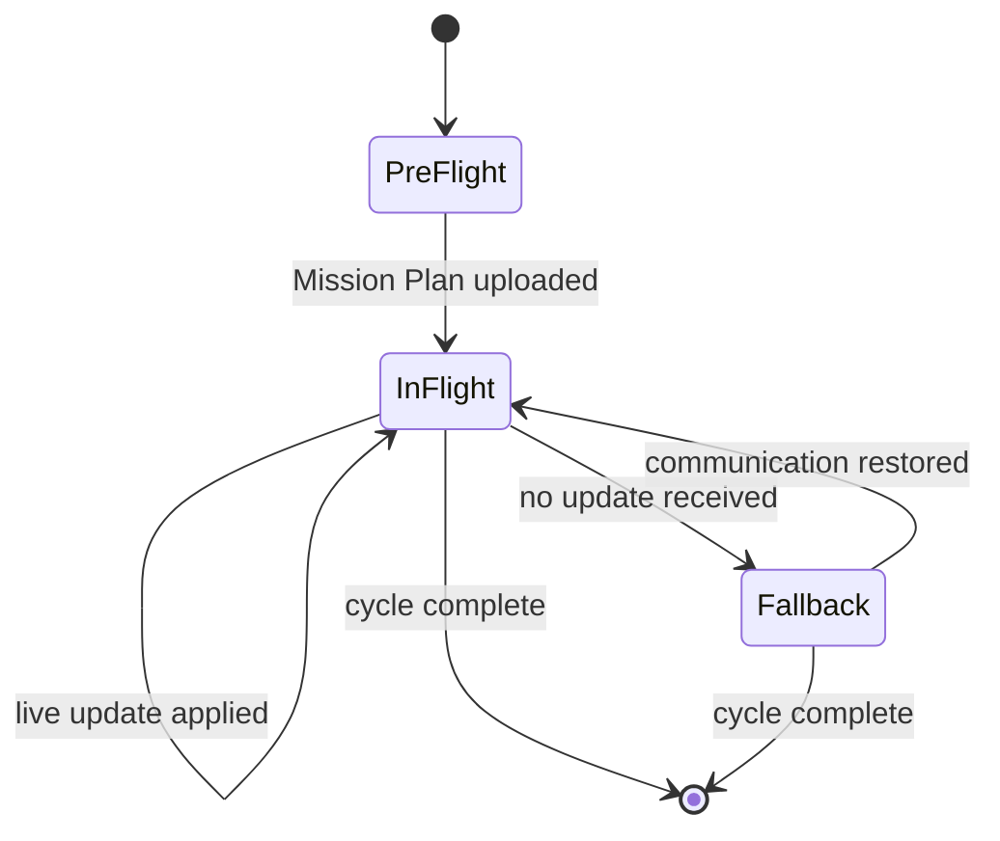

# Blueprint

*Public architectural specification of the Supply Open Sky project.*

---

## Table of Contents

 1. [Project Vision](#1-project-vision)
 2. [Operational Context and Areas of Application](#2-operational-context-and-areas-of-application)
 3. [Operational Architecture](#3-operational-architecture)
 4. [Node Configuration](#4-node-configuration)
 5. [Integrated Communication Network](#5-integrated-communication-network)
 6. [Drones and Payloads](#6-drones-and-payloads)
 7. [Control Architecture](#7-control-architecture)
 8. [Operational Challenges and Design Considerations](#8-operational-challenges-and-design-considerations)
 9. [Network Scalability](#9-network-scalability)
10. [Design Goals and Expected Impact](#10-design-goals-and-expected-impact)

For technical terminology used throughout this document, see [NOMENCLATURE.md](./NOMENCLATURE.md).

---

## 1. Project Vision

Supply Open Sky is an integrated drone delivery system designed to operate
fully autonomously in regions where conventional logistics fail. It carries
potable water, medicines, mail, and essential goods to communities that lack
reliable access to basic services — places where road infrastructure is
absent, intermittent, or unreliable, and where established distribution
networks have never reached or have collapsed.

The system is designed around three principles, each of which is a hard
constraint on every architectural choice that follows.

**Full operational autonomy.** No human intervention is required at any point
along the network during routine operations. Battery swaps at every **Node**
(see [NOMENCLATURE.md](./NOMENCLATURE.md)) are automated. Water unloading is
metered and triggered by sensors. Cargo release at on-demand drop coordinates
is performed by the drone itself. Operators interact with the system at the
**Hub** to plan missions and respond to alerts; they do not need to be
physically present at any other point in the network for the system to work.

**Resilience to communication outages.** The system is designed to keep
operating with degraded or absent communications. Drones depart with a
complete **Mission Plan** loaded onboard and can complete the assigned flight
even if the link to the Hub or the LoRa Mesh backbone is lost mid-mission.
Loss of communication degrades the precision of resource allocation, not the
operation itself.

**Modular scalability.** New Nodes and new branches integrate into the
existing network without redesigning it. The scheduling engine adapts
automatically to topology changes; the communication backbone extends
mesh-style as new nodes come online.

> The goal is to build a lightweight, scalable, and energy-autonomous aerial
> infrastructure capable of reaching multiple destinations along branching
> routes from a central Hub.

Supply Open Sky is more than a delivery service. Each Node is conceived as a permanent
service point for the surrounding community: it provides direct access to
water through a public fountain, a node on the LoRa Mesh communication
network, and an emergency relay accessible to villages within range through
distributed **Field Transmitters**. Final-destination Nodes additionally
receive medicines and medical kits as part of the routine delivery cycle.
On-demand missions can deliver to arbitrary GPS coordinates within the
network's operational range, allowing the system to respond to emergencies
that fall outside the fixed delivery routes.

## 2. Operational Context and Areas of Application

The Supply Open Sky architecture is designed for contexts where conventional logistics
are ineffective or impossible. The reference scenarios include:

- Rural areas of sub-Saharan Africa and the Sahel, where communities are
  scattered across vast territories without passable road infrastructure.
- Mountainous and riverine regions of South-East Asia, inaccessible for long
  parts of the year due to seasonal conditions.
- Areas affected by humanitarian crises or natural disasters, where existing
  infrastructure has been damaged or destroyed.
- Remote communities lacking stable access to drinking water, health
  services, or communication systems.

In all these settings, distance from a supply source is not the only
obstacle. The absence of communication infrastructure — the inability to
signal an emergency, request supplies, or coordinate a response — is often
the more critical problem.

Supply Open Sky is designed to address both dimensions simultaneously. The drone delivery
network solves the physical logistics problem; the LoRa Mesh communication
backbone, extended to villages through distributed Field Transmitters, solves
the signaling problem. The two are not separate features bolted onto the same
hardware: they are two aspects of the same infrastructure deployment, sharing
the same Nodes, the same energy budget, and the same operational footprint.

## 3. Operational Architecture

### 3.1 Tree Network Topology

The system operates on a network branching out from a central Hub. Drones
depart from the Hub, follow a shared trunk path, and distribute themselves
along secondary branches toward multiple destinations. Each branch can have
a different length and a different number of intermediate Nodes, depending
on the geography of the territory.

The terms *trunk* and *branches* describe the physical shape of the
topology. They do not imply a hierarchy of roles among Nodes. **All Nodes
are equivalent infrastructure.** Whether a Node serves as a transit stop
or as a final delivery point on a given flight is determined by the
**Mission Plan**, not by the Node itself.

The distance between consecutive Nodes is held within the 8–9 km range,
compatible with the drone's operational endurance after the safety margin
is applied. The topology is modular: new branches and new Nodes integrate
into the existing network without redesigning it.

A typical topology looks like this:

<picture>
  <source media="(prefers-color-scheme: dark)" srcset="assets/topology-dark.svg">
  
</picture>

Terminal Nodes on each branch act as final delivery points within the
Mission Plan. The "destination" role is not encoded in the Node's identity
— it is assigned dynamically by mission planning at the Hub.

At the end of each delivery, the drone follows the reverse path back to
the Hub, where the payload tank is refilled (for **SCHEDULED** flights) or
where it remains on standby until the next mission is assigned (for
**ON-DEMAND** flights).

### 3.2 Mission Types

The system supports two **Flight Modes**, sharing the same Node
infrastructure and the same LoRa Mesh communication backbone but differing
in mission logic, route, and payload handling.

**WATER / SCHEDULED missions.** SCHEDULED flights operate on fixed routes
along the tree topology, in a continuous cycle. A drone on a WATER /
SCHEDULED mission departs from the Hub with its tank fully loaded (10
litres), releases a variable share of water at each intermediate Node — a
share calculated by the Hub from pre-launch sensor readings — discharges
the remaining payload at the final destination Node, and returns to the
Hub to begin the next cycle.

**ON-DEMAND missions.** ON-DEMAND missions are scheduled into the same
flight plan as SCHEDULED missions. The applicable **Mission Types** are
MEDICAL, POSTAL, and SUPPLY. A drone on an ON-DEMAND mission departs from
the Hub with the assigned payload, flies to a delivery GPS coordinate that
may lie off the network's fixed routes, releases the payload autonomously
without requiring any human presence on the ground, and then computes the
nearest reachable Node compatible with its remaining endurance and lands
there to recharge.

> **Endurance constraint for ON-DEMAND missions:**
> *dist(Hub → drop_coordinate) + dist(drop_coordinate → nearest_node)
> ≤ available_endurance.*
> This constraint is verified by the scheduling engine before authorizing
> the mission.

ON-DEMAND missions do not replace SCHEDULED missions: the two Flight Modes
coexist within the same flight plan. ON-DEMAND missions are fitted into
free slots in such a way that they do not create conflicts on the
**Landing Pads** of intermediate Nodes.

### 3.3 Operational Flow

**Outbound leg (Hub → destination).** Traffic divides naturally: at each
branching Node, drones separate toward their respective branches. There is
no congestion on the outbound leg, because flows diverge as they progress
away from the Hub. ON-DEMAND flights follow a direct route to their
assigned coordinates, decoupled from the branching pattern.

**Return leg (destination → Hub).** Flows from SCHEDULED missions converge
progressively toward the shared trunk. The Nodes closest to the Hub
aggregate the return traffic of all branches and are the highest-pressure
points in the system. ON-DEMAND drones return instead to the nearest
reachable Node, where they may temporarily become **Off-cycle Drones** —
resources outside the normal cycle, which the scheduler tracks and
reintegrates into the plan at the next viable opportunity.

> The coordination of launch times from the Hub is the single critical
> factor that prevents two drones from arriving at a Node with both Landing
> Pads occupied. The scheduling engine accounts for topology, branch
> distances, the Flight Mode of each flight, and the occupancy time of
> each Landing Pad (6 minutes per cycle).

## 4. Node Configuration

Each Node is a multi-function station: it handles automated battery swaps
for transiting drones, distributes water to the surrounding community
through a public fountain, and acts as a node on the LoRa Mesh
communication network. All physical operations — battery exchange, water
unloading, cargo release — are fully automated. No human presence is
required at a Node for routine operations.

A typical Node integrates the following components.

| # | Component | Function |
|---|---|---|
| 1 | Landing Pad ×2 | Automated battery swap; up to 2 drones in service simultaneously; 6-minute cycle |
| 2 | Battery stock | Reserve batteries kept fully charged by the photovoltaic array; ensures continuity through periods of reduced sunlight |
| 3 | Photovoltaic array | Continuous charging of the reserve battery stock; no dependency on external power grid |
| 4 | Local water tank | Accumulates the water released by transiting drones; distributed via public fountain with level sensor |
| 5 | LoRa Mesh transceiver | Node on the mesh communication backbone; telemetry, mission updates, emergency relays |
| 6 | RF transceiver | Local radio coverage (7–10 km) for drones, operators, and Field Transmitters |
| 7 | Field Transmitters (on loan) | Distributed to villages within range; provide access to the mesh network for emergency signalling and supply requests |

Nodes are designed to be fully energy-autonomous. The photovoltaic array
ensures continuous recharge of the reserve battery stock, decoupling the
system from any external power grid. Photovoltaic sizing includes a safety
margin to compensate for the seasonal variability of solar irradiation in
tropical and Sahelian regions.

### 4.1 Local Water Management

Each Node receives water from drones on WATER / SCHEDULED missions in
transit. The amount released at each Node is not fixed: it is computed
dynamically by the Hub based on the current level of the local tank,
reported via the LoRa Mesh backbone before each mission launch.

The tank is equipped with a level sensor that updates the Hub
continuously. If pre-launch communication with a Node fails, the Hub uses
the most recent valid reading (with timestamp) to compute a fallback
allocation. The public fountain enables direct distribution of water to
the inhabitants of the villages within 7–10 km of the Node.

## 5. Integrated Communication Network

Supply Open Sky incorporates a multi-layer communication system that turns every Node
into a relay and an intelligent endpoint of the network. The communication
network operates in the absence of any pre-existing Internet or telecom
infrastructure — it is part of what the system deploys, not something it relies on.

| Layer | Technology | Application |
|---|---|---|
| Drone in flight | RF Control Link | Real-time control and telemetry; in-flight Mission Plan updates |
| Inter-Node backbone | LoRa Mesh | Communication between Nodes; low power, long range; sensor data and scheduling |
| Local communication | Field Transmitter | Village ↔ SOS network link; 7–10 km range |
| Emergency / distress | LoRa Mesh (redundant routing) | Alternative paths automatically used when intermediate Nodes are unavailable |

The redundancy is deliberate. The mesh routing logic guarantees that a
distress signal from a Field Transmitter can reach the Hub even if one or
more intermediate Nodes are offline: the signal finds an alternative path
through the network rather than failing.

### 5.1 Field Transmitters

Villages and communities within 7–10 km of any Node receive **Field
Transmitters** on loan. These devices give residents a direct interface to
the Supply Open Sky network. They allow inhabitants to send distress signals or
requests for assistance, request urgent supplies (water, medicine), and
communicate with other villages and with the Hub.

The LoRa Mesh backbone provides redundancy: even if one or more
intermediate Nodes fail, the signal finds alternative paths to its
destination. A village relying on a Field Transmitter is never
single-pointed against a single Node failure.

## 6. Drones and Payloads

The system uses multi-rotor drones with a modular payload system, allowing
the fleet's configuration to be varied in real time according to
operational needs. The flight parameters reported below are reference
values for the current design phase, with a 15–20% operational margin
incorporated into all working distance calculations.

| Parameter | Value |
|---|---|
| Cruise speed | 35 km/h |
| Reference endurance | 15 minutes (placeholder, 15–20% operational margin) |
| Coverage per leg | ~8.75 km per battery (theoretical) |
| Operational distance between Nodes | 8–9 km |
| Stop time at Node | 6 minutes (automated battery swap) |
| WATER payload | 10 litres |
| ON-DEMAND payload | Modular slot for medicine / mail / medical kits / other goods (max 10 kg) |
| SCHEDULED Flight Mode | Outbound: demand-driven partial unloading. Return: empty, back to Hub |
| ON-DEMAND Flight Mode | Outbound: GPS drop. Return: nearest reachable Node |

All Node-side interfaces — battery exchange, water release, cargo drop —
are automated. No human presence is required at a Node for routine
operations.

The endurance figure is treated as a placeholder rather than a confirmed
specification: validated values will come from prototype testing under
real operational conditions (wind, battery degradation, variable load).
The 15–20% operational margin is the engineering buffer that keeps
working distances safe regardless of how the final endurance number
settles.

## 7. Control Architecture

The system follows a **Hub-centric** model with graceful degradation. The
Hub is the single decision-making centre, but every drone is capable of
completing its assigned mission even with no communication to the Hub or
to the LoRa Mesh backbone for the entire flight duration.

### 7.1 Mission Cycle

Each flight is structured in three sequential phases:

| Phase | Name | Description |
|---|---|---|
| 1 | Pre-flight | The Hub queries the level sensors of all relevant Nodes via LoRa Mesh, computes the full Mission Plan (route, water shares per stop, endurance check for ON-DEMAND missions), and uploads it to the drone before takeoff. |
| 2 | In flight | The Hub can push Mission Plan updates to the drone via intermediate Nodes (RF / LoRa Mesh). The drone applies the most recent update in place of the pre-loaded plan for the remaining legs. |
| 3 | Fallback Mode | If no update is received within a leg, the drone executes the pre-loaded Mission Plan sequentially. The mission proceeds without blocking; water shares are those computed from pre-launch sensor data. |

The state transitions across these phases can be summarised as follows:

### 7.2 Graceful Degradation

The control model is designed so that the system continues to operate
under degraded communication conditions, with a progressive reduction in
precision — not in functionality.

**Full communication.** The Hub updates water shares in real time based on
the actual consumption measured by the local sensors.

**Partial communication.** The drone operates on the pre-loaded Mission
Plan for legs without incoming updates, and resumes applying live updates
as soon as communication is restored.

**No communication.** The drone completes the mission entirely on the
pre-loaded Mission Plan. The data used is the one measured by the sensors
before launch, with the timestamp recorded for traceability.

> Total loss of communication does not block the mission. The drone
> completes the delivery using the data available at launch time. The Hub
> records the event and recalibrates its estimates for the following cycle
> when the drone returns.

### 7.3 Flight Scheduling

The scheduling engine is the most critical software component of the
system. It operates on the tree topology and must guarantee that no
**Landing Pad** is occupied by two drones simultaneously — a constraint
that becomes particularly demanding on the return leg, where flows from
all branches converge toward the trunk Nodes.

The number of drones in simultaneous flight is not pre-defined: it is an
output of the scheduling computation, derived from the active missions,
the current topology, the meteorological and operational conditions, and
the capacity of the Nodes. The system computes both the optimal number of
drones for the current plan and the maximum arithmetically admissible
number.

The scheduler integrates both Flight Modes: ON-DEMAND missions are fitted
into available slots in the SCHEDULED plan, with prior verification of
the endurance constraint for the return to the nearest Node. Off-cycle
Drones that have landed at intermediate Nodes are tracked as out-of-cycle
resources and reintegrated into the plan at the appropriate opportunity.

## 8. Operational Challenges and Design Considerations

The nature of the operational context and the complexity of the tree
topology introduce a set of challenges the project must address through
development and deployment. They fall into three groups: engineering,
field operations, and deployment.

### Engineering challenges

The most demanding technical challenge is **flight scheduling on a
heterogeneous tree topology**. The Nodes on the shared trunk concentrate
the return traffic of all branches, and the introduction of ON-DEMAND
missions adds Off-cycle Drones that must be dynamically tracked and
reintegrated into the active plan. The scheduler must produce
conflict-free plans across two Flight Modes simultaneously, on a topology
that can change between deployments.

Drone **endurance and cruise speed remain placeholders** at the current
design phase. Validated values will come from prototype testing under
operational conditions: wind, battery degradation, variable payload.
Until those values are confirmed, all working distances incorporate a
15–20% safety margin.

**Local water tank management** requires balancing the inflow from
transiting drones against local consumption from the public fountain. The
demand-driven water allocation depends on reliable level sensors and on a
predictive consumption model that calibrates over time as data accumulates
per Node.

### Field operations challenges

**Remote maintenance** is structurally constrained by the location of
Nodes in isolated areas. The system requires local-operator training for
first-level interventions (battery handling, photovoltaic panel
inspection, transceiver checks), and clear escalation protocols for
second-level failures requiring on-site technical staff.

**Solar energy variability** is significant in tropical and Sahelian
regions across seasons. Photovoltaic sizing includes a safety margin, and
the reserve battery stock is dimensioned for night-time autonomy plus a
buffer against cloudy-day sequences.

**Off-route ON-DEMAND missions** push the endurance constraint to its
limit. The constraint must be verified in real time before launch,
because atmospheric conditions can invalidate the calculation made at the
pre-flight stage. The scheduler maintains a margin that absorbs typical
weather variability but flags missions that approach the boundary for
operator review.

### Deployment challenges

**Local adoption** depends on engaging communities through training of
on-site operators, especially for the management of Field Transmitters
and emergency signalling. Adoption is not assumed: it is built through
deployment-stage engagement with the communities the system serves.

**Network growth** must absorb new branches and new Nodes without
redesigning the existing infrastructure or rewriting the scheduling
logic. The scheduler is designed to recompute plans automatically against
an updated topology graph; the communication backbone extends mesh-style
as new Nodes come online.

> The most complex single challenge from a technical standpoint is flight
> scheduling on a tree topology with heterogeneous Flight Modes. Trunk
> Nodes on the return leg concentrate the traffic of all branches, and
> ON-DEMAND missions introduce Off-cycle Drones that must be tracked and
> reintegrated into the plan dynamically.

## 9. Network Scalability

The modular architecture of Supply Open Sky is designed to grow incrementally, with
each deployment reducing the cost and time of the next.

New destinations can be added as additional branches of the tree, without
redesigning the existing network. New intermediate Nodes integrate into
the LoRa Mesh as additional mesh peers. The Hub itself can be replicated
in new locations, either to cover wider territories with independent
networks or to support inter-Hub coordination across regions. Drone
fleet size is scalable: the number of active vehicles is determined by
the scheduling computation against actual demand, within the capacity
limits of the Nodes. ON-DEMAND missions can be progressively enabled on
new branches as the network consolidates.

Each new deployment benefits from the operational data of the deployments
that came before: per-Node consumption models, calibration of fallback
water shares, scheduling parameters tuned against real flight behaviour.
What begins as engineering judgement becomes, over multiple deployments,
an empirical baseline.

## 10. Design Goals and Expected Impact

Supply Open Sky is designed to achieve specific outcomes in the contexts where it
operates. The list below describes the system's design goals — the
results it is engineered to produce — rather than aspirations.

**Continuous water access.** Potable water is delivered to communities
that lack reliable water infrastructure, with capillary distribution at
every intermediate Node along the network rather than concentration at a
single endpoint.

**Health support.** Medicines and medical kits are delivered both to
final-destination Nodes through scheduled cycles, and on demand to
arbitrary GPS coordinates within the network's operational range.

**Emergency communication infrastructure.** Supply Open Sky deploys a communication
backbone where none exists, with coverage extending up to 7–10 km from
each Node through Field Transmitters distributed to surrounding villages.
The same infrastructure also provides postal delivery as a regular
service.

**Energy autonomy.** The system operates without dependence on any
external power grid or fossil fuel supply chain, on photovoltaic
generation alone.

**Local capacity building.** Operator training for Node management and
maintenance creates technical roles within the communities. Field
Transmitters in distributed loan establish a permanent communication
presence in villages.

**Permanent infrastructure.** Each Node is a permanent point of essential
services for the surrounding area: water, emergency communication, a
fixed reference point. The system does not aim to provide temporary
relief; it aims to install something that stays.

> Supply Open Sky does not just deliver water and medicine. It deploys infrastructure.
> Each Node is a permanent service point for the community surrounding it.
> Each ON-DEMAND mission is a direct response to a need signalled by the
> network itself.
