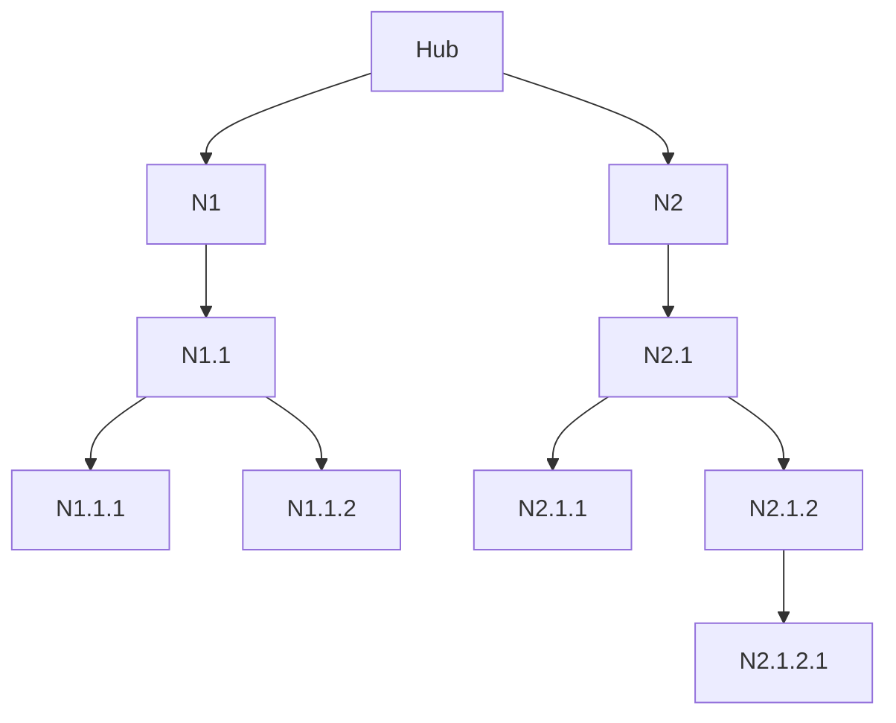

# Supply Open Sky
## Technical Nomenclature Reference

This document is the glossary of Supply Open Sky — a single place where
every technical term used across the project is defined. Whether you are
exploring the architecture for the first time or contributing to a
specific subsystem, this reference ensures you are reading the same
words with the same meaning as everyone else on the project.

For the wider architectural context, see the [Blueprint](./BLUEPRINT.md).

*Version 1.0 — March 2026*

---

## Network Infrastructure

| Concept | Term | Abbreviation / Format |
|---|---|---|
| Central operations center | **Hub** | `HUB` |
| Network relay and service node | **Node** | `N1`, `N1.1`, `N1.2.1` |
| Connection between two nodes | **Segment** | — |
| Single landing slot on a node | **Landing Pad** | `PAD-1`, `PAD-2` |

### Node Identifier Format

Node IDs are positional and hierarchical, encoding the path from the Hub:

- The ID reflects the topological position in the network graph, not the role of the node.
- Whether a node is a transit stop or a final delivery point is determined by the Mission Plan, not by the node itself.
- Each deployment may assign human-readable names to nodes (e.g. `Village-A`, `Village-B`) alongside the positional ID.

---

## Flight Operations

### Mission Type
Describes the payload and operational purpose of the flight.

| Mission Type | Description |
|---|---|
| `WATER` | Potable water delivery (10L tank) |
| `MEDICAL` | Medicines and medical kits |
| `POSTAL` | Mail and documents |
| `SUPPLY` | Essential goods and other materials (max 10kg) |

### Flight Mode
Describes the operational logic and routing of the flight.

| Flight Mode | Description |
|---|---|
| `SCHEDULED` | Fixed-route cycle flight along the network tree; repeating cycle |
| `ON-DEMAND` | Mission triggered by request; delivery to arbitrary GPS coordinates |

> A `WATER` mission is almost always `SCHEDULED`.  
> A `MEDICAL` mission can be either `SCHEDULED` (regular node delivery) or `ON-DEMAND` (emergency response to GPS coordinates).

### Other Flight Terms

| Concept | Term |
|---|---|
| Complete operational cycle (HUB → delivery → HUB) | **Flight Cycle** |
| Full set of instructions loaded before takeoff | **Mission Plan** |
| Pre-launch sensor query and plan calculation phase | **Pre-flight** |
| Drone operating on stored plan without live updates | **Fallback Mode** |

---

## Communication

| Concept | Term |
|---|---|
| Backbone mesh between nodes | **LoRa Mesh** |
| Portable device distributed to villages | **Field Transmitter** |
| RF link between Hub/nodes and drone in flight | **RF Control Link** |

---

*This document is the reference for all technical communications, code identifiers, and documentation within the Supply Open Sky project.*
