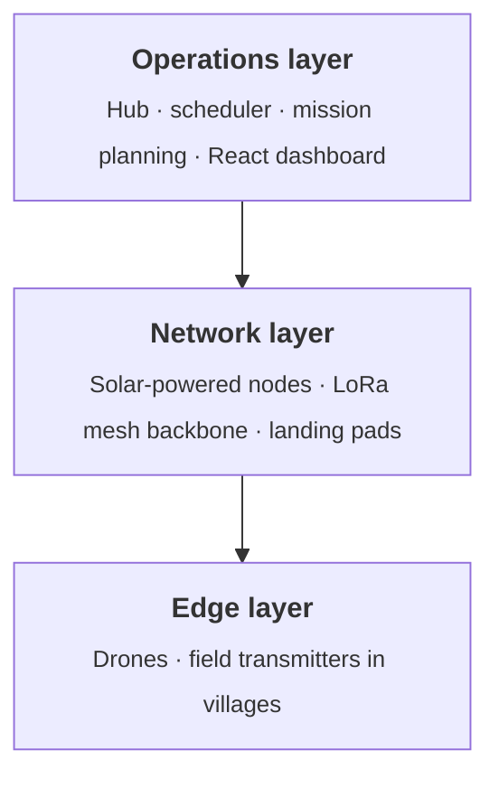

# Supply Open Sky

*Autonomous infrastructure for underserved communities: drone delivery and mesh communication on solar-powered nodes.*

---

## What it is

Supply Open Sky is an integrated autonomous drone delivery system designed to
bring potable water, medicines, mail, and essential goods to communities that
lack reliable access to basic services. It is built for geographically
isolated regions where conventional logistics are ineffective or impossible;
areas without dependable road infrastructure or established distribution
networks.

The architecture is grounded in three principles: full operational autonomy
with no human intervention required along the network, resilience to
communication outages, and modular scalability that allows the network to
grow without redesigning existing infrastructure.

The network is organized as a tree topology branching out from a central Hub.
Drones depart loaded with payload, deliver along scheduled routes or to
on-demand GPS coordinates, and return to be reloaded. Each Node is
solar-powered, fully autonomous, and serves a dual purpose: it is relay
infrastructure for drone operations, and at the same time a permanent service
point for the surrounding community; providing public water access and an
emergency communication link via a LoRa Mesh backbone.

Supply Open Sky is not just a delivery system. It is logistical infrastructure
designed to exist where no other infrastructure does.

## What this repository contains

This repository hosts the public architectural documentation of the Supply
Open Sky project. The implementation code - drone firmware, scheduling
engine, hub software, communication stack, simulator, dashboard - is
maintained in a private repository during the current development phase and
is not published here.

- **[BLUEPRINT.md](./BLUEPRINT.md)** full architectural specification of
  the system: operational concept, network topology, mission types, control
  architecture, communication stack, and design considerations.
- **[NOMENCLATURE.md](./NOMENCLATURE.md)** reference for the technical
  terminology used across the project documentation and source code.

## System architecture at a glance

The system is organized in three layers, each with distinct responsibilities
and components:

The Operations layer plans missions, schedules flights, and coordinates the
network; without human intervention along the network during routine
operations. The Network layer is the physical backbone of the system: relay
nodes that host battery swaps, water tanks, and the LoRa mesh radio
infrastructure, designed to keep operating when external communication is
degraded or absent. The Edge layer is where the system meets the world,
drones flying missions on pre-loaded plans that complete even if the radio
link is lost, and field transmitters distributed to villages within range of
each Node.

For the topology of the network itself (Hub, Nodes, branches), see
[BLUEPRINT.md](./BLUEPRINT.md) and [NOMENCLATURE.md](./NOMENCLATURE.md).

## Project status

The system architecture is fully specified; reference implementations of the
central operations software (Hub, mission scheduler, mesh communication
sidecar) are deployed on dedicated single-board computers and operate in a
first end-to-end network configuration. Mission planning and execution have
been validated against a software-in-the-loop simulation environment.

Current focus is on operational hardening, telemetry instrumentation, and
validation of the scheduling logic on extended test scenarios.

*This section is updated periodically as the project advances.*

## Project signs of life

To make project activity verifiable rather than rhetorical, this repository
publishes two automatically generated files that summarise development
metrics from the private working repository:

- **[STATUS.md](./STATUS.md)** human-readable summary: commit cadence over
  the last 30 days, issue throughput, branch activity, and continuous
  integration status.
- **[STATUS.json](./STATUS.json)** the same data in a machine-readable form
  (schema version 1.0), suitable for dashboards or scripted checks.

Both files are regenerated daily by an automated workflow that runs against
the private repository, then committed here by a dedicated GitHub App
(`supply-open-sky-mirror-bot[bot]`). On days with no underlying activity,
no commit is produced; an unchanged file therefore reflects an unchanged
project, not a stale pipeline.

The metrics deliberately exclude any figure that would require independent
verification (deployment counts, test totals beyond what CI exposes, field
operation statistics). Only data that GitHub can attest to directly is
reported.

## Following the project

- **LinkedIn** [Matteo Casavecchia](https://www.linkedin.com/in/casavecchia/)
- **Watch this repository** for documentation updates and future releases.

## Contributing

Documentation contributions, corrections, translations, and feedback are
welcome. See [CONTRIBUTING.md](./CONTRIBUTING.md) for guidelines on how to
report issues, propose changes, and what is currently in scope.

For security-related concerns, see [SECURITY.md](./SECURITY.md).

This project follows the [Contributor Covenant](./CODE_OF_CONDUCT.md) Code
of Conduct.

## License

The documentation in this repository is released under the
[Creative Commons Attribution 4.0 International License (CC BY 4.0)](./LICENSE.md).
You are free to share and adapt the material with appropriate attribution.

The implementation code of Supply Open Sky is maintained in a separate
private repository and will be released, when published, under the
[Apache License 2.0](https://www.apache.org/licenses/LICENSE-2.0).
